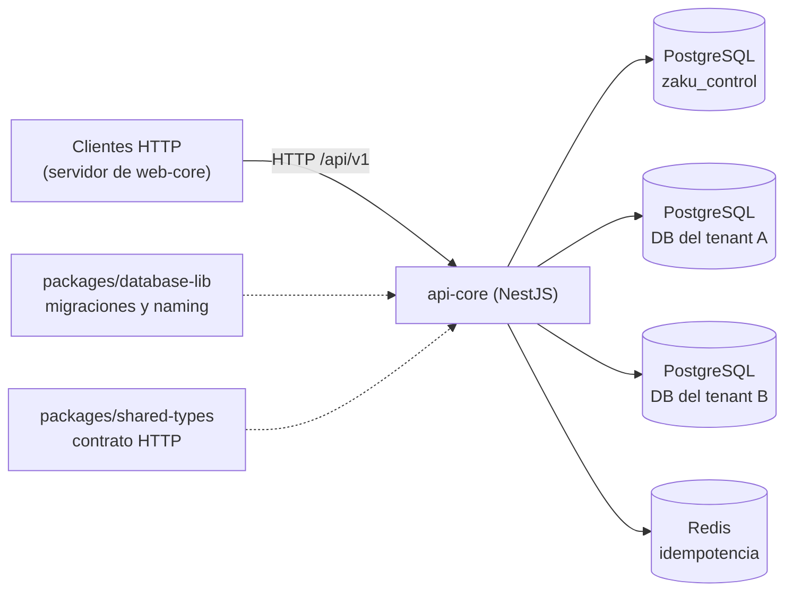
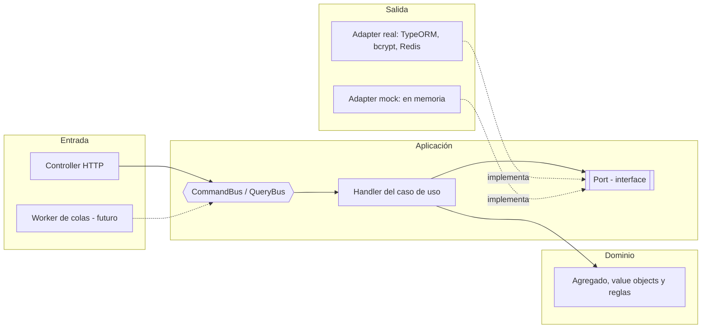
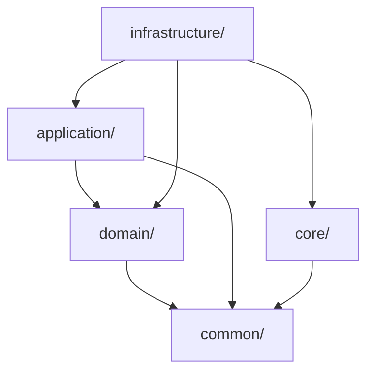
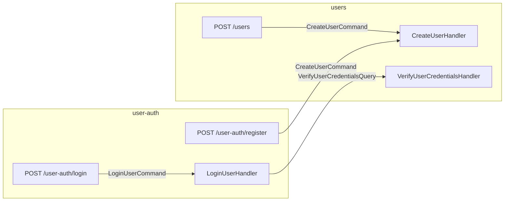
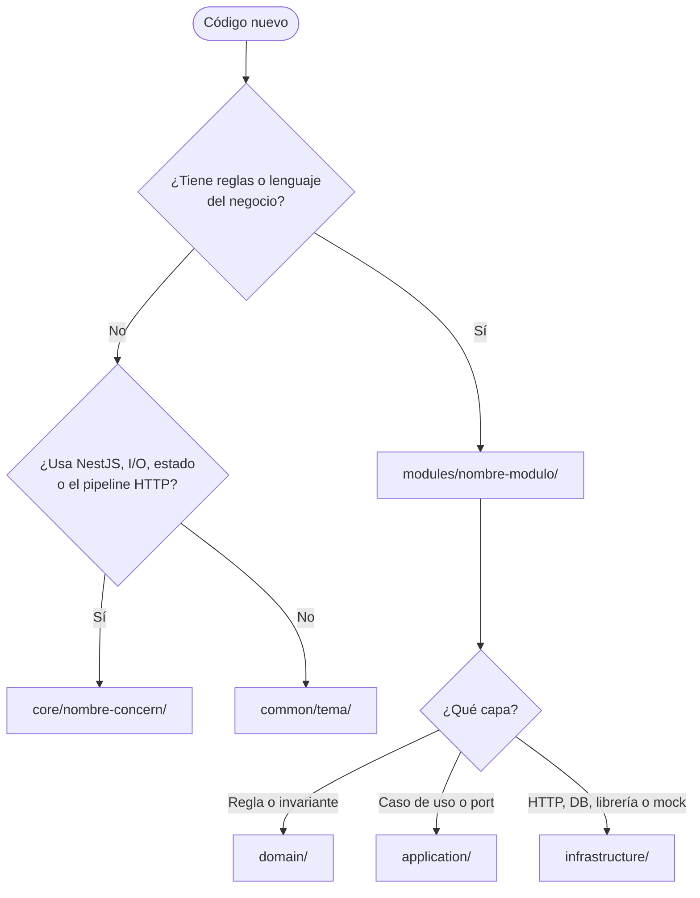
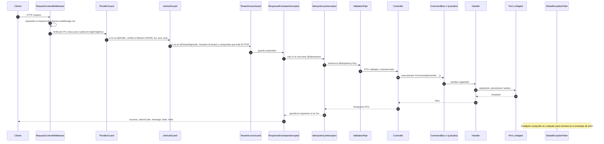
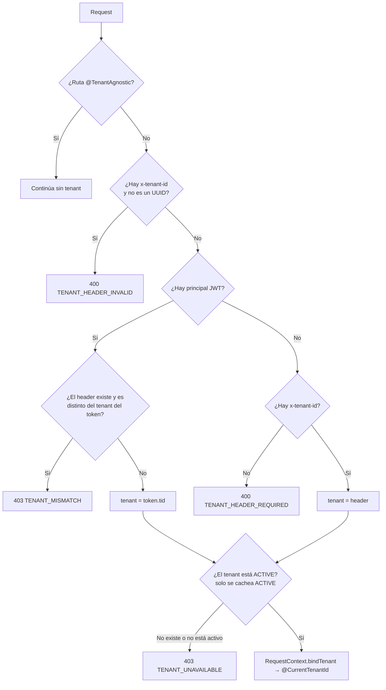
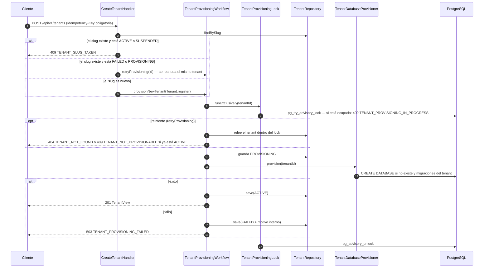
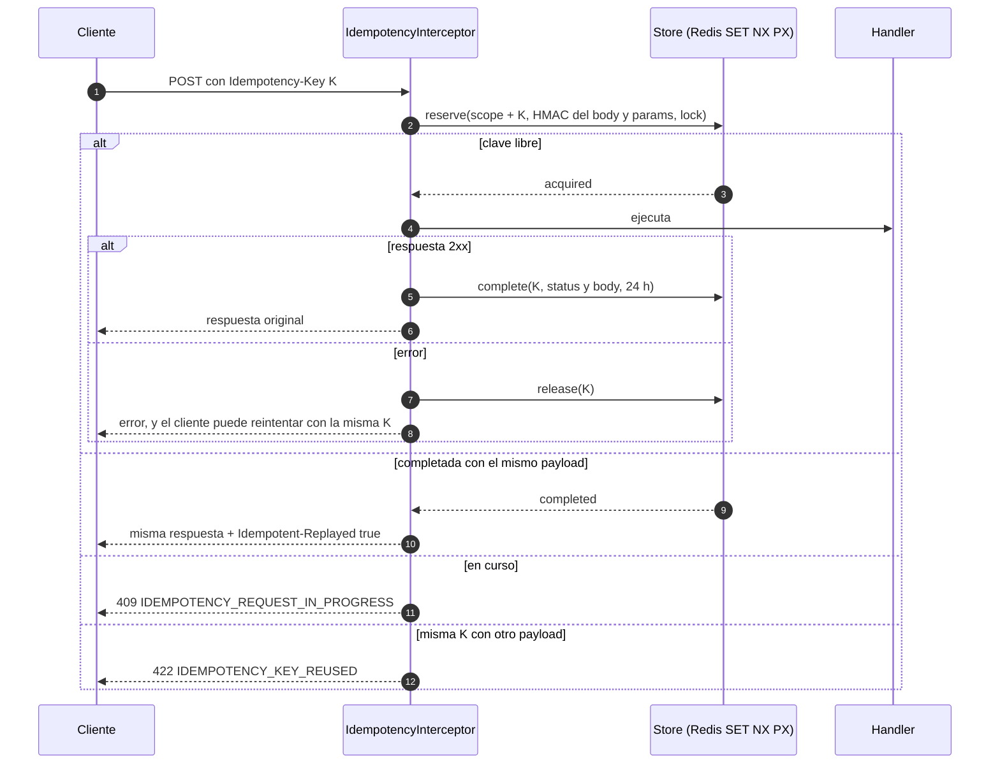

# ARCHITECTURE · api-core

Referencia de la arquitectura de `apps/api-core`. Si el código y este documento no coinciden, hay un bug en uno de los dos.

> Léelo antes de tocar el backend. Documentos relacionados:
> - [Arquitectura general del monorepo](../../../docs/ARCHITECTURE.md): cómo encaja api-core con web-core y los paquetes, el contrato HTTP y el flujo de autenticación de punta a punta.
> - [CLEAN_CODE.md](./CLEAN_CODE.md): reglas de código de api-core.
> - [DEVELOPMENT.md](./DEVELOPMENT.md): guías paso a paso.
> - [DATABASE.md](./DATABASE.md): conexiones, pools y aprovisionamiento. El esquema y las migraciones están en el [DATABASE.md general](../../../docs/DATABASE.md).
> - [AI_RULES.md](./AI_RULES.md): reglas para agentes de IA.
> - [ONBOARDING.md](./ONBOARDING.md): recorrido didáctico de una request y de un endpoint nuevo.

## 1. Visión general

api-core es la única pieza del sistema que habla con PostgreSQL y Redis. Sus clientes (hoy, el servidor de web-core) la llaman por HTTP en `/api/v1`. El mapa completo del sistema está en la [arquitectura general](../../../docs/ARCHITECTURE.md#1-visión-general).



| Dependencia | Para qué la usa api-core |
|---|---|
| `packages/database-lib` | Migraciones del control plane y de las DBs de tenant, y el naming de las DBs de tenant. |
| `packages/shared-types` | Tipos del contrato HTTP que comparte con web-core: envelope de respuesta, requests y responses. |

## 2. Estilo arquitectónico: Hexagonal + CQRS-lite

### 2.1 Hexagonal (Ports & Adapters)

El **negocio** (dominio y casos de uso) está en el centro y **no conoce** HTTP, TypeORM ni Redis. Cuando necesita algo del exterior, declara un **port**: una interfaz. La **infraestructura** implementa ese port con un **adapter** (TypeORM, bcrypt, JWT, Redis…) o con un **mock**. Si mañana se cambia Postgres por otra cosa, o por un mock en memoria, el negocio no se toca.



### 2.2 Regla de dependencias

Las dependencias solo apuntan hacia adentro. Lo verifica `test/architecture/dependency-rules.spec.ts`:

- `domain/` y `application/` se validan con **listas de permitidos**: cualquier import que no esté en la lista falla.
- `common/`, `core/` e `infrastructure/` se validan con reglas de prohibición: `common/` no importa frameworks ni librerías de I/O (`@nestjs/*`, `typeorm`, `express`, `ioredis`, `bcrypt`, `@zaku/database-lib`) ni otras áreas; `core/` no importa `modules`; ningún módulo se salta la API pública de otro.



| Capa | Solo puede importar |
|---|---|
| `domain/` | su propio `domain/`, `@common/*`, `node:*` |
| `application/` | su `domain/` y `application/`, `@common/*`, `node:*`, `@nestjs/common` (`@Injectable`, `@Inject`, `Logger`), `@nestjs/cqrs` y la API pública de otros módulos (`@modules/<x>`) |
| `infrastructure/` | todo lo anterior, `@core/*` y librerías |
| `core/` | `@common/*` y librerías. Nunca `@modules/*`. |
| `common/` | nada interno y ningún framework |

> **Excepción documentada:** `application/` usa los decoradores de `@nestjs/cqrs` y `@nestjs/common`. Es un acoplamiento acotado y pragmático: la lógica se sigue probando instanciando el handler con `new` y pasándole fakes.

### 2.3 CQRS-lite

CQRS separa las **escrituras** (Commands) de las **lecturas** (Queries). Aquí se aplica en la capa de aplicación, **sin** event sourcing y **sin** una base de lectura separada.

| Concepto | Qué es | Ejemplo |
|---|---|---|
| Command | Intención de cambiar estado. Clase inmutable que extiende `Command<TResult>`. | `CreateTenantCommand` |
| Query | Pregunta sin efectos secundarios. Extiende `Query<TResult>`. | `ListUsersQuery` |
| Handler | El caso de uso. Hay un handler por cada command o query. | `CreateUserHandler` |
| View | DTO de lectura que devuelven los handlers. Nunca se devuelve el agregado. | `UserView` |
| Bus | `CommandBus` / `QueryBus` de `@nestjs/cqrs`. `execute()` infiere el tipo de resultado. | `commandBus.execute(new CreateUserCommand(...))` |

Reglas:

1. Los controllers **solo** despachan commands y queries. No tienen lógica.
2. **¿Command o query?**
   - Es command si muta estado **o** si tiene un efecto que importa fuera del proceso (emitir credenciales, enviar un email, encolar un job). Por eso el login es `LoginUserCommand`.
   - Es query si solo lee. `VerifyUserCredentialsQuery` es una query porque hoy solo compara; si algún día registra intentos fallidos (bloqueo de cuenta), pasará a ser un command.
3. Todo command o query declara su resultado con `extends Command<T>` o `extends Query<T>`. Sin eso, `execute()` devolvería `any`. El architecture test lo exige.
4. Los datos que viven en la **DB de un tenant** se piden con el `tenantId` explícito en el command/query y en cada método del port: `findById(tenantId, id)`. Así los handlers no dependen del request HTTP y un worker puede ejecutarlos igual. Los datos del control plane (módulo `tenants`) no llevan `tenantId`, porque no pertenecen a un tenant.
5. Los datos sensibles viajan envueltos en `Secret` (`common/security/secret.ts`): `JSON.stringify`, `inspect` y la interpolación de strings muestran `[REDACTED]`. Para obtener el valor hay que llamar a `.reveal()`, que solo debe usarse donde se consume.
6. La lógica compartida por varios handlers **del mismo módulo** va en `application/services/` (ej. `TenantProvisioningWorkflow`). La lógica de **otro** módulo se pide por el bus.
7. Las lecturas simples usan el port del repositorio (`findPage`). Si una lectura necesita proyecciones o joins costosos, se crea un read-port dedicado.

#### Reutilización entre módulos y endpoints



`user-auth` no importa servicios de `users`. Solo importa **contratos** desde `@modules/users`:

- `CreateUserCommand`
- `VerifyUserCredentialsQuery`
- `UserView`
- `CreateUserRequestDto`
- `UserResponseDto`

y los envía por el bus. Reutiliza los DTOs HTTP de `users` a propósito: `POST /user-auth/register` expone exactamente el mismo contrato que `POST /users`. Si algún día divergen, `user-auth` tendrá sus propios DTOs.

## 3. ¿Dónde va cada cosa? `core`, `common` o `modules`

| Carpeta | Qué contiene | Criterio |
|---|---|---|
| `src/common/` | TypeScript puro: sin estado, sin I/O y sin `@nestjs/*`. | "¿Lo copiaría tal cual a un proyecto sin NestJS?" Ej: `AppError`, `Page`, `newestFirst`, `Secret`, `isUuid`. |
| `src/core/` | Infraestructura **transversal**: providers globales de Nest, con estado o I/O, o que participan en el pipeline de **todas** las requests. Sin reglas de negocio. | "¿Existe una sola vez en toda la app y no sabe nada del negocio?" Ej: config, request-context, security, tenancy, http, idempotency, mocking, database. |
| `src/modules/<x>/` | Un bounded context de negocio: tenants, users, user-auth… | "¿Usa el lenguaje del negocio?" |



**Sobre el middleware y el contexto de tenant que vivían en `modules/tenant`:**

- **Dónde quedaron:**
  - El contexto por request (`AsyncLocalStorage` + middleware) está en `core/request-context/`.
  - La resolución y validación del tenant está en `core/tenancy/`.
- **Por qué `core`:** son piezas con estado por request y se aplican una sola vez a todas las rutas.
- **Por qué no `common`:** usan Nest y tienen estado.
- **Por qué no el módulo `tenants`:** todos los módulos dependen de ellas.

## 4. Estructura de carpetas

```text
apps/api-core/
├── src/
│   ├── main.ts                      # bootstrap: crea la app Express, configureHttpApp, listen
│   ├── app.module.ts                # composition root: CoreModule + módulos de negocio
│   ├── common/                      # TS puro, sin frameworks
│   │   ├── errors/app-error.ts      # base de todos los errores (code + category)
│   │   ├── pagination/              # Page<T>, PageRequest, newestFirst (orden canónico)
│   │   ├── security/secret.ts       # envoltorio para datos sensibles
│   │   └── utils/uuid.ts
│   ├── core/                        # infraestructura transversal (nunca importa modules)
│   │   ├── core.module.ts           # guards globales en orden: throttler → JWT → tenant
│   │   ├── config/                  # validación del entorno + AppConfig tipado
│   │   ├── request-context/         # AsyncLocalStorage + middleware (requestId, principal, tenant)
│   │   ├── security/                # JwtAuthGuard global, @Public, rate limiting, claims
│   │   ├── tenancy/                 # TenantAccessGuard global, @TenantAgnostic, @CurrentTenantId, port TENANT_ACCESS_CHECKER
│   │   ├── http/                    # envelope, filtro de errores, pipes, @ApiEnvelope, configureHttpApp
│   │   ├── idempotency/             # @Idempotent, interceptor, store (Redis | memoria)
│   │   ├── mocking/                 # MockSwitch, provideSwitchableAdapter, demo-fixtures
│   │   ├── database/                # LazyDataSource, ControlPlaneDatabase, TenantDataSourceManager, errores de Postgres
│   │   └── health/                  # GET /health
│   └── modules/
│       ├── tenants/                 # registro de tenants y aprovisionamiento de su DB
│       ├── users/                   # identidad y credenciales de los usuarios de un tenant
│       └── user-auth/               # login y registro de usuarios (emisión de JWT)
├── test/                            # TODOS los tests: en src/ no hay ninguno
│   ├── unit/                        # espejo de src/: src/<ruta>/<x>.ts → test/unit/<ruta>/<x>.spec.ts
│   ├── architecture/                # reglas ejecutables: dependency-rules (capas y módulos) y test-layout (dónde viven los tests)
│   ├── contracts/                   # suites que cumplen mocks y adapters reales por igual
│   ├── e2e/                         # API completa en modo mock (sin Docker)
│   ├── integration/                 # adapters reales contra Postgres + Redis (Docker)
│   ├── setup/                       # entorno y setup global por tipo de test
│   └── support/                     # helpers y fakes compartidos
└── nest-cli.json, tsconfig*.json, jest*.config.ts, eslint.config.mjs, .env.example
```

### 4.1 Anatomía de un módulo (plantilla obligatoria)

```text
modules/<modulo>/
├── domain/                          # opcional si el módulo no tiene modelo propio (ej. user-auth)
│   ├── <agregado>.ts                # entidad raíz: register/create, restore, transiciones, toSnapshot
│   ├── <agregado>-status.ts         # enums de dominio como objeto const + type
│   ├── value-objects/<vo>.ts        # validación + normalización (Email, TenantSlug)
│   └── errors/<agregado>.errors.ts  # subclases de AppError
├── application/
│   ├── commands/<caso>/<caso>.command.ts | .handler.ts   # su test: test/unit/modules/<modulo>/application/commands/<caso>/<caso>.handler.spec.ts
│   ├── queries/<caso>/<caso>.query.ts   | .handler.ts
│   ├── ports/<nombre>.port.ts       # interface + token Symbol
│   ├── services/                    # lógica reutilizada por varios handlers del módulo
│   ├── views/<nombre>.view.ts       # DTO de lectura + función toXView
│   └── errors/<modulo>.errors.ts    # errores de aplicación (si no son de dominio)
├── infrastructure/
│   ├── http/<modulo>.controller.ts + dtos/   # request/response con class-validator y Swagger
│   ├── persistence/typeorm/         # *.orm-entity.ts, *-orm.mapper.ts, typeorm-*.repository.ts
│   ├── adapters/                    # otros adapters reales (bcrypt, jwt, provisioner y lock de Postgres)
│   ├── mocks/                       # adapters en memoria, datos y seeders demo
│   └── <modulo>-adapter-keys.ts     # claves del MockSwitch: '<modulo>.<port>'
├── <modulo>.module.ts               # wiring de Nest
└── index.ts                         # API pública: SOLO contratos (commands, queries, views, DTOs HTTP y enums, value objects o errores de dominio que forman parte de ellos, como TenantStatus). Nunca agregados. Lo verifica el architecture test
```

Responsabilidades:

- **Agregado:** protege las invariantes (ej. un tenant `ACTIVE` no puede volver a aprovisionarse).
  - Se crea con `register()`/`create()`, que valida.
  - Se reconstruye con `restore()`, que no valida porque los datos vienen de la DB.
  - Expone `toSnapshot()` para los mappers.
- **Value Object:** normaliza y valida un valor (ej. `Email` pasa a minúsculas).
- **Handler:** orquesta el caso de uso:
  1. valida la entrada con value objects;
  2. consulta los ports;
  3. aplica las reglas del agregado;
  4. persiste;
  5. devuelve una view.
- **Port:** describe lo que el caso de uso necesita, en el vocabulario del negocio.
- **Adapter:** traduce entre el port y la tecnología, y mapea los errores técnicos a errores de dominio (ej. unique violation `uq_users_email` → `UserAlreadyExistsError`).
- **Controller:** valida el HTTP (DTO), obtiene el contexto (`@CurrentTenantId()`), despacha por el bus y mapea la view a un response DTO.
- **`index.ts`:** lo único que otros módulos pueden importar.
  - Publica los casos de uso del módulo (todos sus commands y queries), sus views, los DTOs HTTP que otro módulo reutiliza y los tipos de dominio que aparecen en esos contratos (enums `*-status`, value objects y errores), nunca los agregados.
  - Nunca exporta handlers, ports, adapters, mocks ni el `*.module.ts` (lo verifica el architecture test).
  - Hay dos excepciones que sí importan rutas profundas:
    - `src/app.module.ts`, que es el composition root;
    - los tests.

## 5. Ciclo de vida de una request



Los guards globales se declaran en `core/core.module.ts` en este orden exacto. El orden importa: el guard de tenant lee el principal que fija el guard JWT.

El mismo recorrido, archivo por archivo y con el error de ejemplo, está en [ONBOARDING §4](./ONBOARDING.md#4-recorrido-completo-de-post-apiv1users).

## 6. Multi-tenancy: una base de datos por tenant

- **Control plane** (`zaku_control`): tabla `tenants` con el registro global (slug, nombre, estado y nombre de la DB).
- **DB por tenant** (`zaku_t_` + el UUID sin guiones): contiene los datos del tenant (hoy, `users`). El aislamiento es físico, así que no hay columna `tenant_id`.
- El nombre de la DB se **deriva** del id del tenant con `tenantDatabaseNameFor` (`@zaku/database-lib`): es inmutable y no admite inyección SQL.

### 6.1 Resolución del tenant en cada request



- La tenancy es **segura por defecto**: toda ruta exige un tenant, salvo que se marque `@TenantAgnostic()` (health y `/tenants`).
- `core/tenancy` define el port `TENANT_ACCESS_CHECKER`. El módulo `tenants` lo implementa (`RepositoryTenantAccessChecker`) y lo exporta de forma global. Así `core` no depende de `modules`.
- "No existe" y "no está activo" responden igual (`403 TENANT_UNAVAILABLE`), para no revelar qué tenants existen.

### 6.2 Alta y aprovisionamiento de un tenant



- **El lock envuelve todas las transiciones de estado.** En los reintentos el tenant se relee dentro del lock, así que si otra instancia ya lo activó, el reintento responde `409 TENANT_NOT_PROVISIONABLE` en lugar de pisarlo. Dos ejecuciones simultáneas del mismo tenant son imposibles: la segunda recibe `409 TENANT_PROVISIONING_IN_PROGRESS`.
- **Recuperación:** el error `TENANT_PROVISIONING_FAILED` trae el id en `error.details` (`{ "field": "tenantId", "message": "<uuid>" }`). El cliente puede repetir el mismo `POST /tenants` (la key liberada permite re-ejecutarlo y el slug se reanuda) o llamar a `POST /tenants/{id}/provisioning`.
- Las sesiones del lock, que se mantienen abiertas durante todo el aprovisionamiento, usan un pool dedicado (`TenantProvisioningDatabase`, 4 conexiones). Así no agotan el pool que atiende las requests. El `CREATE DATABASE` es una consulta breve sobre el pool normal del control plane.

Detalles de conexiones, pools y aprovisionamiento en [DATABASE.md](./DATABASE.md). El esquema, los estados del tenant y las migraciones están en el [DATABASE.md general](../../../docs/DATABASE.md).

## 7. Estándar de respuesta

Todas las respuestas, de éxito y de error, tienen la misma forma. **Nadie arma el envelope a mano**: lo hacen globalmente `ResponseEnvelopeInterceptor` (éxito) y `GlobalExceptionFilter` (error). Los controllers devuelven DTOs planos. El contrato está tipado en `packages/shared-types` (`ApiSuccessResponse`, `ApiErrorResponse`). Cómo lo consume web-core: [arquitectura general §4](../../../docs/ARCHITECTURE.md#4-contrato-http-entre-apps).

```jsonc
// Éxito
{
  "success": true,
  "statusCode": 201,
  "message": "Tenant created",          // @ResponseMessage() o el texto estándar del status
  "data": { "id": "…", "slug": "acme" },
  "meta": { "requestId": "…", "timestamp": "2026-10-01T12:00:00.000Z" }
}

// Éxito paginado: data es un array y la paginación va en meta
{ "success": true, "statusCode": 200, "message": "OK", "data": [ … ],
  "meta": { "requestId": "…", "timestamp": "…",
            "pagination": { "page": 1, "pageSize": 20, "totalItems": 42, "totalPages": 3 } } }

// Error
{
  "success": false,
  "statusCode": 409,
  "message": "Tenant slug \"acme\" is already in use",
  "data": null,
  "error": { "code": "TENANT_SLUG_TAKEN", "details": [] },
  "errorImage": "https://http.cat/409",
  "meta": { "requestId": "…", "timestamp": "…", "path": "/api/v1/tenants" }
}
```

### 7.1 Errores

Todos los errores esperados extienden `AppError` (`common/errors/app-error.ts`) con:

- un `code` estable: el frontend traduce por `code`, no por `message`;
- una `category` independiente de HTTP.

El filtro traduce la categoría a un status HTTP. **Un `code` publicado nunca cambia.**

| Categoría | HTTP | Codes |
|---|---|---|
| `VALIDATION` | 400 | `VALIDATION_FAILED`, `TENANT_HEADER_REQUIRED`, `TENANT_HEADER_INVALID`, `TENANT_SLUG_INVALID`, `TENANT_NAME_INVALID`, `USER_EMAIL_INVALID`, `USER_PASSWORD_POLICY_VIOLATION`, `IDEMPOTENCY_KEY_REQUIRED`, `IDEMPOTENCY_KEY_INVALID` |
| `UNAUTHORIZED` | 401 | `AUTH_TOKEN_MISSING`, `AUTH_TOKEN_INVALID`, `AUTH_TOKEN_EXPIRED`, `USER_AUTH_INVALID_CREDENTIALS` |
| `FORBIDDEN` | 403 | `TENANT_MISMATCH`, `TENANT_UNAVAILABLE` |
| `NOT_FOUND` | 404 | `TENANT_NOT_FOUND`, `USER_NOT_FOUND` |
| `CONFLICT` | 409 | `TENANT_SLUG_TAKEN`, `TENANT_NOT_PROVISIONABLE`, `TENANT_PROVISIONING_IN_PROGRESS`, `USER_ALREADY_EXISTS`, `IDEMPOTENCY_REQUEST_IN_PROGRESS` |
| `BUSINESS_RULE` | 422 | `IDEMPOTENCY_KEY_REUSED` |
| `UNAVAILABLE` | 503 | `DATABASE_UNAVAILABLE`, `TENANT_PROVISIONING_FAILED`, `IDEMPOTENCY_STORE_UNAVAILABLE` |
| `INTERNAL` | 500 | reservado |

Además:

- **`HttpException` de Nest** (404 de ruta, 429 de rate limit…) y **errores 4xx expuestos por middlewares de Express** (ej. body-parser con un body mayor de 100 KB): el `code` es el nombre del status (`NOT_FOUND`, `TOO_MANY_REQUESTS`, `PAYLOAD_TOO_LARGE`, `BAD_REQUEST`).
- **Errores transitorios de Postgres** (no se puede conectar, pool agotado, timeout de sentencia, conexión caída): `503 DATABASE_UNAVAILABLE`, en cualquier momento de la request.
- **Cualquier otra excepción:** `500 INTERNAL_ERROR` con un mensaje genérico. El stack, con la cadena de `cause`, solo va al log.
- **Los mensajes de `AppError` llegan al cliente.** Nunca deben incluir datos internos (nombres de DB, SQL, stacks); ese detalle va en `cause`.

### 7.2 Decoradores del estándar

| Decorador | Uso |
|---|---|
| `@ResponseMessage('Tenant created')` | Mensaje de éxito propio. |
| `@RawResponse()` | Excluye la ruta del envelope (archivos, streams, 204). |
| `@ApiEnvelope(Dto, { status, paginated, isArray, errors })` | Documenta en Swagger la respuesta envuelta y sus errores. |

## 8. Idempotencia

Permite reintentar una operación con seguridad (timeouts, doble clic, reintentos de red) **sin ejecutarla dos veces**. Se activa por ruta, y hay que elegir **una** de las dos variantes:

```ts
@Post()
@Idempotent({ required: true })   // la cabecera es obligatoria
```

```ts
@Post()
@Idempotent()                     // opcional: si el cliente manda la cabecera, se respeta
```

`lockTtlMs` ajusta cuánto se considera "en curso" una request (por defecto 60 s; las rutas de aprovisionamiento usan 5 min).



- **Scope de la key:** `tenant|platform : usuario|anonymous : método : ruta : key`. La misma key enviada por dos usuarios o tenants distintos no colisiona.
- **Fingerprint:**
  - Es un HMAC-SHA256 del JSON canónico de `params + body`.
  - La clave del HMAC se deriva de `JWT_SECRET`, porque los bodies pueden contener contraseñas.
  - Si se rota el secreto, los reintentos de las 24 h anteriores darán `422`.
- **Formato de la key:** 8–255 caracteres ASCII visibles. Se recomienda un UUID v4 generado por el cliente.
- **Qué se guarda:** solo las respuestas 2xx, serializadas como JSON (igual en Redis y en memoria). Si la operación falla, se libera la key.
- **Qué deben devolver las rutas idempotentes:** DTOs planos, no `Page`, porque el replay no conserva la clase.

**Qué rutas usan idempotencia y por qué:**

| Ruta | Idempotencia | Motivo |
|---|---|---|
| `POST /tenants` | obligatoria | Crea una base de datos: es costosa y difícil de deshacer. |
| `POST /tenants/{id}/provisioning` | opcional | Ya es idempotente por diseño (lock + pasos idempotentes); la key evita repetir el trabajo. |
| `POST /users`, `POST /user-auth/register` | opcional | Evita duplicados ante reintentos; un duplicado ya responde 409. |
| `POST /user-auth/login` | no aplica | No crea recursos. |

## 9. Capa de mocks conmutable

Es el mismo patrón `mock("Ms.Controller.Action", …)` que usabas en el frontend, pero aplicado en la frontera del **port**: el caso de uso no sabe si habla con Postgres o con un mock.

```ts
provideSwitchableAdapter<UserRepositoryPort>({
  provide: USER_REPOSITORY,
  key: UsersAdapterKeys.repository,   // 'users.repository'
  real: TypeOrmUserRepository,
  mock: InMemoryUserRepository,
});
```

| `MOCK_ADAPTERS` | Efecto |
|---|---|
| vacío | Todo real (Postgres + Redis). |
| `*` | Todos los adapters conmutables en memoria. No hace falta Docker. |
| `tenants.*` | Todos los ports del módulo `tenants`. |
| `users.repository,idempotency.store` | Ports concretos. |

Garantías:

- **Solo se instancia el adapter elegido** (`ModuleRef.create`). Un adapter real nunca abre conexiones en modo mock, y los hooks de ciclo de vida corren una sola vez.
- **Un typo no pasa desapercibido:** si un selector no coincide con ninguna clave declarada, `MockSwitch` falla en su constructor, antes de construir ningún adapter.
- **Producción:** con `NODE_ENV=production` están prohibidos tanto los mocks como `MOCK_SEED_DATA`.
- **Datos demo (`MOCK_SEED_DATA=true`):**
  - siembra el tenant demo (`00000000-0000-4000-8000-000000000001`) y el usuario `demo@zaku.dev` / `demo-password`, ambos con id fijo (`core/mocking/demo-fixtures.ts`);
  - si el repositorio correspondiente no está mockeado, la app **no arranca**, para que una contraseña conocida nunca termine en una DB real.
- **Qué se mockea:** solo los ports con **I/O externo** (DB, Redis, red, colas). bcrypt y JWT son procesos locales y no tienen mock.
- **Los mocks son fieles al adapter real.** Cada port conmutable tiene una **suite de contrato** en `test/contracts/` que se ejecuta:
  - contra el mock, en los tests unitarios;
  - contra el adapter real, en los de integración.
  La suite cubre:
  - orden de paginación;
  - unicidad;
  - aislamiento por tenant;
  - copias desacopladas;
  - serialización JSON;
  - expiración de locks;
  - exclusividad del lock de aprovisionamiento e idempotencia del aprovisionamiento.
- Los mismos mocks sirven como **fakes** en los tests unitarios.
- `test/setup/mock-environment.setup.ts` apunta Postgres y Redis a hosts inexistentes (`*.invalid`). Si algún adapter real se colara en los e2e, fallaría en lugar de escribir en la DB de desarrollo.

Adapters conmutables hoy:

- `tenants.repository`
- `tenants.database-provisioner`
- `tenants.provisioning-lock`
- `users.repository`
- `idempotency.store`

## 10. Seguridad

| Mecanismo | Dónde | Comportamiento |
|---|---|---|
| Autenticación | `core/security/jwt-auth.guard.ts` (global) | Niega por defecto; las rutas abiertas usan `@Public()`. JWT HS256 con `iss`, `aud` y `exp` obligatorios y claims `{ sub, tid, typ }` (ambos UUID). |
| Tipo de principal | `core/security/authenticated-principal.ts` | `typ: 'user'`. La futura autenticación de plataforma agregará otro tipo sin romper este. |
| Emisión de tokens | `modules/user-auth` (port `AccessTokenIssuerPort`) | Solo `user-auth` emite tokens; `core` solo los verifica. |
| Tenancy | `core/tenancy/tenant-access.guard.ts` (global) | Ver §6.1. |
| Rate limiting | `@nestjs/throttler` | Ver detalle debajo. |
| Contraseñas | `BcryptPasswordHasher` + `Secret` | Cost 10 y longitud de 8–72 bytes. Se compara contra un hash señuelo para no revelar si el usuario existe. Nunca se serializan. |
| Config | `core/config` | Falla al arrancar si falta algo. En producción exige un secreto JWT de ≥ 32 caracteres y una contraseña de DB distinta a la de desarrollo, y prohíbe los mocks y el seed. |

Detalle del rate limiting:

- **Límite general:** por IP y por ruta.
- **Login y registro (`@CredentialsRateLimit()`):** además del límite general tienen dos límites propios:
  - uno estricto por **cuenta** (tenant + email; si el body no trae email, se cuenta por IP), para que los intentos contra una cuenta no bloqueen a las demás;
  - uno por **IP**, más amplio, para que un solo cliente no pueda probar contraseñas contra muchas cuentas.
- **Detrás de un balanceador:** configurar `TRUST_PROXY` para que la IP sea la del cliente; sin eso, todos los usuarios comparten el límite general de la IP del proxy.
- **Almacenamiento:** en memoria, por instancia.

## 11. Decisiones de arquitectura (ADR resumido)

Las decisiones que afectan a todo el monorepo están en la [arquitectura general §8](../../../docs/ARCHITECTURE.md#8-decisiones-transversales-adr-resumido). Entre ellas: una base de datos por tenant y los tests fuera de `src/`.

| # | Decisión | Por qué | Alternativa descartada |
|---|---|---|---|
| 1 | Hexagonal por módulo | El negocio se prueba sin infraestructura y los adapters son intercambiables (mocks). | MVC con services: mezcla negocio y persistencia. |
| 2 | CQRS-lite con `@nestjs/cqrs` 11 | Casos de uso explícitos y reutilizables desde HTTP, colas o CLI, tipados sin `any`. | Event sourcing o DB de lectura separada: complejidad sin necesidad actual. |
| 3 | `tenantId` explícito en commands, queries y ports de datos de tenant | Los handlers no dependen de HTTP y el aislamiento funciona igual en mock y en real. | Leerlo de AsyncLocalStorage en los repositorios: acoplamiento oculto. |
| 4 | Tenancy y autenticación como guards globales | Seguro por defecto: olvidar un decorador no deja una ruta abierta. | Guards opt-in por controller. |
| 5 | Envelope por interceptor + filtro globales | Un contrato uniforme que no se puede olvidar. | Envolver la respuesta en cada endpoint. |
| 6 | Mocks por port con `MOCK_ADAPTERS` + suites de contrato | Granularidad, sin tocar los casos de uso, validado al arrancar y fiel al adapter real. | Flags `if (mock)` dentro de los services. |
| 7 | Conexiones lazy, sin `TypeOrmModule.forRoot` | El modo mock no toca Postgres y los pools por tenant se abren bajo demanda. | Conectar al arrancar (rompe el modo mock y tarda con los reintentos). |
| 8 | Migraciones en `database-lib`, entidades ORM en cada módulo | El esquema es un contrato compartido (CLI y app); el mapeo pertenece al módulo. Un test de drift recorre todas las entidades registradas. | Entidades compartidas en un paquete: acopla los módulos. |
| 9 | Lock de aprovisionamiento como port que envuelve las transiciones | Sin carreras entre instancias, reintentable y probado igual en mock y en real. | Lock solo alrededor del `CREATE DATABASE`: no protege el estado del tenant. |
| 10 | Architecture test + ESLint + umbral de cobertura en CI | Las reglas se hacen cumplir, no solo se documentan. | Solo documentación. |

## 12. Riesgos conocidos y deuda técnica intencional

| Tema | Estado | Siguiente paso recomendado |
|---|---|---|
| `/api/v1/tenants` es público | Decisión de producto temporal: cualquiera puede crear, listar o reaprovisionar tenants. | Autenticación de plataforma (`typ: 'platform'`) o API key de plataforma. **Prioridad alta antes de producción.** |
| Registro abierto por tenant | Quien conozca el id de un tenant puede registrarse en él, y el `409 USER_ALREADY_EXISTS` revela si un email ya existe. | Invitaciones o un flag de auto-registro por tenant, y un usuario owner creado junto con el tenant. |
| Sin roles (RBAC) | Cualquier usuario del tenant puede listar y crear usuarios. | Roles por usuario + un guard de permisos. |
| Aprovisionamiento síncrono | `POST /tenants` espera a que terminen el `CREATE DATABASE` y las migraciones. | Pasarlo a un job (ver [ASYNC_JOBS_PROPOSAL.md](./ASYNC_JOBS_PROPOSAL.md)). |
| Pools por tenant sin tope global | Cada tenant activo abre hasta `TENANT_DATABASE_POOL_MAX` conexiones; las inactivas se cierran por `idleTimeout`. | PgBouncer delante de Postgres y desalojo LRU de DataSources. |
| Rate limit en memoria | Se cuenta por instancia. | Storage en Redis para `@nestjs/throttler` al escalar horizontalmente. |
| Cache del estado del tenant | Un tenant suspendido puede seguir operando hasta que expire `TENANT_STATUS_CACHE_TTL_MS`. | Invalidación por evento cuando exista "suspender tenant". |
| Un solo rol de DB con `CREATEDB` | La API se conecta a todas las DBs con el mismo rol. | Rol de aprovisionamiento separado del rol de runtime. |
| `JWT_SECRET` también deriva la clave HMAC de idempotencia | Rotarlo invalida los reintentos en curso (24 h). | Un secreto propio para la idempotencia si se rota con frecuencia. |
| Readiness | `/health` solo indica que el proceso está vivo. | `/health/ready` que compruebe Postgres y Redis. |
| CORS / helmet | No configurados (web-core llama desde su servidor). | Configurarlos cuando un navegador llame a la API directamente. |
