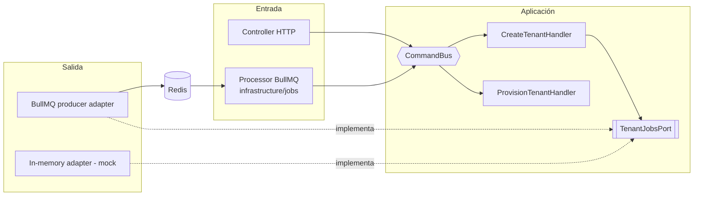
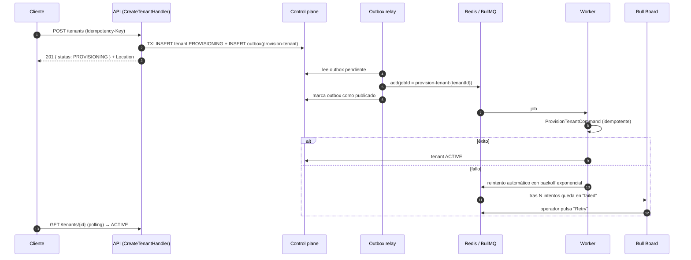

# ASYNC_JOBS_PROPOSAL · api-core

> **Estado: propuesta, no implementada.** Diseño para incorporar trabajos asíncronos (colas) a `api-core` sin romper la arquitectura hexagonal + CQRS. Los fragmentos de código son ilustrativos.

## 1. Problema

Algunas operaciones no deberían ejecutarse dentro del request HTTP:

| Operación | Por qué no síncrona |
|---|---|
| Aprovisionar un tenant (`CREATE DATABASE` + migraciones) | Tarda segundos, ocupa una conexión del control plane y, si el cliente corta, el resultado queda incierto. |
| Enviar notificaciones (email, push, SMS) | Dependen de proveedores externos lentos o caídos. |
| Importaciones/exportaciones masivas, reportes | Minutos de CPU/IO. |
| Tareas programadas (limpiezas, recordatorios) | Con un cron en memoria se ejecutarían en cada instancia. |

Requisitos pedidos:

- Endpoints que respondan rápido y dejen el trabajo en una cola.
- Reintentos **automáticos** con backoff.
- Reintentos **manuales** desde un panel tipo Hangfire.
- Visibilidad del estado de cada trabajo.

## 2. Conceptos en 2 minutos

| Término | Significado |
|---|---|
| **Cola (queue)** | Lista persistente de trabajos pendientes (aquí, en Redis). |
| **Job** | Unidad de trabajo con datos (`{ tenantId, ... }`), id, intentos y estado. |
| **Producer** | Quien encola: un handler de la API. |
| **Worker / consumer** | Proceso que toma jobs de la cola y los ejecuta. |
| **Backoff** | Espera creciente entre reintentos (5 s, 10 s, 20 s…). |
| **Dead letter / failed set** | Donde quedan los jobs que agotaron sus reintentos, para revisión manual. |
| **At-least-once** | Un job puede ejecutarse más de una vez (ej. si el worker muere a mitad). Por eso los handlers deben ser **idempotentes**. |
| **Outbox** | Patrón para no perder jobs: se guardan en la misma transacción que el cambio de negocio y luego se publican. |

## 3. ¿201 o 202?

| Código | Cuándo | Ejemplo |
|---|---|---|
| **201 Created** | El recurso **ya existe** en la base (aunque esté en un estado intermedio). Se devuelve el recurso y la cabecera `Location`. | `POST /tenants` crea el registro con `status: PROVISIONING`, encola el aprovisionamiento y responde 201. El cliente consulta `GET /tenants/{id}` hasta ver `ACTIVE`. |
| **202 Accepted** | Se aceptó una **operación** que aún no produjo un recurso. Se devuelve un id de job y una URL de estado. | `POST /notifications` o `POST /imports` → 202 `{ jobId, statusUrl }`. |

Recomendación:

- 201 para creaciones de recursos con estado (el patrón actual de tenants ya lo soporta).
- 202 para operaciones sin recurso propio.

En ambos casos el envelope estándar no cambia.

## 4. Alternativas evaluadas

| Opción | Infraestructura | Reintentos | Panel | Encaje |
|---|---|---|---|---|
| **BullMQ** | Redis (ya existe en `infra/`) | Automáticos con backoff, manuales desde el panel | **Bull Board** (open source), Taskforce.sh (pago) | ✅ **Recomendada**: madura, integración oficial `@nestjs/bullmq`, mismo cliente `ioredis` que la idempotencia. |
| pg-boss | PostgreSQL | Sí | Básico / de terceros | Válida si no se quisiera Redis; menos tooling y añade carga al Postgres de los tenants. |
| Temporal | Cluster propio | Sí, workflows durables | Excelente | Potente para sagas largas, pero excesivo hoy en operación y aprendizaje. |
| RabbitMQ / SQS | Broker externo | Configurables | Consola del broker | Más orientado a mensajería entre servicios que a jobs con panel. |
| Hangfire | .NET | — | — | No aplica a Node.js. **Bull Board es su equivalente**: lista jobs por estado, muestra errores y payload, y permite reintentar, promover o borrar. |

## 5. Encaje en la arquitectura

La cola es **infraestructura** y el worker es un **adaptador de entrada**, igual que un controller HTTP. Ambos usan los mismos commands y handlers. Por eso el `tenantId` ya viaja explícito en cada command.



### 5.1 Estructura propuesta

```text
src/core/queues/
├── queues.module.ts            # BullModule.forRootAsync(AppConfig.redisUrl), Bull Board protegido
├── job-envelope.ts             # { tenantId?, requestId, attempt, payload } común a todos los jobs
├── job-context.ts              # restaura RequestContext (requestId, tenantId) dentro del worker
├── queue-names.ts              # catálogo único de colas
└── jobs-dashboard.module.ts    # Bull Board en /admin/jobs, solo con auth de plataforma

src/modules/tenants/
├── application/ports/tenant-jobs.port.ts             # enqueueProvisioning(tenantId)
├── infrastructure/jobs/
│   ├── bullmq-tenant-jobs.adapter.ts                 # producer (adapter real)
│   └── tenant-provisioning.processor.ts              # worker → commandBus.execute(ProvisionTenantCommand)
└── infrastructure/mocks/in-memory-tenant-jobs.adapter.ts   # ejecuta en línea o acumula, para tests

src/main.worker.ts              # proceso separado: mismo AppModule sin HTTP, solo processors
```

- **Mismo código, dos procesos**: `main.ts` (API) y `main.worker.ts` (workers) se escalan por separado.
- **Port + mock**: `tenants.jobs` se registra con `provideSwitchableAdapter`. En modo mock el job se ejecuta en memoria y la API funciona sin Redis.

### 5.2 Ejemplo ilustrativo

```ts
// application: el handler no sabe que existe BullMQ
await this.tenants.save(tenant);                     // PROVISIONING
await this.tenantJobs.enqueueProvisioning(tenant.id); // port
return toTenantView(tenant);                          // 201

// infrastructure/jobs: el processor es un adaptador de entrada
@Processor(QueueNames.TenantProvisioning)
export class TenantProvisioningProcessor extends WorkerHost {
  async process(job: Job<JobEnvelope<{ tenantId: string }>>) {
    return runInJobContext(job, () => this.commandBus.execute(new ProvisionTenantCommand(job.data.payload.tenantId)));
  }
}
```

## 6. Flujo completo (aprovisionamiento asíncrono)



## 7. Fiabilidad

| Tema | Decisión propuesta |
|---|---|
| **Doble escritura** (guardar en DB y encolar pueden fallar por separado) | **Transactional outbox** en el control plane: tabla `outbox_messages` escrita en la misma transacción y un relay (repeatable job o loop) que publica a BullMQ. Fase 1 puede encolar directo; el outbox llega en la fase 2. |
| **Duplicados** | `jobId` determinista (`provision-tenant:{tenantId}`): BullMQ ignora un job con el mismo id. Handlers idempotentes (el aprovisionamiento ya lo es, con lock por tenant). |
| **Reintentos automáticos** | `attempts: 5`, `backoff: { type: 'exponential', delay: 5000 }` por defecto. Configurable por cola. |
| **Errores no reintentables** | Los errores de validación o de regla de negocio (`AppError` con categoría `VALIDATION` o `BUSINESS_RULE`) se marcan como fallo definitivo (`UnrecoverableError`), sin reintentos. |
| **Reintentos manuales** | Bull Board (Retry / Retry all) y, para tenants, el endpoint existente `POST /tenants/{id}/provisioning`. |
| **Jobs colgados** | `lockDuration` + detección de *stalled jobs* de BullMQ (se reencolan si el worker muere). |
| **Concurrencia** | `concurrency` por processor (ej. 2 aprovisionamientos a la vez por worker) para proteger Postgres. |
| **Retención** | `removeOnComplete: { age: 24h }`, `removeOnFail: { age: 7d }`. |

## 8. Estado de un job y API

Endpoint genérico para operaciones 202:

```text
GET /api/v1/jobs/{jobId}
→ { success: true, data: { id, type, state: waiting|active|delayed|completed|failed, attempts, progress, resultUrl?, failure?: { code, message } } }
```

- `failure.message` se sanea igual que los errores HTTP: sin stacks ni datos internos.
- Un job solo es visible para el tenant que lo creó (`tenantId` en el envelope del job).

## 9. Multi-tenancy en jobs

- `tenantId` obligatorio en el envelope de todo job de negocio. El worker lo pasa al command; no hay "tenant actual" implícito.
- `requestId` se propaga para correlacionar logs entre API y worker.
- Para evitar que un tenant "ruidoso" bloquee a otros: colas por prioridad y límites por tenant (*rate limiter* de BullMQ o grupos de BullMQ Pro) cuando haga falta.

## 10. Tareas programadas

Sustituyen al `@Cron` de `@nestjs/schedule` que se eliminó en esta refactorización (se habría ejecutado en cada instancia): **repeatable jobs** de BullMQ (`repeat: { pattern: '0 2 * * *' }`). Redis garantiza una sola ejecución por disparo aunque haya muchas instancias.

## 11. Panel tipo Hangfire: Bull Board

- Paquetes: `@bull-board/api`, `@bull-board/express`, `@bull-board/nestjs`.
- Ruta `/admin/jobs`, **excluida** del prefijo público y protegida con autenticación de plataforma (no con usuarios de tenant).
- Permite:
  - ver colas y jobs por estado, payload, stacktrace e intentos;
  - reintentar uno o todos los fallidos;
  - promover jobs demorados;
  - limpiar colas.

## 12. Observabilidad

- Logs con `jobId`, `queue`, `tenantId` y `requestId`.
- Métricas: profundidad de cola, jobs fallidos por minuto y duración (p95).
- Alertas cuando el *failed set* crece o una cola supera un umbral de espera.

## 13. Plan por fases

| Fase | Alcance | Criterio de aceptación |
|---|---|---|
| 1. Infraestructura | `core/queues`, `main.worker.ts`, Bull Board protegido, port + mock de jobs, deps (`bullmq`, `@nestjs/bullmq`, `@bull-board/*`). | Un job de ejemplo con reintentos visible en el panel; tests unitarios con el mock y de integración con Redis. |
| 2. Tenants asíncronos | `POST /tenants` → 201 `PROVISIONING` + job; outbox en el control plane. | El e2e verifica el paso a `ACTIVE`; los reintentos automáticos y manuales funcionan; no se pierden jobs si Redis cae tras el commit. |
| 3. Notificaciones | Módulo `notifications` con port `NotificationSender` (adapter real + mock) y cola dedicada. | Emails reintentados con backoff; fallos definitivos visibles en el panel. |
| 4. Estado y observabilidad | `GET /jobs/{id}`, métricas y alertas. | Dashboard operativo y alertas probadas. |

## 14. Riesgos y decisiones abiertas

- **Redis pasa a ser crítico**: necesita persistencia (AOF), AUTH/TLS y, en producción, alta disponibilidad (Sentinel o servicio gestionado).
- **Consistencia eventual**: el frontend debe manejar estados intermedios (`PROVISIONING`) y hacer polling (o, más adelante, SSE/WebSockets).
- **Decisiones para el equipo**:
  1. ¿Polling o notificación push para el resultado?
  2. ¿Panel solo interno (VPN) o también con autenticación de plataforma?
  3. ¿Retención de jobs fallidos (7 días propuesto)?
