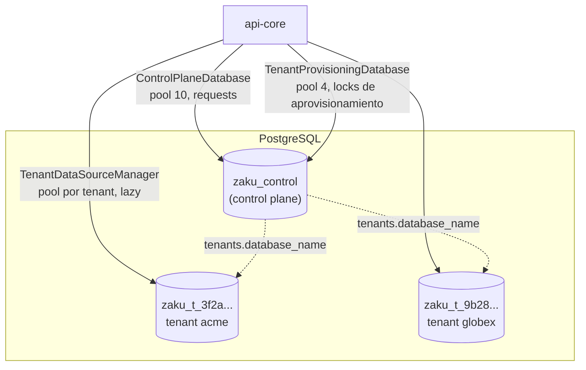

# DATABASE · api-core

Cómo usa api-core las bases de datos: conexiones, pools, aprovisionamiento de tenants y tests contra Postgres.

La estrategia de datos del sistema está en el [DATABASE.md general](../../../docs/DATABASE.md): una DB por tenant, el esquema, los estados del tenant y las migraciones. Arquitectura de api-core en [ARCHITECTURE.md §6](./ARCHITECTURE.md#6-multi-tenancy-una-base-de-datos-por-tenant).

## 1. Topología de conexiones

| Base | Contenido | Quién la usa en api-core |
|---|---|---|
| `zaku_control` (`CONTROL_DATABASE_NAME`) | Registro global de tenants. | Módulo `tenants` vía `ControlPlaneDatabase`. |
| `zaku_t_<uuid sin guiones>` | Datos de un tenant (hoy `users`). | Módulos de negocio vía `TenantDataSourceManager.dataSourceFor(tenantId)`. |

## 2. Dónde vive cada pieza dentro de api-core

| Pieza | Ubicación | Por qué |
|---|---|---|
| Entidades ORM | `src/modules/<x>/infrastructure/persistence/typeorm/*.orm-entity.ts` | El mapeo pertenece al módulo dueño de los datos. |
| Registro de entidades | `DatabaseModule.forFeature({ controlPlane: [...] })` / `({ tenant: [...] })` en el `*.module.ts` | Permite que `core` cree DataSources sin importar módulos. |
| Conexiones | `src/core/database/` | Infraestructura transversal. |

Las migraciones y el naming de las DBs viven en `packages/database-lib` ([DATABASE.md general §4](../../../docs/DATABASE.md#4-dónde-vive-cada-pieza)).

> `DatabaseModule.forFeature()` registra las entidades en un registro global del proceso al importarse el módulo. Es intencional (mismo patrón que `@nestjs/typeorm`): los DataSources se crean de forma lazy después de cargar todos los módulos.

## 3. Conexiones

Todas las conexiones se gestionan con `LazyDataSource` (`core/database/lazy-data-source.ts`):

- **Lazy:** nada se conecta al arrancar; la primera query abre el DataSource. En modo mock, Postgres nunca se toca.
- **Una sola apertura:** las llamadas concurrentes comparten la misma apertura en curso.
- **Fallos:** si la conexión falla, se descarta y la siguiente request lo reintenta.

Pools:

- **Control plane, requests (`ControlPlaneDatabase`):** pool de 10 conexiones.
- **Control plane, locks de aprovisionamiento (`TenantProvisioningDatabase`):** pool aparte de 4 conexiones. Cada aprovisionamiento retiene una sesión durante todo el proceso, así que no deben consumir el pool que atiende las requests. Con más de 4 aprovisionamientos simultáneos, los siguientes esperan su turno (hasta `DATABASE_CONNECTION_TIMEOUT_MS`).
- **Tenants (`TenantDataSourceManager`):** un DataSource por DB de tenant, creado la primera vez que se usa y cacheado. El pool tiene `TENANT_DATABASE_POOL_MAX` conexiones (por defecto 5) con `idleTimeout`, así que un tenant inactivo no retiene conexiones abiertas.

Configuración y cierre:

- **Timeouts:** `DATABASE_CONNECTION_TIMEOUT_MS` para conectar y `DATABASE_STATEMENT_TIMEOUT_MS` por sentencia.
- **TLS:** `DATABASE_SSL=true` activa SSL con verificación de certificado (también en los scripts de migración).
- **Shutdown:** `enableShutdownHooks()` cierra todos los DataSources al detener la app.

Errores transitorios:

- **Cuáles son:** no se puede conectar, pool agotado, timeout de sentencia (`57014`) o conexión caída (clase `08`).
- **Qué devuelven:** `503 DATABASE_UNAVAILABLE`, en cualquier momento de la request y sin exponer nombres internos.
- **Errores de SQL o de esquema** (ej. una tabla inexistente): siguen siendo `500 INTERNAL_ERROR`, y el detalle solo aparece en el log.

### 3.1 Escalado

El número máximo de conexiones es `instancias × (10 + 4 + aprovisionamientos_en_curso + tenants_con_tráfico_simultáneo × TENANT_DATABASE_POOL_MAX)`: control plane, locks de aprovisionamiento, DataSource temporal de migración (1 por aprovisionamiento) y pools de tenant. Con muchos tenants activos a la vez esto supera `max_connections` de Postgres. Antes de producción a escala:

1. **PgBouncer** en modo transaction delante de Postgres (sin cambios de código).
2. Desalojo LRU de DataSources inactivos en `TenantDataSourceManager`.
3. Distribuir tenants en varios servidores. Requiere guardar host/puerto por tenant en el control plane y que el manager los resuelva desde ahí (hoy deriva solo el nombre).

## 4. Aprovisionamiento de un tenant

Lo coordina `TenantProvisioningWorkflow` (aplicación) con dos ports:

1. **`TenantProvisioningLockPort.runExclusively(tenantId, …)`** (adapter `PostgresTenantProvisioningLock`):
   - toma `pg_try_advisory_lock(hashtext('tenant-provisioning:<id>'))` en una sesión dedicada;
   - si otra instancia lo tiene, responde `409 TENANT_PROVISIONING_IN_PROGRESS` sin tocar el estado;
   - el lock es de sesión: si el proceso muere, Postgres lo libera.
2. Dentro del lock, el workflow guarda el tenant en `PROVISIONING` (en un reintento, antes lo **relee** para partir del estado real) y llama a:
3. **`TenantDatabaseProvisionerPort.provision(tenantId)`** (adapter `PostgresTenantDatabaseProvisioner`):
   1. calcula y valida el nombre de la DB;
   2. `SELECT 1 FROM pg_database WHERE datname = $1`, y `CREATE DATABASE` si no existe (fuera de transacción, como exige Postgres);
   3. abre un DataSource temporal (pool 1) y ejecuta `tenantMigrations` con `transaction: 'each'`.
4. El workflow guarda `ACTIVE` o, si algo falló, `FAILED` con el motivo (uso interno, no se expone por la API). Al final se libera el lock.

Todos los pasos son **idempotentes**: reintentar sobre una DB a medio crear la completa sin duplicar nada. Repetir `POST /tenants` con el mismo slug de un tenant `FAILED` o `PROVISIONING` reanuda ese tenant.

El rol de base de datos necesita el permiso `CREATEDB`.

## 5. Añadir una tabla a las DBs de tenant

Antes, lee las [reglas de migraciones](../../../docs/DATABASE.md#51-reglas).

1. Crear `packages/database-lib/src/tenant/migrations/<timestamp>-create-<tabla>.ts` y añadirla a `tenantMigrations`.
2. Crear `modules/<x>/infrastructure/persistence/typeorm/<x>.orm-entity.ts` con los mismos tipos, nombres de constraints e índices.
3. Registrarla en el módulo: `DatabaseModule.forFeature({ tenant: [XOrmEntity] })`.
4. `pnpm --filter @zaku/database-lib build`.
5. Tenants existentes: `pnpm db:migration:run`. Tenants nuevos: se migran solos al aprovisionarse.
6. `pnpm --filter api-core test:integration`. El test de drift recorre **todas** las entidades registradas con `DatabaseModule.forFeature`, así que la nueva tabla queda cubierta sin tocar el test.

## 6. Tests contra base de datos

- `test:integration` usa una base de control aislada, `zaku_control_test`.
- El setup global la crea y la migra. Antes y después de la suite **borra todas las DBs de tenant registradas en esa base** y vacía su tabla `tenants`.
- **Salvaguarda:** el setup se niega a ejecutarse si `CONTROL_DATABASE_NAME` no termina en `_test` o si `DATABASE_HOST` no es local. Nunca exportes en la shell `CONTROL_DATABASE_NAME=zaku_control` antes de lanzar estos tests.
- Los tests no necesitan datos previos: cada uno crea sus tenants.
- `postgres-adapters.int-spec.ts` ejecuta contra Postgres las mismas suites de contrato que los mocks pasan en los tests unitarios.
