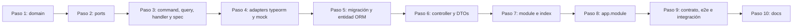

# DEVELOPMENT · api-core

Guía práctica para trabajar en `apps/api-core`. Antes de escribir código, lee [ARCHITECTURE.md](./ARCHITECTURE.md) y [CLEAN_CODE.md](./CLEAN_CODE.md). Si es tu primera vez en el proyecto, empieza por [ONBOARDING.md](./ONBOARDING.md): recorre una request archivo por archivo y construye un endpoint de ejemplo.

## 1. Requisitos

Los requisitos del monorepo (Node, pnpm y Docker) y los comandos de la raíz están en el [DEVELOPMENT.md general](../../../docs/DEVELOPMENT.md). api-core necesita Node 22.12+: es lo que exigen las librerías de Scalar, y es la primera versión de la rama 22 que carga con `require` paquetes que solo publican ESM.

## 2. Puesta en marcha

### 2.1 Modo real (Postgres + Redis)

1. Si es tu primera vez en el monorepo, ejecuta antes `pnpm install` y `pnpm build` en la raíz ([primer arranque](../../../docs/DEVELOPMENT.md#2-primer-arranque)): la API carga `@zaku/database-lib` desde su `dist` al ejecutarse. Después levanta Postgres y Redis (`pnpm infra:up`) y crea y migra las bases de datos (`pnpm db:migration:run`).

2. Copia `apps/api-core/.env.example` a `apps/api-core/.env`. `NODE_ENV` y `JWT_SECRET` son **obligatorias**: cambia `JWT_SECRET` por un valor propio.

3. Arranca la API:

   ```bash
   pnpm --filter api-core dev
   ```

Direcciones:

- API: `http://localhost:3000/api/v1`
- Swagger UI: `http://localhost:3000/api/documentation/swagger` (el JSON OpenAPI está en `/api/documentation/swagger-json`)
- Scalar: `http://localhost:3000/api/documentation/scalar` (la misma especificación con otra interfaz)
- Health: `http://localhost:3000/health`

### 2.2 Modo mock (sin Docker)

Haz los pasos 1 (sin `infra:up` ni `db:migration:run`) y 2 de §2.1. Antes de arrancar, añade en `apps/api-core/.env`:

```dotenv
MOCK_ADAPTERS=*
MOCK_SEED_DATA=true
```

- Después arranca la API (paso 3 de §2.1). `nest start --watch` no recarga el `.env`: si lo cambias, reinicia.
- Se crean datos de demo: el tenant `00000000-0000-4000-8000-000000000001` y el usuario `demo@zaku.dev` / `demo-password`. Son las mismas identidades que usan los mocks de web-core.
- Los datos viven en memoria y se pierden al reiniciar.

**Mezclar real y mock.** Ejemplo, Postgres real con la idempotencia en memoria:

```dotenv
MOCK_ADAPTERS=idempotency.store
```

- **Selectores válidos:** `*`, `<modulo>.*` y `<modulo>.<port>`. La lista de claves está en los archivos `*-adapter-keys.ts`.
- **Si un selector no coincide con ningún adapter**, la app no arranca.
- **`MOCK_SEED_DATA=true` también impide arrancar** si alguno de los repositorios de `tenants` o `users` es real.

## 3. Variables de entorno

| Variable | Defecto | Valores / descripción |
|---|---|---|
| `NODE_ENV` | **obligatoria** | `development`, `test` o `production`. |
| `PORT` | `3000` | 1–65535. |
| `JWT_SECRET` | **obligatoria** | Mínimo 16 caracteres (32 en producción). También deriva la clave HMAC de idempotencia. |
| `JWT_EXPIRES_IN_SECONDS` | `3600` | 60–86400. |
| `DATABASE_HOST` / `DATABASE_PORT` | `localhost` / `5432` | Servidor Postgres. |
| `DATABASE_USER` / `DATABASE_PASSWORD` | `postgres` / `postgres` | En producción está prohibido el password por defecto. El rol necesita `CREATEDB`. |
| `DATABASE_SSL` | `false` | TLS con verificación de certificado. |
| `CONTROL_DATABASE_NAME` | `zaku_control` | DB del control plane. |
| `TENANT_DATABASE_POOL_MAX` | `5` | 1–50 conexiones por DB de tenant. |
| `DATABASE_POOL_IDLE_TIMEOUT_MS` | `30000` | ≥ 1000. Cierra las conexiones ociosas. |
| `DATABASE_CONNECTION_TIMEOUT_MS` | `5000` | ≥ 500. |
| `DATABASE_STATEMENT_TIMEOUT_MS` | `30000` | ≥ 1000. |
| `TENANT_STATUS_CACHE_TTL_MS` | `30000` | 0–300000. Cache del "tenant activo" (0 = sin cache). |
| `REDIS_URL` | `redis://localhost:6379` | Store de idempotencia (`rediss://` para TLS). |
| `TRUST_PROXY` | `false` | Valor de `trust proxy` de Express: `true`, número de saltos (`1`) o subredes separadas por comas. Necesario detrás de un balanceador para que el rate limit vea la IP real. |
| `RATE_LIMIT_WINDOW_MS` | `60000` | ≥ 1000. |
| `RATE_LIMIT_MAX_REQUESTS` | `300` | ≥ 1, por IP y ruta en cada ventana. |
| `RATE_LIMIT_CREDENTIALS_MAX_REQUESTS` | `10` | ≥ 1, intentos de login/registro por cuenta (tenant + email) en cada ventana. |
| `RATE_LIMIT_CREDENTIALS_PER_IP_MAX_REQUESTS` | `60` | ≥ 1, intentos de login/registro por IP de cliente en cada ventana (frena el password spraying). |
| `SWAGGER_ENABLED` | `true` fuera de producción | Publica Swagger UI en `/api/documentation/swagger`. |
| `SCALAR_ENABLED` | `true` fuera de producción | Publica la referencia Scalar en `/api/documentation/scalar`. |
| `MOCK_ADAPTERS` | vacío | Ver §2.2. Prohibido en producción. |
| `MOCK_SEED_DATA` | `false` | Datos demo. Prohibido en producción; exige los repositorios mockeados. |

## 4. Comandos

### 4.1 Raíz del monorepo

Los comandos de turbo (`pnpm build`, `pnpm test`, `pnpm run ci`…), los de infraestructura y los de migraciones están en el [DEVELOPMENT.md general §3](../../../docs/DEVELOPMENT.md#3-comandos-de-la-raíz).

### 4.2 `apps/api-core` (`pnpm --filter api-core <script>`)

| Script | Qué hace |
|---|---|
| `dev` | `nest start --watch`. |
| `build` | Compila a `dist/` (reescribe los aliases). |
| `start` | Ejecuta `dist/main.js`. **No compila**: antes hay que correr `build`. |
| `test` | Unit + architecture + e2e. |
| `test:unit` | Unit + architecture. |
| `test:e2e` | Solo los e2e. |
| `test:cov` | Unit + architecture (el mismo proyecto que `test:unit`) con los umbrales de cobertura. Es el gate de CI. |
| `test:integration` | Adapters reales y suites de contrato contra Docker. Requiere `pnpm infra:up`. |
| `lint` / `typecheck` | ESLint con tipos / TypeScript. |
| `smoke` | Arranca `dist/main.js` en modo mock y comprueba `/health`, Swagger y Scalar. Requiere `build`. Es la única prueba que carga las librerías reales que en Jest se sustituyen por stubs. |

## 5. Endpoints actuales

| Método | Ruta | Auth | Tenant | Idempotencia |
|---|---|---|---|---|
| GET | `/health` | pública | no | — |
| POST | `/api/v1/tenants` | pública ⚠️ | no | obligatoria |
| GET | `/api/v1/tenants?page&pageSize` | pública ⚠️ | no | — |
| GET | `/api/v1/tenants/{tenantId}` | pública ⚠️ | no | — |
| POST | `/api/v1/tenants/{tenantId}/provisioning` | pública ⚠️ | no | opcional |
| POST | `/api/v1/user-auth/register` | pública | header `x-tenant-id` | opcional |
| POST | `/api/v1/user-auth/login` | pública | header `x-tenant-id` | — |
| POST | `/api/v1/users` | Bearer | del token | opcional |
| GET | `/api/v1/users?page&pageSize` | Bearer | del token | — |
| GET | `/api/v1/users/{userId}` | Bearer | del token | — |

⚠️ Ver los riesgos en [ARCHITECTURE.md §12](./ARCHITECTURE.md#12-riesgos-conocidos-y-deuda-técnica-intencional).

> web-core consume algunos de estos endpoints. Antes de cambiar uno, revisa el [contrato entre apps](../../../docs/ARCHITECTURE.md#4-contrato-http-entre-apps): qué endpoints usa y qué hay que cambiar en el mismo PR.

Ejemplo de flujo con curl:

1. Crear un tenant:

   ```bash
   curl -X POST http://localhost:3000/api/v1/tenants -H "Content-Type: application/json" -H "Idempotency-Key: 6f1c2b1e-8d0a-4c5e-9b8f-2f3d4c5b6a7e" -d '{"slug":"acme","name":"Acme Corp"}'
   ```

2. Registrar un usuario en ese tenant:

   ```bash
   curl -X POST http://localhost:3000/api/v1/user-auth/register -H "Content-Type: application/json" -H "x-tenant-id: <tenantId>" -d '{"email":"jane@acme.com","password":"secure-password"}'
   ```

3. Iniciar sesión:

   ```bash
   curl -X POST http://localhost:3000/api/v1/user-auth/login -H "Content-Type: application/json" -H "x-tenant-id: <tenantId>" -d '{"email":"jane@acme.com","password":"secure-password"}'
   ```

4. Listar usuarios con el token obtenido:

   ```bash
   curl http://localhost:3000/api/v1/users -H "Authorization: Bearer <accessToken>"
   ```

## 6. Guías paso a paso

### 6.1 Crear un módulo nuevo

Ejemplo: un módulo `projects` con "crear proyecto" y "listar proyectos". Copia la estructura de `modules/users`. Para añadir un endpoint a un módulo que ya existe, sigue [ONBOARDING §6](./ONBOARDING.md#6-tu-primer-endpoint-paso-a-paso).



1. **Dominio** (`domain/`): `project.ts` con `create()`/`restore()`/`toSnapshot()`, los value objects y `errors/project.errors.ts` (subclases de `AppError`). Sus tests van en `test/unit/modules/projects/domain/`, con la misma ruta que cada archivo.
2. **Ports** (`application/ports/project.repository.port.ts`):

   ```ts
   export const PROJECT_REPOSITORY = Symbol('PROJECT_REPOSITORY');

   export interface ProjectRepositoryPort {
     save(tenantId: string, project: Project): Promise<void>;
     findPage(tenantId: string, request: PageRequest): Promise<Page<Project>>;
   }
   ```

3. **Caso de uso** (`application/commands/create-project/`):

   ```ts
   export class CreateProjectCommand extends Command<ProjectView> {
     constructor(readonly tenantId: string, readonly name: string) {
       super();
     }
   }

   @CommandHandler(CreateProjectCommand)
   export class CreateProjectHandler implements ICommandHandler<CreateProjectCommand> {
     constructor(@Inject(PROJECT_REPOSITORY) private readonly projects: ProjectRepositoryPort) {}

     async execute(command: CreateProjectCommand): Promise<ProjectView> {
       const project = Project.create(ProjectName.create(command.name));
       await this.projects.save(command.tenantId, project);
       return toProjectView(command.tenantId, project);
     }
   }
   ```

   Y su test en `test/unit/modules/projects/application/commands/create-project/create-project.handler.spec.ts`, usando `InMemoryProjectRepository`.
4. **Adapters:**
   - `infrastructure/persistence/typeorm/`: entidad, mapper y `TypeOrmProjectRepository`, que usa `TenantDataSourceManager` y ordena con `createdAt DESC, id ASC`.
   - `infrastructure/mocks/in-memory-project.repository.ts`: ordena con `newestFirst`.
   - Clave en `infrastructure/projects-adapter-keys.ts`: `{ repository: 'projects.repository' }`.
5. **Migración** en `packages/database-lib/src/tenant/migrations/` (ver [DATABASE.md §5](./DATABASE.md#5-añadir-una-tabla-a-las-dbs-de-tenant)).
6. **HTTP:** `infrastructure/http/projects.controller.ts`.
   - Solo despacha por el bus y obtiene el tenant con `@CurrentTenantId()`.
   - DTOs con class-validator + `@ApiProperty` que implementan su interfaz de `@zaku/shared-types` (añádela en `packages/shared-types/src/index.ts` y compila el paquete), y `@ApiEnvelope(...)` en cada ruta.
   - Las rutas exigen autenticación y tenant por defecto.
7. **Módulo:**

   ```ts
   @Module({
     imports: [DatabaseModule.forFeature({ tenant: [ProjectOrmEntity] })],
     controllers: [ProjectsController],
     providers: [
       CreateProjectHandler,
       ListProjectsHandler,
       provideSwitchableAdapter<ProjectRepositoryPort>({
         provide: PROJECT_REPOSITORY,
         key: ProjectsAdapterKeys.repository,
         real: TypeOrmProjectRepository,
         mock: InMemoryProjectRepository,
       }),
     ],
   })
   export class ProjectsModule {}
   ```

   `index.ts` exporta **solo** contratos: commands, queries, tipos de views, los DTOs HTTP que otros módulos necesiten y los tipos de dominio que formen parte de esos contratos.
8. **Registro:** añade el módulo a `src/app.module.ts`.
9. **Tests:**
   - una suite de contrato en `test/contracts/project-repository.contract.ts`, que se ejecuta desde la spec del mock y desde un `*.int-spec.ts` contra TypeORM;
   - e2e en `test/e2e/projects.e2e-spec.ts`, con `createTestApp()`; cada `it` crea su propio tenant.
10. **Docs:** actualiza la tabla de endpoints de este documento y, si hay `code`s de error nuevos, el catálogo de ARCHITECTURE §7.1.

El architecture test falla, entre otros casos, si:

- el handler no está en `providers`;
- el command o la query no extiende `Command<T>` / `Query<T>`;
- `domain/` o `application/` importan algo fuera de su allowlist;
- un adapter real se cablea fuera de `provideSwitchableAdapter`;
- se importa otro módulo por una ruta profunda, o su `index.ts` exporta algo que no es un contrato;
- hay un test dentro de `src/`, o un spec de `test/unit/` que no está en la ruta espejo del archivo que prueba.

La lista completa está en [CLEAN_CODE §7.1](./CLEAN_CODE.md#71-qué-verifica-el-architecture-test).

### 6.2 Llamar a otro módulo

```ts
import { VerifyUserCredentialsQuery } from '@modules/users';

const user = await this.queryBus.execute(new VerifyUserCredentialsQuery(tenantId, email, Secret.of(password)));
```

Nunca se inyectan servicios ni repositorios de otro módulo. Si el contrato que necesitas no existe, se crea un command o query en el módulo dueño y se exporta en su `index.ts`.

### 6.3 Añadir un adapter conmutable (real + mock)

1. Define el port en `application/ports/`.
2. Crea el adapter real en `infrastructure/adapters/` o en `infrastructure/persistence/`.
3. Crea el mock en `infrastructure/mocks/`: sin dependencias, con estado en memoria y el mismo comportamiento observable (unicidad, orden, copias, serialización).
4. Escribe la suite de contrato en `test/contracts/` y ejecútala contra ambos adapters.
5. Declara la clave `'<modulo>.<port>'` en `<modulo>-adapter-keys.ts`.
6. Regístralo con `provideSwitchableAdapter(...)`.
7. Esto es solo para I/O externo. Una librería local (hashing, firma) se registra con `{ provide, useClass }`, sin mock.

### 6.4 Hacer un endpoint idempotente

Elige **una** de las dos variantes:

```ts
@Post()
@Idempotent()                         // opcional
```

```ts
@Post()
@Idempotent({ required: true })       // obligatoria; añade lockTtlMs si la operación tarda más de 60 s
```

El cliente envía `Idempotency-Key: <uuid>` y debe reutilizarla en los reintentos de **la misma** operación. La ruta debe devolver un DTO plano, no un `Page`.

### 6.5 Rutas especiales

| Necesidad | Decorador |
|---|---|
| Ruta sin login | `@Public()` |
| Ruta que no pertenece a un tenant (plataforma, health) | `@TenantAgnostic()` |
| Ruta pública de tenant, como el login (el cliente manda `x-tenant-id`) | `@Public()`. Añade `@ApiTenantHeader()` para documentar la cabecera en Swagger; no cambia el comportamiento. |
| Login, registro y similares | `@CredentialsRateLimit()` (cuenta por tenant + `email` del body; si el body no trae `email`, por IP) |
| Mensaje de éxito propio | `@ResponseMessage('...')` |
| Respuesta sin envelope | `@RawResponse()` |

## 7. Tests

Todos los tests viven en `apps/api-core/test/`; en `src/` no hay ninguno. El árbol de carpetas está en [ONBOARDING §8](./ONBOARDING.md#8-dónde-va-cada-test) y las reglas en [CLEAN_CODE §7](./CLEAN_CODE.md#7-tests).

Unit + architecture + e2e:

```bash
pnpm --filter api-core test
```

Integración (requiere `pnpm infra:up`):

```bash
pnpm --filter api-core test:integration
```

Cobertura:

```bash
pnpm --filter api-core test:cov
```

- **Modo mock de los e2e:** `test/setup/mock-environment.setup.ts` fija `MOCK_ADAPTERS=*` y apunta Postgres y Redis a hosts `*.invalid`, para que ningún adapter real toque tu entorno.
- **Variables en un e2e concreto:** llama a `overrideEnvironment({...})` en `beforeAll`, antes de `createTestApp()`, y restáuralas en `afterAll` (ver `rate-limiting.e2e-spec.ts`).
- **Helpers compartidos** (`test/support/`):
  - `createTestApp`, `createActiveTenant`, `registerUser`, `login`, `registerAndLogin`, `uniqueEmail`, `mockTenantProvisioner` (`test-app.ts`);
  - `buildAppConfig`, `buildMockSwitch`, `FakePasswordHasher`, `httpExecutionContext`.

## 8. Problemas frecuentes

Los problemas comunes a todo el monorepo (paquetes sin compilar, `pnpm ci`…) están en el [DEVELOPMENT.md general §6](../../../docs/DEVELOPMENT.md#6-problemas-frecuentes).

| Síntoma | Causa | Solución |
|---|---|---|
| `Invalid environment configuration: NODE_ENV...` | Falta `.env`. | Copiar `.env.example`. |
| `ERR_REQUIRE_ESM` al arrancar la API | Node anterior a 22.12: no puede cargar con `require` las dependencias ESM de Scalar. | Actualizar Node (ver §1). |
| `SyntaxError: Unexpected token 'export'` en Jest tras añadir una librería | La librería, o una dependencia suya, solo publica ESM. | Mapearla a un stub en `moduleNameMapper` de `jest.config.ts`, como `@scalar/nestjs-api-reference` (CLEAN_CODE §7.3). |
| `MOCK_ADAPTERS selectors match no switchable adapter` | Typo en el selector. | Usar una clave de un `*-adapter-keys.ts`. |
| `MOCK_SEED_DATA=true requires the "..." adapter to be mocked` | Seed activo con un repositorio real. | Mockear `tenants.*` y `users.*`, o desactivar el seed. |
| `503 DATABASE_UNAVAILABLE` | Postgres apagado, credenciales erróneas o pool/timeout. | `pnpm infra:up` y revisar `DATABASE_*`. |
| `503 IDEMPOTENCY_STORE_UNAVAILABLE` en `POST /tenants` | Redis apagado (la key es obligatoria en esa ruta). | `pnpm infra:up`, o `MOCK_ADAPTERS=idempotency.store` en desarrollo. |
| `500 INTERNAL_ERROR` y en el log `relation "tenants" does not exist` | Control plane sin migrar. | `pnpm db:migration:run`. |
| `403 TENANT_UNAVAILABLE` | El tenant no existe o está `FAILED`, `PROVISIONING` o `SUSPENDED`. | `GET /api/v1/tenants/{id}` y reintentar el aprovisionamiento. |
| `503 TENANT_PROVISIONING_FAILED` | Falló la creación o migración de la DB del tenant. | Repetir el mismo `POST /tenants` o `POST /api/v1/tenants/{id}/provisioning` con el id de `error.details`. |
| `429 TOO_MANY_REQUESTS` para todos los usuarios a la vez | API detrás de un proxy sin `TRUST_PROXY`. | Configurar `TRUST_PROXY`. |
