# ONBOARDING · api-core

Esta guía explica, con los archivos reales de `apps/api-core`:

- cómo viaja una request desde que entra hasta que sale;
- qué hace cada carpeta;
- cómo se conectan el command, el bus y el handler;
- cómo crear tu primer endpoint.

Es la versión didáctica. Las reglas formales están en:

- [ARCHITECTURE.md](./ARCHITECTURE.md): qué es cada pieza y por qué existe.
- [CLEAN_CODE.md](./CLEAN_CODE.md): cómo se escribe el código y los tests.
- [DEVELOPMENT.md](./DEVELOPMENT.md): recetas de referencia (módulo nuevo, adapter conmutable, idempotencia…).

Antes de seguir, ten la API corriendo ([DEVELOPMENT §2](./DEVELOPMENT.md#2-puesta-en-marcha)). Cómo encaja api-core con web-core está en la [arquitectura general](../../../docs/ARCHITECTURE.md).

Contenido:

1. [El modelo mental: un restaurante](#1-el-modelo-mental-un-restaurante)
2. [Qué responde cada carpeta](#2-qué-responde-cada-carpeta)
3. [Para qué sirve `index.ts`](#3-para-qué-sirve-indexts)
4. [Recorrido completo de `POST /api/v1/users`](#4-recorrido-completo-de-post-apiv1users)
5. [Command, handler, view y bus](#5-command-handler-view-y-bus)
6. [Tu primer endpoint, paso a paso](#6-tu-primer-endpoint-paso-a-paso)
7. [Variantes: ¿y si mi endpoint…?](#7-variantes-y-si-mi-endpoint)
8. [Dónde va cada test](#8-dónde-va-cada-test)
9. [Errores frecuentes al empezar](#9-errores-frecuentes-al-empezar)

## 1. El modelo mental: un restaurante

| Pieza | En el restaurante | En el código | Ejemplo en `users` |
|---|---|---|---|
| Controller | El mesero: toma el pedido y lo lleva a la cocina. No cocina. | `infrastructure/http/*.controller.ts` | `UsersController` |
| Command / Query | La comanda: un papel con lo que se pidió. No hace nada por sí sola. | `application/commands/<caso>/<caso>.command.ts` (o `queries/`) | `CreateUserCommand` |
| Bus | La ventanilla: entrega cada comanda al cocinero que sabe prepararla. | `CommandBus` / `QueryBus` de `@nestjs/cqrs` | — |
| Handler | El cocinero: sigue la receta, es decir, el caso de uso. | `<caso>.handler.ts`, en la misma carpeta que su comanda | `CreateUserHandler` |
| Dominio | Las reglas de la cocina: qué ingrediente es válido y qué combinación está prohibida. | `domain/` | `Email`, `User`, `assertPasswordMeetsPolicy` |
| Port | "Necesito un proveedor de carne": el contrato, sin decir cuál. | `application/ports/*.port.ts` | `UserRepositoryPort` |
| Adapter | El proveedor concreto: el real (Postgres) o el de práctica (memoria). | `infrastructure/persistence/`, `adapters/`, `mocks/` | `TypeOrmUserRepository`, `InMemoryUserRepository` |
| View | El plato que sale de la cocina. | `application/views/*.view.ts` | `UserView` |
| Response DTO | Cómo se presenta el plato en la mesa (formato HTTP). | `infrastructure/http/dtos/*.response.dto.ts` | `UserResponseDto` |
| `core/` | El edificio: puerta, seguridad, caja. Es igual para todos los platos. | `src/core/` | guards, envelope, idempotencia |

La idea clave es que **las dependencias apuntan hacia adentro**:

- El cocinero (handler) no sabe quién es el mesero ni qué proveedor concreto le trae la carne.
- Solo conoce la comanda y el contrato del proveedor (el port).

Por eso el mismo handler funciona desde HTTP, desde un worker de colas o desde un test, y con Postgres o con memoria.

## 2. Qué responde cada carpeta

### 2.1 Dentro de un módulo

| Carpeta o archivo | Pregunta que responde | En `modules/users` |
|---|---|---|
| `domain/` | ¿Qué reglas son siempre ciertas, venga de donde venga la orden? | `user.ts`, `value-objects/email.ts`, `password-policy.ts`, `errors/user.errors.ts` |
| `application/commands/` | ¿Qué cambios de estado ofrece el módulo? | `create-user/` |
| `application/queries/` | ¿Qué preguntas sabe responder? | `get-user-by-id/`, `list-users/`, `verify-user-credentials/` |
| `application/ports/` | ¿Qué necesita del exterior, sin decir cómo se consigue? | `user.repository.port.ts`, `password-hasher.port.ts` |
| `application/views/` | ¿Qué forma tienen los datos que devuelven los handlers? | `user.view.ts` |
| `infrastructure/http/` | ¿Cómo se llega al módulo por HTTP? | `users.controller.ts`, `dtos/` |
| `infrastructure/persistence/` | ¿Cómo se guarda en Postgres? | `typeorm/` (entidad ORM, mapper y repositorio) |
| `infrastructure/adapters/` | ¿Qué otras tecnologías implementan ports? | `bcrypt-password.hasher.ts` |
| `infrastructure/mocks/` | ¿Cómo funciona el módulo sin Docker? | `in-memory-user.repository.ts`, `users-mock.seeder.ts` |
| `users.module.ts` | ¿Qué piezas existen y cómo se conectan? | registra el controller, los handlers y los adapters |
| `index.ts` | ¿Qué pueden usar los demás módulos? | ver §3 |

> `infrastructure/mocks/` **no son tests**. Es código de `src/` que solo se activa cuando arrancas la API con `MOCK_ADAPTERS` (modo sin Docker, prohibido en producción). Los tests lo reutilizan como *fake*, pero los tests en sí viven en `test/` (§8).

### 2.2 La dirección de la request frente a la dirección de las dependencias

Las carpetas se leen de adentro hacia afuera (`domain` → `application` → `infrastructure`), pero la request entra por fuera:

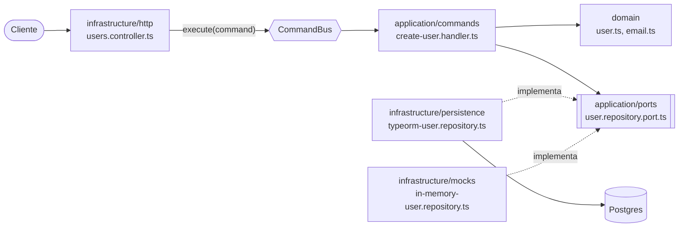

- La request **entra** por `infrastructure/http`. El controller entrega el command al bus: depende del command, no del handler.
- El handler, en `application`, usa el `domain`.
- Cuando necesita algo del exterior, **sale** por un port hacia un adapter de `infrastructure`.
- El handler llama al port (la interfaz) y nunca importa el adapter. Nest le inyecta el adapter elegido al arrancar.

### 2.3 Fuera de los módulos

| Carpeta | Qué contiene | Cuándo la tocas |
|---|---|---|
| `src/main.ts` | Arranca la app y aplica `configureHttpApp`. | Casi nunca. |
| `src/app.module.ts` | Composition root: importa `CoreModule` y los módulos de negocio. | Al crear un módulo nuevo. |
| `src/core/` | Infraestructura transversal: config, guards, envelope, idempotencia, mocks, DB. | Cuando el cambio afecta a **todas** las requests, o es una pieza que cualquier módulo puede necesitar (como un decorador). |
| `src/common/` | TypeScript puro sin frameworks: `AppError`, `Page`, `Secret`. | Cuando algo sin estado ni I/O se reutiliza en varios sitios. |

La diferencia entre `core` y `common` está explicada en [ARCHITECTURE §3](./ARCHITECTURE.md#3-dónde-va-cada-cosa-core-common-o-modules).

## 3. Para qué sirve `index.ts`

Es la **recepción** del módulo: lo único que otro módulo puede pedirle. Este es el de `users`:

```ts
export { CreateUserCommand } from './application/commands/create-user/create-user.command';
export { GetUserByIdQuery } from './application/queries/get-user-by-id/get-user-by-id.query';
export { ListUsersQuery } from './application/queries/list-users/list-users.query';
export { VerifyUserCredentialsQuery } from './application/queries/verify-user-credentials/verify-user-credentials.query';
export type { UserView } from './application/views/user.view';
export { CreateUserRequestDto } from './infrastructure/http/dtos/create-user.request.dto';
export { UserResponseDto } from './infrastructure/http/dtos/user.response.dto';
```

`index.ts` publica los **casos de uso** del módulo (todos sus commands y queries), las views que devuelven, los DTOs HTTP que otro módulo reutiliza y los tipos de dominio que aparecen en esos contratos (por ejemplo `TenantStatus`). Nunca los agregados (`User`, `Tenant`): si otro módulo pudiera crearlos o modificarlos, se saltaría los casos de uso. Nada más.

`user-auth` lo usa así, sin conocer cómo está hecho `users` por dentro:

```ts
import { CreateUserCommand, CreateUserRequestDto, UserResponseDto } from '@modules/users';
```

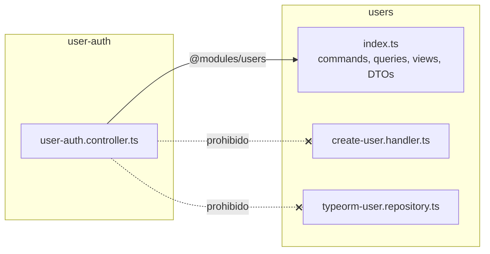

Por qué existe:

1. **Puedes reorganizar el interior del módulo sin romper a otros módulos.** Si mueves un archivo dentro de `users`, solo cambias la línea de `index.ts`. (Los tests unitarios sí importan rutas internas, así que también se mueven: §8).
2. **Evita atajos peligrosos.** Si `user-auth` inyectara el repositorio de `users`, podría guardar usuarios sin pasar por las reglas del handler (validación de email, política de contraseña, unicidad).
3. **El contrato está a la vista.** Un solo archivo dice qué ofrece el módulo.

Reglas, verificadas por `test/architecture/dependency-rules.spec.ts`:

- Otro módulo se importa **solo** por `@modules/<nombre>`. Una ruta profunda como `@modules/users/application/...` hace fallar el test.
- `index.ts` solo puede reexportar commands, queries, views, DTOs de `infrastructure/http/dtos/` y, de `domain/`, enums `*-status`, value objects y errores. Si exporta un agregado, un handler, un port, un adapter, un mock o el `*.module.ts`, el test falla.
- **Dentro** del mismo módulo se usan imports relativos, no el `index.ts`.
- Excepciones: `src/app.module.ts` (importa los `*.module.ts`) y los tests.
- Si otro módulo necesita algo que `index.ts` no exporta, **no** se importa por una ruta profunda: se crea el command o query en el módulo dueño y se exporta.

## 4. Recorrido completo de `POST /api/v1/users`

La request de ejemplo:

```bash
curl -X POST http://localhost:3000/api/v1/users -H "Authorization: Bearer <accessToken>" -H "Content-Type: application/json" -d '{"email":"Jane@Acme.com","password":"secure-password"}'
```

El orden formal de las piezas está en [ARCHITECTURE §5](./ARCHITECTURE.md#5-ciclo-de-vida-de-una-request). Aquí se recorre archivo por archivo.

### 4.1 Al arrancar (una sola vez)

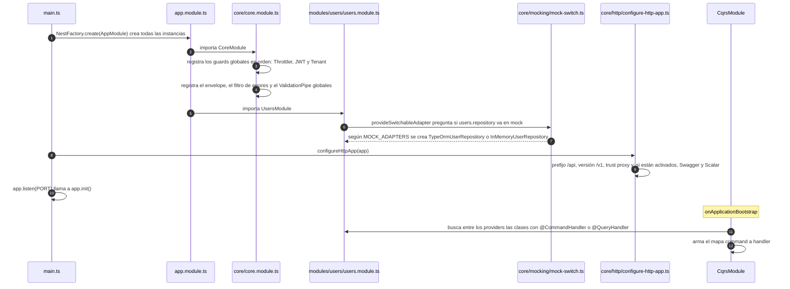

### 4.2 Fase 1: la puerta (`core`)

Estas piezas son comunes a todas las rutas. Algunos decoradores las ajustan: `@Public()` salta el guard JWT, `@TenantAgnostic()` salta el de tenant y el interceptor de idempotencia solo actúa en rutas con `@Idempotent()`.

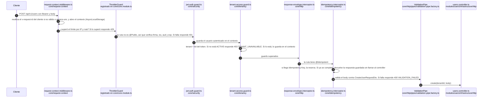

- **Orden de Nest:** middleware → guards → interceptors (antes) → pipes → controller → interceptors (después). Si un guard rechaza la request, el controller nunca se ejecuta.
- **Seguro por defecto:** como la ruta no tiene `@Public()` ni `@TenantAgnostic()`, exige token y tenant sin que el controller lo pida.
- **`@CurrentTenantId()`** no lee el header: lee el contexto donde `tenant-access.guard.ts` guardó el tenant ya validado.

### 4.3 Fase 2: dentro del módulo `users`

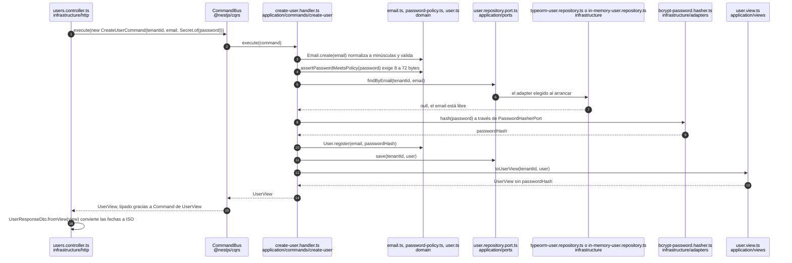

### 4.4 Fase 3: la salida

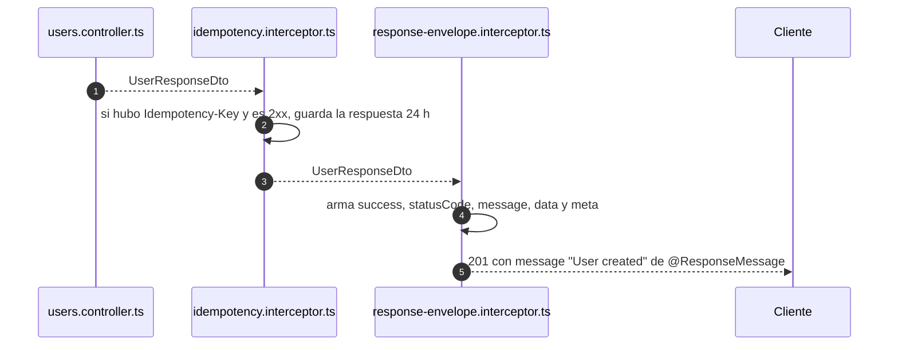

### 4.5 Cuando algo falla

Si el email ya existe, el handler lanza un error de dominio. Nadie lo atrapa hasta el filtro global:

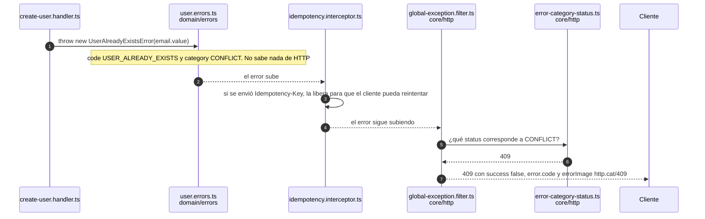

El dominio y la aplicación lanzan errores con una **categoría** (`CONFLICT`, `NOT_FOUND`…), nunca con un status HTTP. El filtro hace la traducción. Por eso el mismo handler sirve para un worker de colas, que no tiene HTTP. El catálogo completo de `code`s está en [ARCHITECTURE §7.1](./ARCHITECTURE.md#71-errores).

### 4.6 Cada archivo en una frase

| Archivo | Qué hace en esta request |
|---|---|
| `core/request-context/request-context.middleware.ts` | Fija el `requestId` (el del cliente si es válido) y abre el contexto de la request. |
| `core/security/jwt-auth.guard.ts` | Verifica el token y guarda el usuario autenticado en el contexto. |
| `core/tenancy/tenant-access.guard.ts` | Decide el tenant, comprueba que esté activo y lo guarda en el contexto. |
| `core/http/response-envelope.interceptor.ts` | Envuelve la respuesta exitosa en el formato estándar. |
| `core/idempotency/idempotency.interceptor.ts` | Evita ejecutar dos veces la misma operación reintentada. |
| `core/http/pipes/validation-pipe.factory.ts` | Valida el body con class-validator y rechaza campos desconocidos. |
| `modules/users/infrastructure/http/users.controller.ts` | Traduce HTTP a un command y la view a un response DTO. |
| `modules/users/application/commands/create-user/create-user.command.ts` | El mensaje con los datos del caso de uso. |
| `modules/users/application/commands/create-user/create-user.handler.ts` | El caso de uso: valida, consulta, crea, guarda y devuelve la view. |
| `modules/users/domain/value-objects/email.ts` | Normaliza y valida el email. |
| `modules/users/domain/user.ts` | El agregado: crea el usuario con id y fechas. |
| `modules/users/application/ports/user.repository.port.ts` | El contrato del repositorio. |
| `modules/users/infrastructure/persistence/typeorm/typeorm-user.repository.ts` | Guarda en la DB del tenant. |
| `modules/users/application/views/user.view.ts` | Lo que sale del handler, sin datos sensibles. |
| `modules/users/infrastructure/http/dtos/user.response.dto.ts` | El formato HTTP de la respuesta, documentado en Swagger. |
| `core/http/global-exception.filter.ts` | Convierte cualquier error en el envelope de error. |

## 5. Command, handler, view y bus

### 5.1 El command es un mensaje

```ts
export class CreateUserCommand extends Command<UserView> {
  constructor(
    readonly tenantId: string,
    readonly email: string,
    readonly password: Secret,
  ) {
    super();
  }
}
```

- **No tiene métodos.** Solo transporta datos. Es la comanda, no el cocinero.
- **`extends Command<UserView>`** declara qué devuelve el caso de uso. No hace nada en tiempo de ejecución; sirve para que `commandBus.execute(...)` devuelva `Promise<UserView>` en lugar de `any`. El architecture test exige que todo command o query lo declare.
- **`super()`** es una regla de TypeScript y JavaScript: el constructor de una clase hija debe llamar al de la clase padre (`Command`). Los `readonly` del constructor son *parameter properties*: TypeScript crea y asigna esas propiedades automáticamente.
- **`readonly`**: un command no cambia después de crearse.
- **`Secret`**: la contraseña viaja envuelta para que no aparezca en logs ni en `JSON.stringify`.

### 5.2 El handler hace el trabajo

```ts
@CommandHandler(CreateUserCommand)
export class CreateUserHandler implements ICommandHandler<CreateUserCommand> {
  constructor(
    @Inject(USER_REPOSITORY) private readonly users: UserRepositoryPort,
    @Inject(PASSWORD_HASHER) private readonly passwordHasher: PasswordHasherPort,
  ) {}

  async execute(command: CreateUserCommand): Promise<UserView> {
    const email = Email.create(command.email);
    assertPasswordMeetsPolicy(command.password.reveal());

    if (await this.users.findByEmail(command.tenantId, email)) {
      throw new UserAlreadyExistsError(email.value);
    }

    const user = User.register(email, await this.passwordHasher.hash(command.password.reveal()));
    await this.users.save(command.tenantId, user);
    return toUserView(command.tenantId, user);
  }
}
```

- **`@CommandHandler(CreateUserCommand)`** significa: "esta clase atiende ese command".
- **`implements ICommandHandler<CreateUserCommand>`** obliga a tener el método `execute(command)`. Ese es el método que buscabas: el bus lo llama por ti.
- **`@Inject(USER_REPOSITORY)`** pide el port por su token (un `Symbol`), no por la clase concreta. Nest entrega el adapter que se eligió al arrancar (Postgres o memoria). El handler nunca sabe cuál es.

### 5.3 ¿Cómo sabe el bus a quién llamar?

Hay tres momentos: al cargar el archivo, al arrancar la app y en cada request.

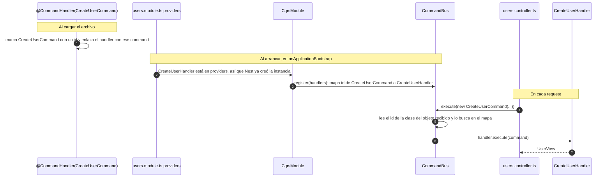

Simplificado, el bus hace esto:

```ts
const handlers = new Map([[CreateUserCommand, createUserHandler]]);

function execute(command) {
  return handlers.get(command.constructor).execute(command);
}
```

- **Cada command tiene exactamente un handler.** Si registras dos, el segundo reemplaza al primero y Nest lo avisa en el log (`Command handler [X] is already registered...`).
- **Si el handler no está en los `providers` del módulo**, el cliente recibe `500 INTERNAL_ERROR` y el motivo solo aparece en el log: `No handler found for the command: "CreateUserCommand".` El architecture test lo detecta antes: exige que todo command y query tenga su handler al lado y registrado.
- **Las queries funcionan igual**, con `QueryBus`, `@QueryHandler` y `IQueryHandler`.
- **Para encontrar el handler de un command**, mira la misma carpeta: `create-user.command.ts` está junto a `create-user.handler.ts`.

### 5.4 ¿Por qué un bus y no llamar a un service?

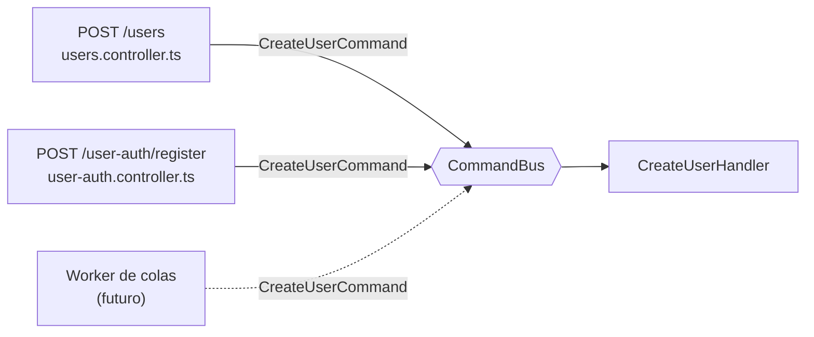

Lo que aporta el bus:

- **Una frontera por módulo hecha de mensajes.** `user-auth` depende de la clase `CreateUserCommand` (el contrato publicado en `index.ts`), pero no del handler ni de sus dependencias (repositorio, hasher). `users` puede cambiar todo eso sin tocar a `user-auth`.
- **Un mecanismo uniforme y tipado** para invocar cualquier caso de uso: siempre `execute(new XCommand(...))`, y el resultado sale tipado gracias a `Command<T>`.
- **Un punto único** para añadir algo a todos los casos de uso en el futuro (logs, métricas, transacciones).
- **Un camino hacia lo asíncrono:** un worker de colas puede despachar los mismos commands sin cambiar los handlers (ver [ASYNC_JOBS_PROPOSAL.md](./ASYNC_JOBS_PROPOSAL.md)).

Lo que **no** viene del bus: poder probar el handler con `new` y reutilizar un caso de uso desde varias entradas. Eso sale de tener una clase por caso de uso.

Lo que cuesta:

- **Una indirección más.** Desde el controller, "ir a la definición" de `execute` te lleva al bus, no al handler. La convención de carpetas (§5.3) lo compensa.
- **El handler se resuelve en tiempo de ejecución.** Si falta registrarlo, el error aparece al llamar (500), no al compilar. Lo cubre el architecture test.
- **La dependencia entre módulos sigue existiendo, pero Nest no la ve:** `user-auth` necesita que `UsersModule` esté cargado, y eso no aparece en sus `imports`.
- **Hoy todo es síncrono y en el mismo proceso.** El bus no hace que nada sea asíncrono por sí solo.

### 5.5 Agregado, view y response DTO: ¿por qué hay tres "usuarios"?

| Clase | Capa | Qué contiene | Quién la usa | Cambia cuando… |
|---|---|---|---|---|
| `User` (`domain/user.ts`) | Dominio | Estado completo, incluido `passwordHash`, y comportamiento. | Solo los handlers y los adapters de su módulo. | Cambian las reglas de negocio. |
| `UserView` (`application/views/user.view.ts`) | Aplicación | Datos planos y de solo lectura, sin secretos. Las fechas son `Date`. | Lo devuelven los handlers. Otros módulos lo reciben por el bus. | Cambia lo que el caso de uso expone. |
| `UserResponseDto` (`infrastructure/http/dtos/user.response.dto.ts`) | HTTP | Lo que viaja en el JSON: fechas en ISO y decoradores de Swagger. Implementa `UserResponse` de `@zaku/shared-types`. | El controller y el frontend. | Cambia el contrato HTTP. |

Tener tres clases parece duplicación, pero cada una cambia por un motivo distinto. Con una sola clase, añadir un campo interno al dominio lo publicaría en la API sin querer, y renombrar un campo del JSON obligaría a tocar las reglas de negocio.

## 6. Tu primer endpoint, paso a paso

Ejemplo: **`PATCH /api/v1/users/me/email`**. El usuario autenticado cambia **su propio** email y, para hacerlo, confirma su contraseña actual.

> **Es un ejercicio: no está implementado en el proyecto.** Antes de escribir esta guía se aplicó sobre el código real y pasó typecheck, lint y los tests unitarios, de arquitectura y e2e. Luego se revirtió. Los casos de la suite de contrato contra Postgres (paso 2) no se ejecutaron porque Docker estaba apagado: córrelos con `test:integration` si lo implementas.
>
> El email es el identificador de login, así que este endpoint toca la seguridad de la cuenta. El ejemplo cubre lo mínimo: solo el propio usuario puede cambiarlo y debe confirmar su contraseña. Lo que falta antes de producción está en §6.5.

### 6.0 Antes de escribir código: responde estas preguntas

| Pregunta | Respuesta para este ejemplo |
|---|---|
| ¿A qué módulo pertenece? | `users`: el email es un dato del usuario. |
| ¿Command o query? | Command: cambia estado. |
| **¿Quién puede hacerlo?** (autorización) | Solo el propio usuario. Su id sale del token, **nunca de la URL**: por eso la ruta usa `me` y no `{userId}`. Así es imposible apuntar a otro usuario. Si un administrador debiera poder cambiar emails ajenos, primero hacen falta roles (ver [ARCHITECTURE §12](./ARCHITECTURE.md#12-riesgos-conocidos-y-deuda-técnica-intencional)). |
| ¿Toca credenciales o datos sensibles? | Sí: el email es el login. Se pide la contraseña actual (viaja como `Secret`) y se aplica el rate limit de credenciales. |
| ¿Qué errores puede devolver? | 400 si el email no es válido, 403 si la contraseña actual no coincide, 404 si el usuario ya no existe, 409 si el email es de otro usuario del tenant y 429 por rate limit. |
| ¿Necesita algo nuevo del exterior (un port)? | No: `findById`, `findByEmail`, `save` y `PasswordHasherPort.verify` ya existen. Pero `save` se usará por primera vez para **actualizar**: hay que comprobar que ambos adapters lo hacen igual (paso 2). |
| ¿Necesita algo nuevo de `core`? | Sí: hoy no hay forma de leer el usuario autenticado en un controller. Se crea `@CurrentUserId()` (paso 6). |
| ¿Necesita idempotencia? | No. Ver la explicación en el paso 8. |
| ¿Cambia el esquema de la DB? | No: la columna `email` y su restricción `UNIQUE` ya existen. |

### 6.1 El orden: de adentro hacia afuera

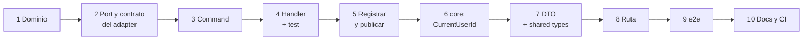

¿Por qué empezar por adentro? Porque cada paso se puede probar antes de que exista el siguiente: la regla de dominio se prueba sin handler, y el handler sin HTTP. Si empiezas por el controller, no puedes probar nada hasta terminar todo.

### 6.2 Los pasos

#### Paso 1. Dominio: el comportamiento y el error nuevo

**Archivo:** `src/modules/users/domain/user.ts`

Un agregado expone **comportamiento**, no setters. Como el estado ahora puede cambiar, `state` deja de ser `readonly` (igual que en `Tenant`):

```ts
export class User {
  private constructor(private state: UserSnapshot) {}

  // ...register, restore, getters y toSnapshot sin cambios...

  changeEmail(email: Email): void {
    if (email.value === this.state.email) {
      return;
    }
    this.state = { ...this.state, email: email.value, updatedAt: new Date() };
  }
}
```

- Recibe un `Email`, no un `string`: así es imposible asignar un email sin validar.
- Si el email es el mismo, no toca `updatedAt`.

**Archivo:** `src/modules/users/domain/errors/user.errors.ts`, un error nuevo para la contraseña incorrecta:

```ts
export class UserCurrentPasswordInvalidError extends AppError {
  constructor() {
    super({ code: 'USER_CURRENT_PASSWORD_INVALID', category: 'FORBIDDEN', message: 'The current password is not correct' });
  }
}
```

Es `FORBIDDEN` (403) y no `UNAUTHORIZED` (401) porque el token sí es válido: lo que falla es la confirmación. Un 401 haría que el frontend creyera que la sesión expiró.

**Test:** `test/unit/modules/users/domain/user.spec.ts`, dentro del `describe('User', …)` existente:

```ts
it('changes its email and refreshes updatedAt', () => {
  const user = User.restore({ ...User.register(Email.create('old@example.com'), 'hash').toSnapshot(), updatedAt: new Date(0) });

  user.changeEmail(Email.create('new@example.com'));

  expect(user.email).toBe('new@example.com');
  expect(user.toSnapshot().updatedAt.getTime()).toBeGreaterThan(0);
});

it('keeps updatedAt when the email does not change', () => {
  const user = User.restore({ ...User.register(Email.create('same@example.com'), 'hash').toSnapshot(), updatedAt: new Date(0) });

  user.changeEmail(Email.create('same@example.com'));

  expect(user.toSnapshot().updatedAt).toEqual(new Date(0));
});
```

```bash
pnpm --filter api-core test:unit
```

#### Paso 2. Port y contrato del adapter

No hace falta un método nuevo en el port. Si lo necesitaras (por ejemplo, `findByIds`), lo añadirías a `application/ports/user.repository.port.ts`, y TypeScript te obligaría a implementarlo en `typeorm-user.repository.ts` **y** en `in-memory-user.repository.ts`, porque los dos hacen `implements UserRepositoryPort`.

Lo que sí cambia es **cómo se usa** `save`: hasta ahora solo insertaba usuarios nuevos y ahora también actualizará uno existente. Antes de escribir el handler hay que garantizar que el mock y Postgres se comportan igual en ese caso. Se añaden dos casos a **`test/contracts/user-repository.contract.ts`**, dentro del `describe` de `describeUserRepositoryContract` (allí existen `context` y un `uniqueEmail()` local que devuelve un `Email`):

```ts
it('updates an existing user instead of inserting a copy', async () => {
  const user = User.register(uniqueEmail(), 'hash');
  await context.repository.save(context.tenantA, user);
  const previousEmail = Email.create(user.email);

  user.changeEmail(uniqueEmail());
  await context.repository.save(context.tenantA, user);

  expect((await context.repository.findById(context.tenantA, user.id))?.toSnapshot()).toEqual(user.toSnapshot());
  await expect(context.repository.findByEmail(context.tenantA, previousEmail)).resolves.toBeNull();
});

it('rejects updating a user to an email owned by another user', async () => {
  const takenEmail = uniqueEmail();
  await context.repository.save(context.tenantA, User.register(takenEmail, 'hash'));
  const user = User.register(uniqueEmail(), 'hash');
  await context.repository.save(context.tenantA, user);

  user.changeEmail(takenEmail);

  await expect(context.repository.save(context.tenantA, user)).rejects.toThrow(UserAlreadyExistsError);
});
```

Esta suite se ejecuta dos veces:

- contra `InMemoryUserRepository`, en los tests unitarios;
- contra `TypeOrmUserRepository`, en los de integración (`test/integration/postgres-adapters.int-spec.ts`, requiere Docker).

Si el mock se comportara distinto de Postgres, los tests unitarios y el modo mock mentirían. La suite de contrato lo impide.

#### Paso 3. El command

**Archivo nuevo:** `src/modules/users/application/commands/change-user-email/change-user-email.command.ts`

```ts
import { Command } from '@nestjs/cqrs';
import { Secret } from '@common/security/secret';
import { UserView } from '../../views/user.view';

export class ChangeUserEmailCommand extends Command<UserView> {
  constructor(
    readonly tenantId: string,
    readonly userId: string,
    readonly newEmail: string,
    readonly currentPassword: Secret,
  ) {
    super();
  }
}
```

- `tenantId` y `userId` van explícitos: el handler no lee nada del request HTTP. El controller decide de dónde salen (del token).
- La contraseña viaja como `Secret`.

> Desde aquí hasta el paso 5, `test:unit` mostrará en rojo el architecture test "every command and query has a handler registered in its module": primero con `... has no sibling handler` y, tras el paso 4, con `ChangeUserEmailHandler is not registered in users.module.ts`. Es lo esperado y se arregla en el paso 5. Mientras tanto, ejecuta solo tus specs:
>
> ```bash
> pnpm --filter api-core test:unit change-user-email
> ```

#### Paso 4. El handler y su test

**Archivo nuevo:** `src/modules/users/application/commands/change-user-email/change-user-email.handler.ts`

```ts
import { Inject } from '@nestjs/common';
import { CommandHandler, ICommandHandler } from '@nestjs/cqrs';
import {
  UserAlreadyExistsError,
  UserCurrentPasswordInvalidError,
  UserNotFoundError,
} from '../../../domain/errors/user.errors';
import { Email } from '../../../domain/value-objects/email';
import { PASSWORD_HASHER, PasswordHasherPort } from '../../ports/password-hasher.port';
import { USER_REPOSITORY, UserRepositoryPort } from '../../ports/user.repository.port';
import { UserView, toUserView } from '../../views/user.view';
import { ChangeUserEmailCommand } from './change-user-email.command';

@CommandHandler(ChangeUserEmailCommand)
export class ChangeUserEmailHandler implements ICommandHandler<ChangeUserEmailCommand> {
  constructor(
    @Inject(USER_REPOSITORY) private readonly users: UserRepositoryPort,
    @Inject(PASSWORD_HASHER) private readonly passwordHasher: PasswordHasherPort,
  ) {}

  async execute(command: ChangeUserEmailCommand): Promise<UserView> {
    const newEmail = Email.create(command.newEmail);
    const user = await this.users.findById(command.tenantId, command.userId);
    if (!user) {
      throw new UserNotFoundError(command.userId);
    }
    if (!(await this.passwordHasher.verify(command.currentPassword.reveal(), user.passwordHash))) {
      throw new UserCurrentPasswordInvalidError();
    }

    const emailOwner = await this.users.findByEmail(command.tenantId, newEmail);
    if (emailOwner && emailOwner.id !== user.id) {
      throw new UserAlreadyExistsError(newEmail.value);
    }

    user.changeEmail(newEmail);
    await this.users.save(command.tenantId, user);
    return toUserView(command.tenantId, user);
  }
}
```

El orden de los pasos importa:

1. **Validar la entrada** con value objects (`Email.create`), antes de tocar la DB.
2. **Cargar** lo necesario por los ports. Si no existe, error de dominio (404).
3. **Autorizar:** comprobar la contraseña actual (403) **antes** de mirar si el email está ocupado. La contraseña es la prueba de que quien llama es el dueño de la cuenta: hasta confirmarla, el caso de uso no debe hacer nada más ni responder distinto según los datos. Si fuera al revés, el endpoint le diría a quien no conoce la contraseña si un email existe. Hoy esa información ya se filtra por otras vías (`GET /users` sin roles y el 409 del registro, ver [ARCHITECTURE §12](./ARCHITECTURE.md#12-riesgos-conocidos-y-deuda-técnica-intencional)), pero un endpoint nuevo no debe sumar otra.
4. **Comprobar las reglas** que dependen de otros datos (409).
5. **Aplicar el comportamiento** del agregado.
6. **Guardar** y devolver una view.

> **¿Y si dos requests ponen el mismo email a la vez?** Las dos podrían pasar el punto 4. La segunda choca con la restricción `UNIQUE` `uq_users_email`, y `typeorm-user.repository.ts` traduce ese error a `UserAlreadyExistsError`: el cliente recibe igualmente un 409. El segundo caso de contrato del paso 2 prueba exactamente eso.

**Test nuevo:** `test/unit/modules/users/application/commands/change-user-email/change-user-email.handler.spec.ts`

La ruta del test es la del archivo que prueba, cambiando `src/` por `test/unit/` y `.ts` por `.spec.ts` (§8).

```ts
import { Secret } from '@common/security/secret';
import { ChangeUserEmailCommand } from '@modules/users/application/commands/change-user-email/change-user-email.command';
import { ChangeUserEmailHandler } from '@modules/users/application/commands/change-user-email/change-user-email.handler';
import {
  UserAlreadyExistsError,
  UserCurrentPasswordInvalidError,
  UserEmailInvalidError,
  UserNotFoundError,
} from '@modules/users/domain/errors/user.errors';
import { User } from '@modules/users/domain/user';
import { Email } from '@modules/users/domain/value-objects/email';
import { InMemoryUserRepository } from '@modules/users/infrastructure/mocks/in-memory-user.repository';
import { FakePasswordHasher } from '@test/support/fake-password-hasher';

const tenantId = '0a000000-0000-4000-8000-00000000000a';
const unknownUserId = '0b000000-0000-4000-8000-00000000000b';
const currentPassword = Secret.of('current-password');
const wrongPassword = Secret.of('wrong-password');

describe('ChangeUserEmailHandler', () => {
  let users: InMemoryUserRepository;
  let handler: ChangeUserEmailHandler;

  beforeEach(() => {
    users = new InMemoryUserRepository();
    handler = new ChangeUserEmailHandler(users, new FakePasswordHasher());
  });

  async function storedUser(email: string): Promise<User> {
    const user = User.register(Email.create(email), await new FakePasswordHasher().hash(currentPassword.reveal()));
    await users.save(tenantId, user);
    return user;
  }

  function changeEmail(userId: string, newEmail: string, password = currentPassword) {
    return handler.execute(new ChangeUserEmailCommand(tenantId, userId, newEmail, password));
  }

  it('stores the normalized email and returns the updated view', async () => {
    const user = await storedUser('old@example.com');

    const view = await changeEmail(user.id, ' New@Example.com ');

    expect(view).toMatchObject({ id: user.id, tenantId, email: 'new@example.com' });
    expect((await users.findById(tenantId, user.id))?.email).toBe('new@example.com');
  });

  it('requires the current password and leaves the user unchanged when it is wrong', async () => {
    const user = await storedUser('old@example.com');

    await expect(changeEmail(user.id, 'new@example.com', wrongPassword)).rejects.toThrow(UserCurrentPasswordInvalidError);
    expect((await users.findById(tenantId, user.id))?.email).toBe('old@example.com');
  });

  it('checks the password before revealing whether the new email is taken', async () => {
    const user = await storedUser('first@example.com');
    await storedUser('taken@example.com');

    await expect(changeEmail(user.id, 'taken@example.com', wrongPassword)).rejects.toThrow(UserCurrentPasswordInvalidError);
  });

  it('rejects an email that already belongs to another user of the tenant', async () => {
    const user = await storedUser('first@example.com');
    await storedUser('taken@example.com');

    await expect(changeEmail(user.id, 'taken@example.com')).rejects.toThrow(UserAlreadyExistsError);
  });

  it('accepts the email the user already has', async () => {
    const user = await storedUser('same@example.com');

    await expect(changeEmail(user.id, 'SAME@example.com')).resolves.toMatchObject({ email: 'same@example.com' });
  });

  it('fails when the user no longer exists', async () => {
    await expect(changeEmail(unknownUserId, 'new@example.com')).rejects.toThrow(UserNotFoundError);
  });

  it('validates the new email before any lookup', async () => {
    await expect(changeEmail(unknownUserId, 'not-an-email')).rejects.toThrow(UserEmailInvalidError);
  });
});
```

- El handler se crea con `new`, sin Nest, sin bus y sin base de datos.
- Se usan *fakes* (`InMemoryUserRepository`, `FakePasswordHasher`) en lugar de `jest.fn()`: se prueba comportamiento, no llamadas.
- Hay un caso por cada camino. Fíjate en los que prueban el **orden**:
  - el último usa un usuario inexistente con un email inválido: si la búsqueda fuera antes que la validación, saldría `UserNotFoundError`;
  - el tercero usa una contraseña incorrecta con un email ocupado: si la unicidad se comprobara antes que la contraseña, saldría `UserAlreadyExistsError`.

#### Paso 5. Registrar el handler y publicar el command

**Archivo:** `src/modules/users/users.module.ts`

```ts
import { ChangeUserEmailHandler } from './application/commands/change-user-email/change-user-email.handler';

@Module({
  // ...
  providers: [
    ChangeUserEmailHandler,
    CreateUserHandler,
    // ...
  ],
})
export class UsersModule {}
```

Sin este paso, la ruta responde 500 (el log dice `No handler found for the command: "ChangeUserEmailCommand".`) y el architecture test falla.

**Archivo:** `src/modules/users/index.ts`. `index.ts` publica todos los casos de uso del módulo (§3), así que se añade:

```ts
export { ChangeUserEmailCommand } from './application/commands/change-user-email/change-user-email.command';
```

#### Paso 6. Lo que falta en `core`: `@CurrentUserId()`

Hoy ninguna ruta necesita saber **qué usuario** hace la llamada, así que no existe un decorador para eso. Es una pieza transversal que cualquier módulo puede usar, así que va en `core/security/`, junto a `@Public()`. Es la versión del usuario de `@CurrentTenantId()` (`core/tenancy/current-tenant-id.decorator.ts`).

**Archivo nuevo:** `src/core/security/current-user-id.decorator.ts`

```ts
import { createParamDecorator } from '@nestjs/common';
import { RequestContext } from '../request-context/request-context';
import { PrincipalType } from './authenticated-principal';

export function currentUserIdOrFail(): string {
  const principal = RequestContext.current()?.principal;
  if (principal?.type !== PrincipalType.User) {
    throw new Error('@CurrentUserId() needs an authenticated user and cannot be used on a @Public() route');
  }
  return principal.subjectId;
}

export const CurrentUserId = createParamDecorator((): string => currentUserIdOrFail());
```

- Lee el usuario que `jwt-auth.guard.ts` guardó en el contexto (§4.2).
- Usarlo en una ruta `@Public()` es un error de programación, no del cliente: por eso lanza `Error` (500) y no un `AppError`.

**Test nuevo:** `test/unit/core/security/current-user-id.decorator.spec.ts`

```ts
import { RequestContext } from '@core/request-context/request-context';
import { PrincipalType } from '@core/security/authenticated-principal';
import { currentUserIdOrFail } from '@core/security/current-user-id.decorator';

describe('currentUserIdOrFail', () => {
  it('returns the id of the authenticated user', () => {
    const userId = RequestContext.run({ requestId: 'req-1' }, () => {
      RequestContext.bindPrincipal({ subjectId: 'user-1', tenantId: 'tenant-1', type: PrincipalType.User });
      return currentUserIdOrFail();
    });

    expect(userId).toBe('user-1');
  });

  it('fails loudly on a route without an authenticated user', () => {
    expect(() => RequestContext.run({ requestId: 'req-1' }, () => currentUserIdOrFail())).toThrow(/@Public/);
  });
});
```

#### Paso 7. El DTO de entrada

Primero, el contrato compartido con el frontend en **`packages/shared-types/src/index.ts`**:

```ts
export interface ChangeUserEmailRequest {
  newEmail: string;
  currentPassword: string;
}
```

api-core lee los tipos de `@zaku/shared-types` desde su `dist/`, así que compila el paquete antes de seguir. Si no, el IDE y el typecheck dirán que `ChangeUserEmailRequest` no existe:

```bash
pnpm --filter @zaku/shared-types build
```

Después, el DTO que lo implementa. **Archivo nuevo:** `src/modules/users/infrastructure/http/dtos/change-user-email.request.dto.ts`

```ts
import { ApiProperty } from '@nestjs/swagger';
import { IsEmail, IsNotEmpty, IsString, MaxLength } from 'class-validator';
import type { ChangeUserEmailRequest } from '@zaku/shared-types';

export class ChangeUserEmailRequestDto implements ChangeUserEmailRequest {
  @ApiProperty({ example: 'new-address@example.com' })
  @IsEmail()
  @MaxLength(254)
  newEmail!: string;

  @ApiProperty({ example: 'securePassword123' })
  @IsString()
  @IsNotEmpty()
  @MaxLength(1024)
  currentPassword!: string;
}
```

- El `ValidationPipe` global rechaza con `400 VALIDATION_FAILED` cualquier campo que no esté declarado aquí.
- `currentPassword` se valida como en el login (`LoginRequestDto`), no con la política de contraseñas nuevas: es una contraseña que ya existe.
- La validación del DTO es la primera barrera (HTTP). La del dominio (`Email.create`) es la definitiva: también protege cuando el command llega desde otro módulo o un worker.

#### Paso 8. La ruta

**Archivo:** `src/modules/users/infrastructure/http/users.controller.ts`

Imports nuevos (en el de `@nestjs/common` solo se añade `Patch`):

```ts
import { Body, Controller, Get, HttpStatus, Param, Patch, Post, Query } from '@nestjs/common';
import { CredentialsRateLimit } from '@core/security/credentials-rate-limit.decorator';
import { CurrentUserId } from '@core/security/current-user-id.decorator';
import { ChangeUserEmailCommand } from '../../application/commands/change-user-email/change-user-email.command';
import { ChangeUserEmailRequestDto } from './dtos/change-user-email.request.dto';
```

La ruta:

```ts
@Patch('me/email')
@CredentialsRateLimit()
@ResponseMessage('User email changed')
@ApiEnvelope(UserResponseDto, { errors: [400, 401, 403, 404, 409, 429, 503] })
async changeMyEmail(
  @CurrentTenantId() tenantId: string,
  @CurrentUserId() userId: string,
  @Body() body: ChangeUserEmailRequestDto,
): Promise<UserResponseDto> {
  const user = await this.commandBus.execute(
    new ChangeUserEmailCommand(tenantId, userId, body.newEmail, Secret.of(body.currentPassword)),
  );
  return UserResponseDto.fromView(user);
}
```

| Pieza | Para qué |
|---|---|
| `@Patch('me/email')` | Con el `@Controller('users')` de la clase, el prefijo global `/api` y la versión `/v1` queda `PATCH /api/v1/users/me/email`. |
| `@CredentialsRateLimit()` | El endpoint acepta una contraseña: le aplica los límites de login y registro para frenar a quien pruebe contraseñas con un token robado. Ojo: `credentialsTracker` agrupa por cuenta solo si el body trae `email`; aquí trae `newEmail`, así que el límite estricto se cuenta **por IP** (10 intentos por ventana con los valores por defecto). |
| `@ResponseMessage(...)` | Texto de `message` en el envelope de éxito. |
| `@ApiEnvelope(...)` | Documenta en Swagger la respuesta envuelta y los errores posibles. |
| `@CurrentTenantId()` / `@CurrentUserId()` | El tenant y el usuario, ya validados por los guards. |
| Sin `@Public()` ni `@TenantAgnostic()` | La ruta exige token y tenant. |
| Sin `@Idempotent()` | Ver la nota de abajo. |

El controller despacha el command y mapea la view. No tiene lógica.

> **¿Por qué no lleva `@Idempotent()`?** En general, `PATCH` **no** es idempotente. Este sí lo es: el body fija un valor absoluto y `changeEmail` no hace nada si el email ya es ese, así que un reintento devuelve el mismo 200. Según [ARCHITECTURE §8](./ARCHITECTURE.md#8-idempotencia), la idempotency key se reserva para operaciones que crean recursos.

> **Orden de las rutas.** `PATCH me/email` no choca con `GET :userId` porque usan métodos distintos. Pero si algún día añades `GET /users/me`, decláralo **antes** de `@Get(':userId')`: si no, Express lo resolverá como `userId = "me"` y `parseUuid` responderá 400.

#### Paso 9. El test e2e

**Archivo nuevo:** `test/e2e/users.e2e-spec.ts`

```ts
import { INestApplication } from '@nestjs/common';
import request from 'supertest';
import {
  DEFAULT_PASSWORD,
  createActiveTenant,
  createTestApp,
  HttpServer,
  login,
  registerAndLogin,
  registerUser,
  uniqueEmail,
} from '@test/support/test-app';

describe('Users (e2e)', () => {
  let app: INestApplication;
  let server: HttpServer;

  beforeAll(async () => {
    app = await createTestApp();
    server = app.getHttpServer();
  });

  afterAll(async () => {
    await app.close();
  });

  function changeMyEmail(accessToken: string, body: { newEmail: string; currentPassword: string }) {
    return request(server).patch('/api/v1/users/me/email').set('Authorization', `Bearer ${accessToken}`).send(body);
  }

  it('changes the email of the authenticated user, who then logs in with it', async () => {
    const tenantId = await createActiveTenant(server);
    const accessToken = await registerAndLogin(server, tenantId);
    const newEmail = uniqueEmail('changed');

    const response = await changeMyEmail(accessToken, { newEmail, currentPassword: DEFAULT_PASSWORD }).expect(200);

    expect(response.body).toMatchObject({ success: true, message: 'User email changed', data: { email: newEmail } });
    await expect(login(server, tenantId, newEmail)).resolves.toEqual(expect.any(String));
  });

  it('answers 403 when the current password is wrong', async () => {
    const tenantId = await createActiveTenant(server);
    const accessToken = await registerAndLogin(server, tenantId);

    const response = await changeMyEmail(accessToken, { newEmail: uniqueEmail(), currentPassword: 'wrong-password' }).expect(403);

    expect(response.body.error.code).toBe('USER_CURRENT_PASSWORD_INVALID');
  });

  it('answers 409 when the email belongs to another user of the tenant', async () => {
    const tenantId = await createActiveTenant(server);
    const takenEmail = uniqueEmail();
    await registerUser(server, tenantId, takenEmail);
    const accessToken = await registerAndLogin(server, tenantId);

    const response = await changeMyEmail(accessToken, { newEmail: takenEmail, currentPassword: DEFAULT_PASSWORD }).expect(409);

    expect(response.body.error.code).toBe('USER_ALREADY_EXISTS');
  });
});
```

- Prueba la API completa (guards, validación, bus, handler y envelope) en modo mock, sin Docker.
- Cada `it` crea su propio tenant y sus usuarios: los tests no dependen del orden.
- El primer caso comprueba el efecto real: después del cambio, el login funciona con el email nuevo.
- Los helpers (`createTestApp`, `createActiveTenant`, `registerUser`, `login`, `registerAndLogin`, `uniqueEmail`) están en `test/support/test-app.ts`.

#### Paso 10. Documentación y verificación

1. Añade la ruta a la tabla de [DEVELOPMENT §5](./DEVELOPMENT.md#5-endpoints-actuales).
2. Añade `USER_CURRENT_PASSWORD_INVALID` a la fila `FORBIDDEN` del catálogo de [ARCHITECTURE §7.1](./ARCHITECTURE.md#71-errores).
3. Verifica todo:

   ```bash
   pnpm run ci
   ```

   Como añadiste casos a la suite de contrato, que también corre contra Postgres, ejecuta además (requiere `pnpm infra:up`):

   ```bash
   pnpm --filter api-core test:integration
   ```

4. Commit convencional: `feat(users): let users change their own email`.

### 6.3 Resultado: el endpoint terminado

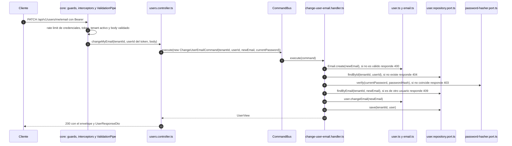

### 6.4 Archivos del ejemplo

| Archivo | Tipo de cambio |
|---|---|
| `src/modules/users/domain/user.ts` | Modificado: `changeEmail`. |
| `src/modules/users/domain/errors/user.errors.ts` | Modificado: `UserCurrentPasswordInvalidError`. |
| `src/modules/users/application/commands/change-user-email/change-user-email.command.ts` | Nuevo. |
| `src/modules/users/application/commands/change-user-email/change-user-email.handler.ts` | Nuevo. |
| `src/modules/users/users.module.ts` | Modificado: registra el handler. |
| `src/modules/users/index.ts` | Modificado: publica el command. |
| `src/core/security/current-user-id.decorator.ts` | Nuevo. |
| `src/modules/users/infrastructure/http/dtos/change-user-email.request.dto.ts` | Nuevo. |
| `src/modules/users/infrastructure/http/users.controller.ts` | Modificado: ruta `PATCH me/email`. |
| `packages/shared-types/src/index.ts` | Modificado: `ChangeUserEmailRequest`. |
| `test/unit/modules/users/domain/user.spec.ts` | Modificado: casos de `changeEmail`. |
| `test/unit/modules/users/application/commands/change-user-email/change-user-email.handler.spec.ts` | Nuevo. |
| `test/unit/core/security/current-user-id.decorator.spec.ts` | Nuevo. |
| `test/contracts/user-repository.contract.ts` | Modificado: dos casos de actualización. |
| `test/e2e/users.e2e-spec.ts` | Nuevo. |
| `apps/api-core/docs/DEVELOPMENT.md`, `apps/api-core/docs/ARCHITECTURE.md` | Modificados: endpoint y `code` de error. |

### 6.5 Antes de llevarlo a producción

El ejercicio es seguro frente a lo más grave (cambiar el email de otro usuario), pero un cambio de email real necesita además:

- **Verificar la dirección nueva:** enviar un enlace y aplicar el cambio solo cuando se confirme. Si no, alguien puede apropiarse de una dirección ajena. Requiere un port de email y jobs ([ASYNC_JOBS_PROPOSAL.md](./ASYNC_JOBS_PROPOSAL.md)).
- **Avisar a la dirección anterior** de que se cambió el email de la cuenta.
- **Límite de intentos por usuario.** Hoy el límite estricto de este endpoint se cuenta por IP: un atacante con un token robado que cambie de IP no tiene tope por cuenta. Se resuelve contando por usuario los fallos de `USER_CURRENT_PASSWORD_INVALID` y bloqueando tras N intentos. El `ThrottlerGuard` no sirve tal cual: se ejecuta antes que el guard JWT y todavía no conoce al usuario.
- **Control de concurrencia optimista** cuando exista otro command que modifique usuarios (por ejemplo, cambiar la contraseña). `save` de TypeORM escribe las columnas que difieren de lo que hay en la DB, así que dos cambios simultáneos podrían pisarse. Se resuelve con una columna `version` y `UPDATE … WHERE version = ?`.
- **Roles**, si un administrador debe poder cambiar emails ajenos. Esa sería otra ruta (`/users/{userId}/email`) con su propio permiso, nunca esta misma sin control.

## 7. Variantes: ¿y si mi endpoint…?

| Si tu endpoint… | Haz esto | Ejemplo o referencia |
|---|---|---|
| …solo lee datos | Query + `@QueryHandler` + `@Get` + `queryBus.execute`. Devuelve una view. | `get-user-by-id/` |
| …devuelve una lista | `PaginationQueryDto` en el controller, `findPage` en el port y `@ApiEnvelope(Dto, { paginated: true })`. | `list-users/` |
| …actúa sobre el usuario autenticado | Ruta con `me`, id con `@CurrentUserId()` (créalo como en el paso 6 si aún no existe). | §6 |
| …necesita una tabla o una columna nueva | Migración en `packages/database-lib` + entidad ORM + mapper, en el mismo cambio. | [DATABASE.md §5](./DATABASE.md#5-añadir-una-tabla-a-las-dbs-de-tenant) |
| …necesita otra tecnología (email, API externa, colas) | Port nuevo + adapter real + mock + suite de contrato + `provideSwitchableAdapter`. | [DEVELOPMENT §6.3](./DEVELOPMENT.md#63-añadir-un-adapter-conmutable-real--mock) |
| …necesita datos de otro módulo | Envía un command o query por el bus, importándolo de `@modules/<otro>`. | [DEVELOPMENT §6.2](./DEVELOPMENT.md#62-llamar-a-otro-módulo) |
| …es pública o no pertenece a un tenant | `@Public()` y/o `@TenantAgnostic()`, solo si es intencional. | [DEVELOPMENT §6.5](./DEVELOPMENT.md#65-rutas-especiales) |
| …crea recursos y el cliente puede reintentar | `@Idempotent()` o `@Idempotent({ required: true })`. | [ARCHITECTURE §8](./ARCHITECTURE.md#8-idempotencia) |
| …pertenece a un concepto de negocio nuevo | Crea un módulo nuevo. | [DEVELOPMENT §6.1](./DEVELOPMENT.md#61-crear-un-módulo-nuevo) |

## 8. Dónde va cada test

**En ningún `src/` del monorepo hay tests.** En `apps/api-core` todos viven en `test/`:

```text
test/
├── unit/            # espejo de src/: cada spec está en la ruta del archivo que prueba
│   ├── common/
│   ├── core/
│   └── modules/
│       └── users/domain/user.spec.ts   ← prueba src/modules/users/domain/user.ts
├── architecture/    # reglas de dependencias y de ubicación de los tests
├── contracts/       # suites que deben pasar el mock y el adapter real
├── e2e/             # API completa en modo mock (sin Docker)
├── integration/     # adapters reales contra Postgres y Redis (Docker)
├── setup/           # entorno de cada tipo de test
└── support/         # helpers y fakes compartidos
```

`packages/database-lib` sigue la misma idea: `test/unit/` es espejo de su `src/`.

| Qué pruebas | Dónde | Comando |
|---|---|---|
| Dominio, handlers, servicios, guards, interceptors, decoradores, mappers | `test/unit/<misma ruta que en src>/<archivo>.spec.ts` | `pnpm --filter api-core test:unit` |
| Reglas de arquitectura | `test/architecture/` | `pnpm --filter api-core test:unit` |
| Un endpoint completo | `test/e2e/<area>.e2e-spec.ts` | `pnpm --filter api-core test:e2e` |
| Un adapter real (TypeORM, Postgres, Redis) | `test/integration/*.int-spec.ts` + suite de `test/contracts/` | `pnpm --filter api-core test:integration` |

Reglas (las formales están en [CLEAN_CODE §7](./CLEAN_CODE.md#7-tests)):

- **La ruta del test es la del archivo con otro prefijo:** `src/<ruta>/<archivo>.ts` → `test/unit/<ruta>/<archivo>.spec.ts`. No todo archivo necesita spec, pero todo spec corresponde a un archivo y lo importa.
- **Si mueves o renombras un archivo de `src/`, mueve su spec.**
- **Los helpers no van en `test/unit/`**, porque allí cada archivo debe corresponder a uno de `src/`. Van en `test/support/`.
- **Los tests importan el código con los aliases** (`@modules/…`, `@core/…`, `@common/…` y `@test/…`), nunca con `../../src`. La única excepción es `AppModule` (`src/app.module.ts`), que no tiene alias y lo importa `test/support/test-app.ts`. En los tests se permiten rutas profundas, pero el spec de un módulo llega a **otros** módulos solo por su `index.ts`.
- **`nest g` no genera specs** (`generateOptions.spec: false` en `nest-cli.json`), para que no aparezcan dentro de `src/`.

`test/architecture/test-layout.spec.ts` hace cumplir todo lo anterior. Falla si:

- hay un archivo de test dentro de `src/`;
- un spec de `test/unit/` no tiene su archivo en `src/` con la misma ruta, respetando mayúsculas y minúsculas;
- un spec de `test/unit/` no importa el archivo que dice probar;
- un archivo de test está en una carpeta cuyo proyecto de Jest no lo ejecuta (por ejemplo, un `.spec.ts` en `test/e2e/` nunca correría), o hay un helper fuera de `test/support/` y `test/setup/`;
- un test importa `src/` con una ruta relativa;
- el spec de un módulo importa el interior de otro módulo.

¿Por qué una carpeta aparte y no el spec al lado del archivo, como sugiere NestJS? Es una decisión de todo el monorepo: [ADR 6 de la arquitectura general](../../../docs/ARCHITECTURE.md#8-decisiones-transversales-adr-resumido). En api-core, además, `src/` queda solo con código de la aplicación, incluidos los mocks del modo sin Docker.

## 9. Errores frecuentes al empezar

| Síntoma | Causa | Solución |
|---|---|---|
| `500 INTERNAL_ERROR` y en el log `No handler found for the command: "XCommand".` | El handler no está en los `providers` del módulo. | Añádelo en `<modulo>.module.ts`. El architecture test también lo detecta: `XHandler is not registered in <modulo>.module.ts`. |
| `commandBus.execute(...)` devuelve `any` | El command no extiende `Command<T>`. | Declara el tipo: `extends Command<MiView>`. |
| `400 VALIDATION_FAILED` con `property x should not exist` | El campo no está declarado en el DTO. | Decláralo con su decorador de class-validator. |
| `401 AUTH_TOKEN_MISSING` en una ruta nueva | Las rutas exigen token por defecto. | Envía el Bearer, o usa `@Public()` si la ruta debe ser pública. |
| `400 TENANT_HEADER_REQUIRED` en una ruta pública | Las rutas pertenecen a un tenant por defecto. | Envía `x-tenant-id`, o usa `@TenantAgnostic()` si la ruta no es de un tenant. |
| `Nest can't resolve dependencies of the XHandler (?, …)` | Si el mensaje dice `argument Object at index [N]`, falta `@Inject(TOKEN)`. Si nombra un `Symbol(...)`, ese port no está registrado en el módulo. | Usa `@Inject(TOKEN)` y registra el adapter con `provideSwitchableAdapter` o `{ provide, useClass }`. |
| `Module '"@zaku/shared-types"' has no exported member ...` | Cambiaste `packages/shared-types` y no lo compilaste. | `pnpm --filter @zaku/shared-types build` (o `pnpm build`). |
| Architecture test: `import from "@modules/x" (its index.ts) instead of a deep path` | Importaste el interior de otro módulo. | Usa su `index.ts`. Si falta el contrato, créalo y expórtalo. |
| Architecture test: `use relative imports inside the same module` | Usaste `@modules/<propio>/...` dentro del mismo módulo. | Cambia a un import relativo. |
| Architecture test: `public module APIs expose only contracts…` | `index.ts` exporta un agregado, handler, port, adapter, mock o el `*.module.ts`. | Exporta solo commands, queries, views, DTOs y, de `domain/`, enums `*-status`, value objects y errores. |
| Architecture test: `src/ holds runtime code only` | Hay un archivo de test dentro de `src/`. | Muévelo a `test/unit/`, en la ruta espejo. |
| Architecture test: `mirrors src/ in test/unit…` o `makes each unit spec import the file it mirrors` | Moviste o renombraste un archivo sin mover su spec, o el spec tiene otro nombre. | Mueve o renombra el spec a la ruta espejo. |
| Architecture test: `puts every test file in the folder whose Jest project runs it` | Un archivo de test tiene el sufijo de otra carpeta (por ejemplo, `.spec.ts` en `test/e2e/`), o hay un helper fuera de `test/support/` y `test/setup/`. | Usa `.e2e-spec.ts` en `e2e/`, `.int-spec.ts` en `integration/` y `.spec.ts` en `unit/`; los helpers van a `test/support/`. |
