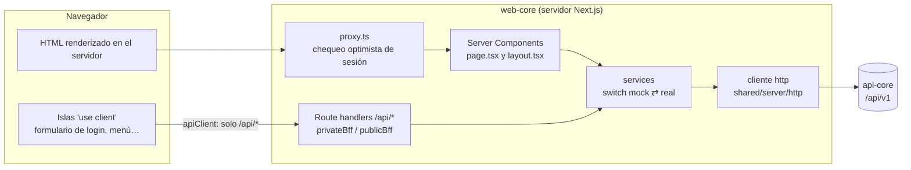
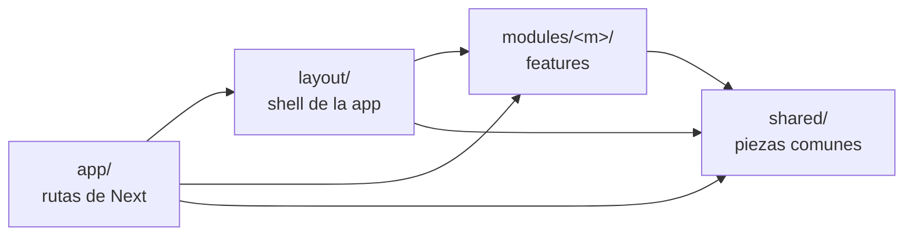
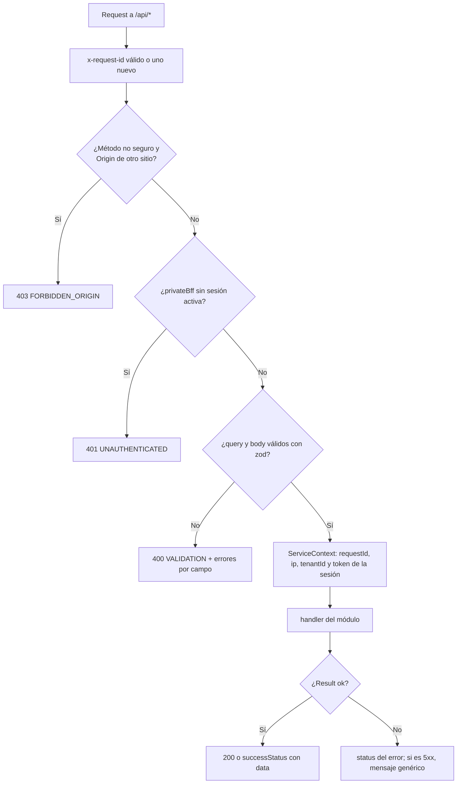

# ARCHITECTURE · web-core

Referencia de la arquitectura de `apps/web-core`. Si el código y este documento no coinciden, hay un bug en uno de los dos.

> Documentos relacionados:
> - [Arquitectura general del monorepo](../../../docs/ARCHITECTURE.md): cómo encaja web-core con api-core, el contrato HTTP y la autenticación de punta a punta.
> - [ONBOARDING.md](./ONBOARDING.md): recorrido didáctico de una página y de un endpoint, y una página nueva paso a paso.
> - [CLEAN_CODE.md](./CLEAN_CODE.md): reglas de código y qué verifican los architecture tests.
> - [DEVELOPMENT.md](./DEVELOPMENT.md): puesta en marcha, variables de entorno y scripts.
> - [AI_RULES.md](./AI_RULES.md): reglas para agentes de IA.

## 1. Visión general

web-core es una app **Next.js 16 (App Router) + React 19** que sigue el patrón **mini-BFF** (Backend For Frontend):



- **Las páginas se renderizan en el servidor** (Server Components): piden los datos directamente a los services, sin pasar por `/api/*`, y envían HTML ya listo. El navegador descarga muy poco JavaScript.
- **Las acciones del usuario** (login, logout…) salen de pequeñas **islas cliente** y llaman a los endpoints `/api/*` del propio Next.js, nunca a api-core.
- **Solo el servidor habla con api-core.** El token de acceso vive en una cookie cifrada que el JavaScript del navegador no puede leer.

## 2. Capas y regla de dependencias



| Capa | Qué contiene | Puede importar |
|---|---|---|
| `src/app/` | **Solo** archivos de rutas de Next: `page.tsx`, `layout.tsx`, `error.tsx`, `not-found.tsx`, `route.ts`, `globals.css`. Componen; no tienen lógica. | todo |
| `src/layout/` | El shell de la app: `AppShell`, `PublicShell`, menú (`navigation.ts`, `NavLink`), marca y versión. | `modules/`, `shared/` |
| `src/modules/<m>/` | Una feature completa: tipos, validación, llamadas al BFF, hooks, componentes y su parte de servidor. | `shared/` y su propio módulo. El `server/` de **otro** módulo, nunca. |
| `src/shared/` | Piezas sin negocio: cliente HTTP, sesión, BFF, entorno, logger (`server/`); `apiClient`, hooks y stores (`client/`); componentes de UI (`ui/`); utilidades, tipos y constantes. | nada de las capas superiores |
| `src/proxy.ts` | Chequeo optimista de sesión antes de cada página (en Next 16 reemplaza a `middleware.ts`). | `shared/` |

Las dependencias solo apuntan hacia abajo: `app → layout → modules → shared`. Lo verifica `test/architecture/dependency-rules.spec.ts` (lista completa en [CLEAN_CODE §7.1](./CLEAN_CODE.md#71-qué-verifican-los-architecture-tests)).

## 3. Estructura de carpetas

```text
apps/web-core/
├── src/
│   ├── app/                              # solo rutas de Next (cada página es un único page.tsx)
│   │   ├── layout.tsx                    # <html>, metadata y Toaster
│   │   ├── globals.css                   # Tailwind + tokens de shared/ui/theme.css
│   │   ├── not-found.tsx
│   │   ├── (public)/                     # grupo de rutas sin sesión
│   │   │   ├── layout.tsx                # PublicShell
│   │   │   ├── page.tsx                  # / (landing)
│   │   │   └── login/page.tsx            # /login
│   │   ├── (private)/                    # grupo de rutas con sesión
│   │   │   ├── layout.tsx                # requireUser + AppShell + SessionWatcher
│   │   │   ├── error.tsx
│   │   │   ├── home/page.tsx             # /home
│   │   │   └── users/page.tsx            # /users
│   │   └── api/auth/{login,logout}/route.ts   # una línea: re-exportan un handler de modules/auth/server/auth.bff.ts
│   ├── proxy.ts                          # chequeo optimista de sesión
│   ├── layout/                           # AppShell, PublicShell, SidebarFrame, NavLink, navigation.ts…
│   ├── modules/
│   │   ├── auth/                         # login, logout, sesión, inactividad
│   │   ├── users/                        # listado paginado de usuarios
│   │   ├── home/                         # dashboard
│   │   └── landing/                      # página pública
│   └── shared/
│       ├── server/                       # SOLO servidor: env, logger, session, bff/, http/, service-context…
│       ├── client/                       # SOLO navegador: apiClient, hooks, navegación, stores de toast y alertas
│       ├── ui/                           # componentes presentacionales + theme.css (tokens)
│       ├── types/ · utils/ · constants.ts
├── test/                                 # TODOS los tests: en src/ no hay ninguno
│   ├── unit/                             # espejo de src/
│   ├── architecture/                     # dependency-rules y test-layout
│   ├── setup/                            # entorno de Jest y matchers del DOM
│   └── support/                          # fakes y helpers compartidos
├── scripts/                              # check-boundaries, services-status, with-env
├── .env.example                          # catálogo de variables
└── .env.dev · .env.qa · .env.certification · .env.production   # plantillas por ambiente, sin secretos
```

## 4. Anatomía de un módulo

```text
modules/<m>/
├── types.ts            # tipos públicos que ve la UI (UserSummary, UsersPage…)
├── schemas.ts          # validación de entrada con zod (formularios, query params, params de ruta)
├── api.ts              # llamadas del navegador al BFF con apiClient (solo si el módulo tiene islas cliente)
├── hooks/              # hooks de las islas cliente ('use client')
├── components/         # componentes: Server Components por defecto, 'use client' solo si hay interacción
└── server/             # SOLO servidor (import 'server-only' en cada archivo, salvo los que solo re-exportan tipos)
    ├── contracts.ts    # tipos de api-core, re-exportados de @zaku/shared-types
    ├── <m>.service.ts  # llamadas a api-core con el switch mock ⇄ real
    ├── <m>.mock.ts     # datos y comportamiento del modo mock
    ├── <m>.mappers.ts  # contrato de api-core → tipos públicos (types.ts)
    └── <m>.bff.ts      # endpoints del BFF (privateBff/publicBff) y loaders de las páginas
```

No todos los módulos necesitan todo: `home` y `landing` solo tienen `components/`.

Qué hace cada pieza, con el módulo `users` como ejemplo:

| Pieza | Responsabilidad | Ejemplo |
|---|---|---|
| `schemas.ts` | Valida y normaliza lo que viene de fuera (URL, formularios). | `usersPageQuerySchema`: `?page=abc` se convierte en `1`. |
| `server/<m>.service.ts` | Habla con api-core. Un método por endpoint, con sus dos ramas (mock y real). | `UsersService.listPage` |
| `server/<m>.mock.ts` | Imita a api-core en memoria, con los mismos códigos de error. | `usersMock.listPage` |
| `server/<m>.mappers.ts` | Quita lo que la UI no necesita (por ejemplo, `tenantId`). | `toUsersPage` |
| `server/<m>.bff.ts` | Une service + mapper para una página (loader) o para un endpoint `/api/*` (handler). | `loadUsersPage`, `login` |
| `components/` | Pinta los datos ya mapeados. | `UsersView` |

## 5. Separación cliente / servidor

**Por defecto todo es Server Component.** Un archivo solo lleva `'use client'` si necesita estado, efectos o eventos del navegador. Hoy son:

| Isla cliente | Por qué necesita el navegador |
|---|---|
| `modules/auth/components/LoginForm.tsx` + `hooks/use-login.ts` | Estado del formulario, validación al escribir y envío. |
| `modules/auth/components/LogoutButton.tsx` | Evento de clic. |
| `modules/auth/components/SessionWatcher.tsx` | Detecta la inactividad y muestra los avisos de sesión (inactividad, sesión vencida, acceso denegado). |
| `layout/SidebarFrame.tsx`, `layout/NavLink.tsx` | Colapsar el menú y resaltar la ruta actual. |
| `shared/ui/Modal.tsx`, `shared/ui/Toaster.tsx`, `app/(private)/error.tsx` | Foco, teclado y estado de UI. |
| `shared/client/*` | `useAppNavigation`, `useApiMutation` y los stores (zustand) de toasts y alertas de sesión. |

La frontera se protege con tres mecanismos:

1. **`import 'server-only'`** en cada archivo de una carpeta `server/` (salvo los que solo re-exportan tipos, que no tienen código). Si una isla cliente lo importa, el build falla. Lo exige un architecture test.
2. **`pnpm check:boundaries`** (incluido en `pnpm lint`). Falla si código de `modules/` o `shared/` fuera de `server/`:
   - importa código de `server/` o paquetes de servidor (`iron-session`, `next/headers`, `node:*`…);
   - hace `fetch` a una URL absoluta;
   - lee variables de entorno.
3. **Las props de un Client Component viajan al navegador.** Solo se pasan datos que el usuario puede ver; nunca tokens, URLs internas ni errores crudos.

## 6. Mini-BFF

Los endpoints `/api/*` son la única puerta del navegador hacia el servidor. Cada uno se declara en el `server/<m>.bff.ts` de su módulo con `privateBff` (exige sesión) o `publicBff` (no la exige), y la ruta de Next solo lo re-exporta:

```ts
// src/app/api/auth/login/route.ts
export { login as POST } from '@/modules/auth/server/auth.bff';
```

```ts
// src/modules/auth/server/auth.bff.ts
export const login = publicBff({ body: loginSchema }, async ({ body, session, service }) => {
  const result = await AuthService.login(service, body);
  // ...guarda la sesión y responde el usuario, sin el token
});
```

`privateBff` / `publicBff` (`shared/server/bff/define-bff.ts`) hacen, en este orden:



- **Cuerpo de error** hacia el navegador (`BffErrorBody`): `{ "error": { "code", "message", "fields"? } }`. Los 5xx siempre llevan un mensaje genérico; el detalle va al log.
- **Cabeceras:** toda respuesta lleva `Cache-Control: no-store` y `x-request-id`.
- **Una excepción inesperada** responde 500 `INTERNAL` y queda en el log.
- **Las páginas no usan el BFF HTTP:** llaman al loader del `.bff.ts` directamente (ej. `loadUsersPage`), con el contexto de `getServerServiceContext()`.

En el navegador, `apiClient` (`shared/client/api-client.ts`) es la única forma de llamar al BFF:

- rechaza rutas que no empiecen por `/api/`;
- convierte los errores en `ApiError` (`status`, `code`, `message`, `fields`);
- ante un 401 o 403 fuera de `/api/auth/*`, abre el aviso de sesión (`sessionAlert`).

## 7. Capa HTTP hacia api-core

`shared/server/http/` es el único lugar que hace `fetch` a api-core.

**Registro de APIs** (`apis.ts`). Un endpoint externo se registra antes de usarlo; si no está registrado, la llamada falla con `500 API_NOT_REGISTERED` en lugar de construir una URL arbitraria.

```ts
export const apis = [
  {
    name: 'Core',
    urlEnv: 'API_CORE_URL',
    controllers: [
      { name: 'user-auth', actions: [{ endpoint: 'login', version: 'v1' }] },
      { name: 'users', actions: [{ endpoint: '', version: 'v1' }] },
    ],
  },
] as const satisfies readonly ApiDefinition[];
```

URL resultante: `{API_CORE_URL}/{version}/{controller}/{endpoint}/{urlParams…}?{queryParams}`. Con `API_CORE_URL=http://localhost:3000/api`, `users` + `urlParams: [id]` da `http://localhost:3000/api/v1/users/<id>`.

**Cliente** (`http-request.ts`): `http.get`, `http.getPage`, `http.post`, `http.put`, `http.patch` y `http.delete`. Todos devuelven un `Result<T>` y nunca lanzan excepciones:

```ts
type Result<T> = { ok: true; data: T } | { ok: false; error: ErrorModel };
interface ErrorModel { status: number; code: string; message: string; fields?: Record<string, string> }
```

| Qué | Comportamiento |
|---|---|
| Cabeceras | Siempre `x-request-id`. `withAuth: true` añade `Authorization: Bearer <token de la sesión>` (sin token: `401 UNAUTHENTICATED` sin llamar). `tenantId` añade `x-tenant-id`. |
| Respuesta 2xx | Exige el envelope estándar de api-core y devuelve `data`. `getPage` devuelve `{ items, pagination }` a partir de `data` y `meta.pagination`. |
| Respuesta de error | `code` = `error.code` de api-core; `fields` = `error.details` con campo; `message` = el de api-core. |
| Envelope inválido | `502 UPSTREAM_INVALID_RESPONSE`. |
| Sin respuesta | `502 UPSTREAM_UNREACHABLE`. |
| Timeout (`HTTP_TIMEOUT_MS`) | `504 UPSTREAM_TIMEOUT`. |
| `API_CORE_URL` vacía con el service en REAL | `500 API_NOT_CONFIGURED`. |

El contrato completo entre las dos apps está en la [arquitectura general §4](../../../docs/ARCHITECTURE.md#4-contrato-http-entre-apps).

## 8. Switch mock ⇄ real

Cada método de un `*.service.ts` tiene **dos `return`** y gana el primero:

```ts
static async listPage(context: ServiceContext, page: number, pageSize: number): Promise<Result<Paged<UserResponse>>> {
  return mock('Core.users.list', () => usersMock.listPage(context.tenantId, page, pageSize));
  return http.getPage<UserResponse>({
    context,
    api: 'Core',
    controller: 'users',
    action: '',
    withAuth: true,
    queryParams: { page, pageSize },
  });
}
```

- **Para pasar a REAL:** comenta solo la línea `return mock(...)`. Para volver a MOCK, descoméntala.
- **No borres ninguna de las dos ramas.** El segundo `return` es inalcanzable a propósito; `allowUnreachableCode: true` en `tsconfig.json` lo permite. Un architecture test exige las dos ramas en cada método.
- **`mock()`** (`shared/server/http/mock.ts`) simula la latencia (`MOCK_LATENCY_MS`) y registra en el log qué método respondió en modo mock.
- **Los mocks imitan a api-core:**
  - los mismos códigos de error (`TENANT_UNAVAILABLE`, `USER_AUTH_INVALID_CREDENTIALS`…);
  - la misma paginación y el mismo orden;
  - las mismas identidades demo (`shared/server/demo-fixtures.ts`).
- **Qué está en cada modo:** `pnpm services:status`. Antes de desplegar, `pnpm services:status --require-real` falla si queda algún método en MOCK.

## 9. Sesión y autenticación

| Pieza | Dónde | Qué hace |
|---|---|---|
| Cookie de sesión | `shared/server/session-options.ts` | iron-session, cookie `zaku-session` cifrada con `SESSION_SECRET`, `httpOnly`, `SameSite=Lax`, `Secure` en producción (o según `SESSION_COOKIE_SECURE`). Guarda `user`, `accessToken` y `expiresAt`. |
| Sesión activa | `isActiveSession()` | Hay usuario y el token no ha vencido (`expiresAt`). La sesión termina cuando vence el JWT de api-core o la cookie (`SESSION_TTL_SECONDS`), lo que ocurra primero. |
| Login | `modules/auth/server/auth.bff.ts` | Llama a api-core, guarda la sesión y recuerda el tenant en la cookie `zaku-tenant` (`httpOnly`, 1 año). Responde el usuario sin el token. |
| Logout | `auth.bff.ts` | Destruye la sesión. |
| Proxy | `src/proxy.ts` | Sin sesión activa → redirige a `/login?next=<ruta>`; con sesión en `/login` → `/home`. Si la sesión venció, la borra. Es un chequeo **optimista**: no es la barrera de seguridad. |
| Barrera real | `requireUser()` | Cada `page.tsx` y `layout.tsx` privado lo llama. Next no vuelve a renderizar los layouts al navegar, así que comprobar solo en el layout dejaría huecos. |
| BFF | `privateBff` | Vuelve a comprobar la sesión en cada llamada. |
| Inactividad | `SessionWatcher` | Revisa cada minuto: tras 10 minutos sin actividad muestra el aviso "Cierre por inactividad", y la sesión se cierra cuando el usuario lo acepta. También muestra los avisos de 401 y 403 que detecta `apiClient`. |
| Redirección tras el login | `shared/utils/safe-redirect.ts` | Solo acepta rutas internas (`/…`), nunca `//otro-sitio` ni URLs absolutas. |

El flujo completo con api-core está en la [arquitectura general §5](../../../docs/ARCHITECTURE.md#5-autenticación-y-sesión-de-punta-a-punta).

## 10. Ambientes

| `APP_ENV` | Dónde corre | Archivo |
|---|---|---|
| `local` | Tu máquina | `.env.local` (no debe versionarse; está en `.gitignore`) |
| `dev` | Desarrollo | `.env.dev` |
| `qa` | Calidad | `.env.qa` |
| `cert` | Certificación | `.env.certification` |
| `prod` | Producción | `.env.production` |

- **Plantillas sin secretos:** las de cada ambiente se versionan. `SESSION_SECRET` lo inyecta el pipeline o el gestor de secretos, y `scripts/with-env.mjs` nunca sobrescribe una variable ya definida.
- **Lector único:** `shared/server/env.ts` es el único archivo que lee `process.env`. Valida con zod y se evalúa de forma lazy, para que `next build` no exija secretos que solo existen al ejecutar.
- **Lo que solo debe verse en tu máquina** (por ejemplo, las credenciales demo en `/login`) se condiciona con `isLocalEnvironment()`, nunca con `NODE_ENV`, porque QA y certificación también corren con `NODE_ENV=production`.
- **Sin `NEXT_PUBLIC_`:** ninguna variable se expone al navegador.
- **Versión y ambiente** se muestran en el pie: `getAppInfo()` lee la versión del `package.json` y, fuera de producción, el nombre del ambiente.

## 11. Interfaz (UI)

- **Estilos:** Tailwind CSS 4. Los tokens (colores `canvas`, `surface`, `ink`, `muted`, `line`, paletas `primary` / `secondary` / `tertiary`, `success`, `danger`, radios y sombras) están en `shared/ui/theme.css`. Se usan sus clases (`bg-primary-600`, `text-muted`), nunca colores fijos.
- **Componentes comunes** (`shared/ui/`):
  - `Button`, `ButtonLink`, `Card`, `TextField`, `Modal`, `PageHeader`, `Pagination`;
  - estados `ErrorState`, `EmptyState` e `InlineAlert`;
  - `Toaster`, `SplashLoading` y `BackgroundBubbles`.
- **Iconos:** `lucide-react`.
- **`cn()`** (`shared/utils/cn.ts`) combina clases condicionales y resuelve conflictos de Tailwind.
- **Textos de la interfaz en español;** fechas con `formatDate` (es-CO, zona America/Bogota).

## 12. Seguridad

| Mecanismo | Dónde |
|---|---|
| Token solo en el servidor (cookie cifrada `httpOnly`) | §9 |
| Defensa CSRF: `SameSite=Lax` + verificación de `Origin` en métodos no seguros | `define-bff.ts` |
| Validación de toda entrada con zod (body, query, params de ruta) | `schemas.ts` de cada módulo |
| Errores 5xx sin detalle hacia el navegador | `define-bff.ts` |
| Logs sin datos sensibles: `logger` oculta claves como `password`, `token`, `secret`, `authorization` o `cookie` | `shared/server/logger.ts` |
| Cabeceras: `X-Content-Type-Options`, `X-Frame-Options: DENY`, `Referrer-Policy`, `Permissions-Policy`, sin `X-Powered-By` | `next.config.ts` |
| Respuestas del BFF sin caché (`Cache-Control: no-store`) | `define-bff.ts` |
| Redirecciones solo internas | `safe-redirect.ts` |

## 13. Decisiones de arquitectura (ADR resumido)

| # | Decisión | Por qué | Alternativa descartada |
|---|---|---|---|
| 1 | Un solo `src/app/`, solo con archivos de rutas | Cada página es un `page.tsx` que compone piezas de `modules/`; la lógica no se esconde en las rutas. | Un `app/` en la raíz y otro en `src/` (Next solo usaba uno y el otro quedaba muerto), o componentes y providers dentro de `app/`. |
| 2 | Módulos por feature (`modules/<m>/`) con su parte `server/` | Todo lo de una feature está junto y su código de servidor queda aislado. | Carpetas por tipo (`components/`, `services/`, `utils/`): una feature queda repartida por todo el proyecto. |
| 3 | Server Components por defecto e islas `'use client'` mínimas | Menos JavaScript en el navegador y datos que nunca salen del servidor. | Páginas enteras como Client Components que piden datos con `useEffect`. |
| 4 | Mini-BFF con `privateBff` / `publicBff` | Sesión, CSRF, validación y ocultamiento de errores, iguales en todos los endpoints. | Route handlers escritos a mano: cada uno olvida algo distinto. |
| 5 | Switch mock ⇄ real por método del service | Se desarrolla sin backend y se pasa a real método a método, con un script que dice qué falta. | Una variable de entorno global (todo o nada) o un servidor de mocks aparte. |
| 6 | `Result<T>` en lugar de excepciones en la capa HTTP | Los errores esperados son datos tipados: la página decide qué mostrar sin `try/catch`. | Lanzar excepciones y capturarlas en cada página. |
| 7 | iron-session en cookie, sin base de datos de sesiones | Sin infraestructura extra; la cookie cifrada guarda el token fuera del alcance del JavaScript del navegador. | Guardar el token en `localStorage`: expuesto a XSS. |
| 8 | Tailwind + `shared/ui` propio + lucide-react | Componentes pequeños, sin una librería de UI pesada en el bundle, con tokens del tema centralizados. | antd + iconify (usados antes): más JavaScript en el cliente y estilos difíciles de adaptar. |

## 14. Riesgos conocidos y deuda técnica intencional

| Tema | Estado | Siguiente paso recomendado |
|---|---|---|
| Services en MOCK | `AuthService.login` y `UsersService.listPage` responden con mocks. El modo REAL se verificó contra api-core en modo mock (login, errores 401/403, listado). | Pasarlos a REAL cuando api-core esté desplegada y añadir `services:status --require-real` al pipeline. |
| Mensajes de error de api-core en inglés | En REAL, los errores 4xx muestran el `message` de api-core, que está en inglés. Los mocks los devuelven en español. | Traducir por `error.code` en web-core (un mapa de mensajes por módulo), como prevé el contrato. |
| Sin refresh token | La sesión vence con el JWT. | Ver [riesgos transversales](../../../docs/ARCHITECTURE.md#9-riesgos-transversales). |
| IP del cliente | `x-forwarded-for` solo es fiable detrás de un proxy que lo sobrescriba. | Configurar el proxy del despliegue, o dejar de enviar la IP si no se usa. |
| Sin rate limit en el BFF | El login depende del rate limit de api-core. | Añadir un límite en el BFF si se expone a Internet sin un WAF delante. |
| Sin Content-Security-Policy | Solo hay las cabeceras de §12. | Definir una CSP con nonces cuando se estabilicen los scripts de terceros. |
| Cobertura fuera de CI | `pnpm --filter web-core test:cov` no forma parte de `pnpm run ci`. | Ver [DEVELOPMENT general §5](../../../docs/DEVELOPMENT.md#5-integración-continua). |
