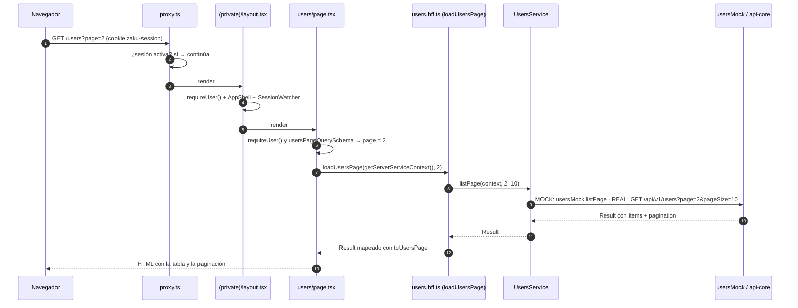
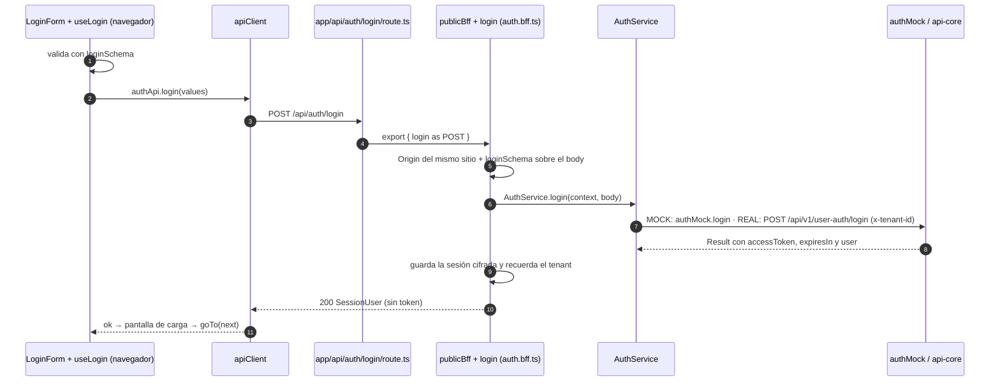
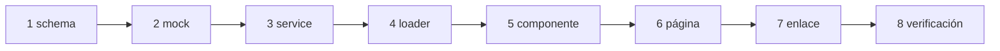

# ONBOARDING · web-core

Esta guía explica, con los archivos reales de `apps/web-core`:

- cómo se construye una página en el servidor, archivo por archivo;
- cómo viaja una acción del usuario (el login) desde el navegador hasta api-core;
- por qué hay tres tipos de "usuario";
- cómo crear tu primera página, paso a paso.

Es la versión didáctica. Las reglas formales están en:

- [ARCHITECTURE.md](./ARCHITECTURE.md): qué es cada pieza y por qué existe.
- [CLEAN_CODE.md](./CLEAN_CODE.md): cómo se escribe el código y los tests.
- [DEVELOPMENT.md](./DEVELOPMENT.md): puesta en marcha, variables y scripts.

Antes de seguir, ten la app corriendo ([DEVELOPMENT §1](./DEVELOPMENT.md#1-puesta-en-marcha)).

Contenido:

1. [El modelo mental](#1-el-modelo-mental)
2. [Qué responde cada carpeta](#2-qué-responde-cada-carpeta)
3. [Recorrido 1: la página `/users`](#3-recorrido-1-la-página-users)
4. [Recorrido 2: el login](#4-recorrido-2-el-login)
5. [¿Por qué hay tres "usuarios"?](#5-por-qué-hay-tres-usuarios)
6. [Tu primera página, paso a paso](#6-tu-primera-página-paso-a-paso)
7. [Variantes: ¿y si mi pantalla…?](#7-variantes-y-si-mi-pantalla)
8. [Dónde va cada test](#8-dónde-va-cada-test)
9. [Errores frecuentes al empezar](#9-errores-frecuentes-al-empezar)

## 1. El modelo mental

Piensa en web-core como un restaurante cuya cocina está en otro edificio (api-core):

| Pieza | En el restaurante | En el código | Ejemplo |
|---|---|---|---|
| Página (`page.tsx`) | El mesero que arma el plato completo antes de llevarlo a la mesa. El cliente recibe el plato listo. | `src/app/**/page.tsx` | `app/(private)/users/page.tsx` |
| Loader | La comanda que el mesero pasa a la cocina interna. | función `load…` en `server/<m>.bff.ts` | `loadUsersPage` |
| Service | El encargado de pedir los ingredientes al edificio de la cocina (api-core) o, en modo práctica, sacarlos de la despensa (mock). | `server/<m>.service.ts` | `UsersService.listPage` |
| Mock | La despensa de práctica: ingredientes falsos, pero con la misma forma. | `server/<m>.mock.ts` | `usersMock` |
| Mapper | Quitar lo que no va al plato (lo que la UI no necesita). | `server/<m>.mappers.ts` | `toUsersPage` |
| Componente | La presentación del plato. | `components/*.tsx` | `UsersView` |
| BFF (`/api/*`) | La ventanilla donde el cliente pide algo especial desde la mesa (enviar un formulario). | handler en `server/<m>.bff.ts` + `app/api/**/route.ts` | `login` |
| Isla cliente | El timbre de la mesa: lo único que el cliente maneja por su cuenta. | componente con `'use client'` | `LoginForm` |

La regla de oro: **el cliente nunca entra a la cocina**. El navegador solo recibe HTML y solo llama a `/api/*` de web-core. Quien habla con api-core es el servidor de web-core.

## 2. Qué responde cada carpeta

| Pregunta | Carpeta |
|---|---|
| ¿Qué URL existe y qué compone? | `src/app/` (solo `page.tsx`, `layout.tsx`, `route.ts`…) |
| ¿Cómo es el marco de la app (menú, cabecera, pie)? | `src/layout/` |
| ¿Qué hace una feature y cómo se ve? | `src/modules/<m>/` (`types`, `schemas`, `components`, `hooks`, `api`) |
| ¿Cómo habla esa feature con api-core? | `src/modules/<m>/server/` (`service`, `mock`, `mappers`, `bff`, `contracts`) |
| ¿Qué es común a todas las features? | `src/shared/` (`server/` solo servidor, `client/` solo navegador, `ui/`, `utils/`…) |
| ¿Quién revisa la sesión antes de cada página? | `src/proxy.ts` (optimista) y `requireUser()` en cada página privada |

## 3. Recorrido 1: la página `/users`

Una página privada que lista usuarios, renderizada **entera en el servidor**.



Archivo por archivo:

1. **`src/proxy.ts`** lee la cookie de sesión. Si no hay sesión activa, redirige a `/login?next=%2Fusers%3Fpage%3D2`. Es solo una comprobación rápida: la barrera real viene después.
2. **`app/(private)/layout.tsx`** llama a `requireUser()` y envuelve la página con el shell (`AppShell`) y el vigilante de inactividad (`SessionWatcher`).
3. **`app/(private)/users/page.tsx`** es el centro:

   ```tsx
   export default async function UsersPage({ searchParams }: PageProps<'/users'>) {
     await requireUser();
     const { page } = usersPageQuerySchema.parse(await searchParams);
     const result = await loadUsersPage(await getServerServiceContext(), page);

     return (
       <>
         <PageHeader title="Usuarios" … />
         {result.ok ? <UsersView page={result.data} /> : <UsersView errorMessage={result.error.message} />}
       </>
     );
   }
   ```

   - Vuelve a llamar a `requireUser()`: Next no vuelve a renderizar los layouts al navegar entre páginas, así que cada página privada se protege a sí misma.
   - `usersPageQuerySchema` convierte `?page=abc` o `?page=-1` en `1`. Nada que venga de la URL se usa sin validar.
   - `getServerServiceContext()` arma el **contexto del servicio**: `requestId`, IP del cliente, `tenantId` y token de la sesión.
4. **`modules/users/server/users.bff.ts`** une service y mapper:

   ```ts
   export async function loadUsersPage(context: ServiceContext, page: number): Promise<Result<UsersPage>> {
     return mapResult(await UsersService.listPage(context, page, USERS_PAGE_SIZE), toUsersPage);
   }
   ```

   `mapResult` aplica el mapper solo si el resultado es `ok`; si es un error, lo deja pasar tal cual.
5. **`modules/users/server/users.service.ts`** tiene las dos ramas. Hoy gana la primera (MOCK). En REAL, `http.getPage` llama a api-core con `Authorization: Bearer <token>` y devuelve `{ items, pagination }`.
6. **`modules/users/server/users.mappers.ts`** convierte cada `UserResponse` de api-core en un `UserSummary`: la UI no necesita `tenantId` ni `updatedAt`.
7. **`modules/users/components/UsersView.tsx`** pinta la tabla, o el estado vacío, o el error. La paginación son enlaces normales (`/users?page=3`): no necesitan JavaScript.

¿Cuánto JavaScript propio de esta página llega al navegador? **Ninguno.** Solo se cargan las islas del shell (menú, logout y vigilante de sesión).

**Si algo falla:**

- **api-core no responde:** el service devuelve `{ ok: false, error: { status: 502, … } }` y la página muestra `UsersView` con el mensaje de error.
- **Excepción inesperada:** la muestra `app/(private)/error.tsx`, con un botón para reintentar.

## 4. Recorrido 2: el login

Una acción del usuario: sale de una **isla cliente**, pasa por el **BFF** y termina en api-core.



1. **`app/(public)/login/page.tsx`** (Server Component) prepara las props del formulario:
   - el destino tras el login (`?next=`, filtrado por `safeRedirectPath`);
   - el último tenant usado (cookie `zaku-tenant`);
   - las credenciales demo, solo si `APP_ENV=local`.
2. **`modules/auth/components/LoginForm.tsx`** (`'use client'`) pinta los campos y delega toda la lógica en el hook.
3. **`modules/auth/hooks/use-login.ts`**:
   - valida con `loginSchema`, el **mismo** schema que usa el servidor;
   - envía con `useApiMutation(authApi.login)`, que gestiona `isPending` y convierte los errores en `ApiError`.
4. **`modules/auth/api.ts`** → `apiClient.post('/api/auth/login', input)`. `apiClient` solo acepta rutas `/api/*`.
5. **`app/api/auth/login/route.ts`** es una sola línea: `export { login as POST } from '@/modules/auth/server/auth.bff';`.
6. **`publicBff`** (`shared/server/bff/define-bff.ts`):
   - comprueba que el `Origin` sea el mismo sitio;
   - valida el body con `loginSchema` (si falla, responde 400 con errores por campo);
   - arma el `ServiceContext`.
7. **`login`** (`modules/auth/server/auth.bff.ts`):
   - llama a `AuthService.login`;
   - convierte la respuesta con `toEstablishedSession` (calcula `expiresAt`);
   - guarda `user`, `accessToken` y `expiresAt` en la cookie cifrada y recuerda el tenant;
   - responde **solo el usuario**.
8. De vuelta en el navegador:
   - **si va bien:** pantalla de carga (`SplashLoading`) durante 1,8 s y `goTo(redirectTo)`, que hace `router.replace` + `router.refresh` para que los layouts lean la sesión nueva;
   - **si falla con errores por campo:** se muestran debajo de cada campo;
   - **si falla por otra causa:** se muestra el mensaje general.

## 5. ¿Por qué hay tres "usuarios"?

| Tipo | Dónde | Qué contiene | Quién lo ve |
|---|---|---|---|
| `UserResponse` | `@zaku/shared-types`, re-exportado en `modules/users/server/contracts.ts` | Lo que responde api-core: `id`, `tenantId`, `email`, `createdAt`, `updatedAt`. | Solo el servidor de web-core. |
| `UserSummary` | `modules/users/types.ts` | Lo que la pantalla necesita: `id`, `email`, `createdAt`. | Los componentes. |
| `SessionUser` | `shared/types/session-user.ts` | Quién inició sesión: `id`, `email`, `tenantId`. | La sesión y el navegador tras el login. |

Separarlos permite que api-core cambie su contrato sin romper las pantallas (solo cambia el mapper), y evita mandar al navegador datos que no necesita.

## 6. Tu primera página, paso a paso

Vamos a construir **"Detalle de usuario"**: al hacer clic en un correo de `/users`, se abre `/users/<id>` con su información. api-core ya tiene el endpoint: `GET /api/v1/users/{userId}`.

> El ejemplo **no está en el código**: es un ejercicio. Se verificó implementándolo completo con `lint`, `typecheck`, `test:cov` y `build`, y probándolo por HTTP:
> - `/users/<id del demo>` → 200;
> - un id inválido o inexistente → 404;
> - sin sesión → redirección al login con `?next=`;
> - en REAL contra api-core en modo mock → mismo comportamiento.
>
> Después se retiró.

### 6.0 Antes de escribir código: responde estas preguntas

| Pregunta | Respuesta en el ejemplo |
|---|---|
| ¿Pública o privada? | Privada: va en `app/(private)/` y llama a `requireUser()`. |
| ¿Qué endpoint de api-core usa? ¿Está en `apis.ts`? | `GET /api/v1/users/{userId}`. El controller `users` con la acción `''` ya está registrado; el id viaja en `urlParams`. |
| ¿Qué necesita ver el usuario? | Correo y fecha de creación: `UserSummary` ya lo tiene. |
| ¿Necesita interacción en el navegador? | No: es un Server Component, sin `'use client'`. |
| ¿Qué entradas hay que validar? | El `userId` de la URL: debe ser un UUID. |
| ¿Qué errores esperados hay? | Usuario de otro tenant o inexistente: api-core responde `404 USER_NOT_FOUND` y la página muestra el 404 de la app. |

### 6.1 El orden: de adentro hacia afuera



Cada paso trae su test. Así, cuando llegas a la página, todo lo que usa ya está probado.

### 6.2 Los pasos

#### Paso 1. Validar el parámetro de la ruta

`src/modules/users/schemas.ts`:

```ts
export const userIdSchema = z.uuid();
```

Test en `test/unit/modules/users/schemas.spec.ts`:

```ts
describe('userIdSchema', () => {
  it('accepts a UUID and rejects anything else', () => {
    expect(userIdSchema.safeParse('00000000-0000-4000-8000-000000000101').success).toBe(true);
    expect(userIdSchema.safeParse('../tenants').success).toBe(false);
  });
});
```

#### Paso 2. El mock

El mock imita a api-core: sin tenant responde 401, y un usuario de otro tenant no existe (404). `src/modules/users/server/users.mock.ts`, dentro de `usersMock`:

```ts
  findById(tenantId: string | undefined, userId: string): Result<UserResponse> {
    if (!tenantId) {
      return fail(401, 'Tu sesión expiró. Inicia sesión nuevamente.', 'UNAUTHENTICATED');
    }
    const user = users().find((candidate) => candidate.tenantId === tenantId && candidate.id === userId);
    return user ? ok(user) : fail(404, 'El usuario no existe', 'USER_NOT_FOUND');
  },
```

Test en `test/unit/modules/users/server/users.mock.spec.ts` (añade `DEMO_USER` al import de `@/shared/server/demo-fixtures`):

```ts
  it('finds a user only inside its own tenant', () => {
    expect(usersMock.findById(DEMO_TENANT_ID, DEMO_USER.id)).toMatchObject({ ok: true, data: { email: DEMO_USER.email } });
    expect(usersMock.findById('00000000-0000-4000-8000-0000000000ff', DEMO_USER.id)).toMatchObject({ ok: false, error: { status: 404, code: 'USER_NOT_FOUND' } });
    expect(usersMock.findById(undefined, DEMO_USER.id)).toMatchObject({ ok: false, error: { status: 401 } });
  });
```

#### Paso 3. El service, con sus dos ramas

`src/modules/users/server/users.service.ts`, dentro de `UsersService`:

```ts
  static async getById(context: ServiceContext, userId: string): Promise<Result<UserResponse>> {
    return mock('Core.users.getById', () => usersMock.findById(context.tenantId, userId));
    return http.get<UserResponse>({
      context,
      api: 'Core',
      controller: 'users',
      action: '',
      withAuth: true,
      urlParams: [userId],
    });
  }
```

- `withAuth: true` añade el token de la sesión. El tenant lo saca api-core del token: no se envía `tenantId`.
- `urlParams: [userId]` produce `…/api/v1/users/<userId>` (el valor se codifica en la URL).
- Si el endpoint fuera nuevo, antes lo registrarías en `shared/server/http/apis.ts`.

Test de la rama activa en `test/unit/modules/users/server/users.service.spec.ts` (también con `DEMO_USER` en el import):

```ts
  it('gets one user of the session tenant from the active branch', async () => {
    const result = await UsersService.getById(serviceContext({ tenantId: DEMO_TENANT_ID, accessToken: 'token' }), DEMO_USER.id);

    expect(result).toMatchObject({ ok: true, data: { id: DEMO_USER.id } });
  });
```

#### Paso 4. El loader

No hace falta un mapper nuevo: `toUserSummary` ya existe. `src/modules/users/server/users.bff.ts` queda así:

```ts
import 'server-only';
import { mapResult, type Result } from '@/shared/server/http';
import type { ServiceContext } from '@/shared/server/service-context';
import { USERS_PAGE_SIZE } from '../schemas';
import type { UserSummary, UsersPage } from '../types';
import { toUserSummary, toUsersPage } from './users.mappers';
import { UsersService } from './users.service';

export async function loadUsersPage(context: ServiceContext, page: number): Promise<Result<UsersPage>> {
  return mapResult(await UsersService.listPage(context, page, USERS_PAGE_SIZE), toUsersPage);
}

export async function loadUser(context: ServiceContext, userId: string): Promise<Result<UserSummary>> {
  return mapResult(await UsersService.getById(context, userId), toUserSummary);
}
```

Test en `test/unit/modules/users/server/users.bff.spec.ts` (importa `loadUser` junto a `loadUsersPage`). Comprueba que el resultado ya no lleva `tenantId` ni `updatedAt`:

```ts
describe('loadUser', () => {
  beforeEach(() => {
    jest.spyOn(console, 'log').mockImplementation(() => undefined);
  });

  afterEach(() => {
    jest.restoreAllMocks();
  });

  it('returns the public summary of one user', async () => {
    const result = await loadUser(serviceContext({ tenantId: DEMO_TENANT_ID, accessToken: 'token' }), DEMO_USER.id);

    expect(result).toEqual({ ok: true, data: { id: DEMO_USER.id, email: DEMO_USER.email, createdAt: DEMO_USER.createdAt } });
  });
});
```

#### Paso 5. El componente

Un Server Component: sin `'use client'`, sin estado. `src/modules/users/components/UserDetailView.tsx`:

```tsx
import { Card } from '@/shared/ui/Card';
import { formatDate } from '@/shared/utils/format';
import type { UserSummary } from '../types';

export function UserDetailView({ user }: { readonly user: UserSummary }) {
  return (
    <Card>
      <dl className="grid gap-4 sm:grid-cols-2">
        <div>
          <dt className="text-xs font-bold uppercase tracking-wider text-muted">Correo</dt>
          <dd className="mt-1 font-medium text-ink">{user.email}</dd>
        </div>
        <div>
          <dt className="text-xs font-bold uppercase tracking-wider text-muted">Creado</dt>
          <dd className="mt-1 text-ink">{formatDate(user.createdAt)}</dd>
        </div>
      </dl>
    </Card>
  );
}
```

Test en `test/unit/modules/users/components/UserDetailView.spec.tsx` (fíjate en la primera línea: los tests de componentes corren en jsdom):

```tsx
/** @jest-environment jsdom */
import { render, screen } from '@testing-library/react';
import { UserDetailView } from '@/modules/users/components/UserDetailView';

describe('UserDetailView', () => {
  it('shows the email and the creation date of the user', () => {
    render(<UserDetailView user={{ id: 'user-1', email: 'demo@zaku.dev', createdAt: '2026-02-01T09:00:00.000Z' }} />);

    expect(screen.getByText('demo@zaku.dev')).toBeInTheDocument();
    expect(screen.getByText('Creado')).toBeInTheDocument();
  });
});
```

#### Paso 6. La página

Un único archivo en `app/`, que solo compone. `src/app/(private)/users/[userId]/page.tsx`:

```tsx
import { UserRound } from 'lucide-react';
import type { Metadata } from 'next';
import { notFound } from 'next/navigation';
import { UserDetailView } from '@/modules/users/components/UserDetailView';
import { userIdSchema } from '@/modules/users/schemas';
import { loadUser } from '@/modules/users/server/users.bff';
import { getServerServiceContext } from '@/shared/server/next-context';
import { requireUser } from '@/shared/server/session';
import { Card } from '@/shared/ui/Card';
import { PageHeader } from '@/shared/ui/PageHeader';
import { ErrorState } from '@/shared/ui/states';

export const metadata: Metadata = { title: 'Detalle de usuario' };

export default async function UserDetailPage({ params }: PageProps<'/users/[userId]'>) {
  await requireUser();
  const userId = userIdSchema.safeParse((await params).userId);
  if (!userId.success) {
    notFound();
  }
  const result = await loadUser(await getServerServiceContext(), userId.data);
  if (!result.ok && result.error.status === 404) {
    notFound();
  }

  return (
    <>
      <PageHeader title="Detalle de usuario" icon={<UserRound className="size-7" aria-hidden />} />
      {result.ok ? (
        <UserDetailView user={result.data} />
      ) : (
        <Card>
          <ErrorState message={result.error.message} />
        </Card>
      )}
    </>
  );
}
```

- `PageProps<'/users/[userId]'>` lo genera `next typegen` (parte de `pnpm typecheck`): `params` queda tipado.
- `params` es una Promise en Next 16: se espera con `await`.
- Un id inválido y un usuario inexistente muestran el mismo 404: no se revela si el id existe en otro tenant.

Las páginas no tienen test unitario: solo componen piezas que ya están probadas. Se verifican con el build y en el navegador.

#### Paso 7. El enlace desde la lista

En `src/modules/users/components/UsersView.tsx`, el correo pasa a ser un enlace (`import Link from 'next/link'`):

```tsx
<td className="px-4 py-3 font-medium text-ink">
  <Link href={`/users/${user.id}`} className="hover:text-primary-600">
    {user.email}
  </Link>
</td>
```

Y su test (`UsersView.spec.tsx`) comprueba el enlace:

```tsx
expect(screen.getByRole('link', { name: 'demo@zaku.dev' })).toHaveAttribute('href', '/users/user-1');
```

#### Paso 8. Verificación

```bash
pnpm --filter web-core lint
```

```bash
pnpm --filter web-core typecheck
```

```bash
pnpm --filter web-core test:cov
```

```bash
pnpm --filter web-core build
```

Después, en el navegador:

1. entra con los datos de demo;
2. abre `/users` y haz clic en un correo;
3. prueba `/users/no-es-un-uuid` (debe mostrar el 404);
4. cierra sesión y abre la URL del detalle (debe llevarte al login y volver tras entrar).

**En REAL:** comenta la línea `return mock(...)` de `getById` (y de los demás métodos, ver [DEVELOPMENT §3](./DEVELOPMENT.md#3-mock-o-real)). La página funciona igual contra api-core.

### 6.3 Archivos del ejemplo

| Archivo | Tipo de cambio |
|---|---|
| `src/modules/users/schemas.ts` | Modificado: `userIdSchema`. |
| `src/modules/users/server/users.mock.ts` | Modificado: `findById`. |
| `src/modules/users/server/users.service.ts` | Modificado: `getById`. |
| `src/modules/users/server/users.bff.ts` | Modificado: `loadUser`. |
| `src/modules/users/components/UserDetailView.tsx` | Nuevo. |
| `src/modules/users/components/UsersView.tsx` | Modificado: enlace al detalle. |
| `src/app/(private)/users/[userId]/page.tsx` | Nuevo. |
| `test/unit/modules/users/schemas.spec.ts` | Modificado. |
| `test/unit/modules/users/server/users.mock.spec.ts` | Modificado. |
| `test/unit/modules/users/server/users.service.spec.ts` | Modificado. |
| `test/unit/modules/users/server/users.bff.spec.ts` | Modificado. |
| `test/unit/modules/users/components/UserDetailView.spec.tsx` | Nuevo. |
| `test/unit/modules/users/components/UsersView.spec.tsx` | Modificado. |

## 7. Variantes: ¿y si mi pantalla…?

| Si tu pantalla… | Haz esto | Referencia |
|---|---|---|
| …tiene un formulario que guarda datos | Endpoint `privateBff({ body: schema }, …)` en `<m>.bff.ts`, un `route.ts` de una línea, la llamada en `api.ts` y un hook con `useApiMutation` dentro de una isla cliente. Tras guardar, `toast.success(...)` y `goTo()` o `router.refresh()`. | Recorrido del login (§4) |
| …es pública | Ponla en `app/(public)/`, sin `requireUser()`. Si tiene endpoints, usa `publicBff`. | `app/(public)/login/page.tsx` |
| …llama a un endpoint nuevo de api-core | Regístralo en `shared/server/http/apis.ts` y añade su tipo en `packages/shared-types` (y en api-core). | [Contrato entre apps](../../../docs/ARCHITECTURE.md#4-contrato-http-entre-apps) |
| …necesita filtros o búsqueda | Guárdalos en la URL (`searchParams`) y valídalos con un schema: la página sigue renderizándose en el servidor. Si el control necesita estado propio, hazlo isla cliente y navega a la nueva URL. | `usersPageQuerySchema` |
| …necesita un ítem en el menú | Añádelo a `NAV_ITEMS` (`layout/navigation.ts`) y su icono a `layout/NavIcon.tsx`. | — |
| …muestra un aviso tras una acción | `toast.success / error / info` de `shared/client/toast.ts`, solo desde islas cliente. | — |
| …necesita una variable de entorno | Añádela al schema de `shared/server/env.ts`, a `.env.example` y a las plantillas de ambiente. | [DEVELOPMENT §2](./DEVELOPMENT.md#2-variables-de-entorno) |
| …pertenece a un concepto nuevo | Crea `modules/<nuevo>/` con la misma anatomía que `users`. | [ARCHITECTURE §4](./ARCHITECTURE.md#4-anatomía-de-un-módulo) |

## 8. Dónde va cada test

```text
test/
├── unit/                                  # espejo exacto de src/
│   ├── modules/users/schemas.spec.ts      ← src/modules/users/schemas.ts
│   ├── modules/users/server/*.spec.ts     ← mock, service, mappers, bff
│   ├── modules/users/components/*.spec.tsx   ← componentes (jsdom)
│   ├── modules/auth/hooks/use-login.spec.tsx ← hooks (jsdom)
│   ├── shared/server/**                   ← http, bff, sesión, entorno
│   └── proxy.spec.ts                      ← src/proxy.ts
├── architecture/                          # reglas ejecutables (no espejan src/)
├── setup/                                 # entorno y matchers de Jest
└── support/                               # fakes y helpers: fake-session, service-context.fixture, api-core-responses…
```

Si mueves o renombras un archivo de `src/`, mueve su spec: `test-layout.spec.ts` falla si un spec no tiene su archivo.

## 9. Errores frecuentes al empezar

| Error | Qué pasa | Cómo se arregla |
|---|---|---|
| Poner un componente, hook o provider dentro de `app/` | Falla el architecture test (`app/` solo admite archivos de rutas). | Muévelo a `modules/<m>/components/` o `hooks/`. |
| Escribir lógica en un `route.ts` | Falla el architecture test (debe ser un re-export de una línea). | Escribe el handler en `<m>.bff.ts` con `privateBff`/`publicBff`. |
| Llamar a api-core desde un componente con `fetch` | Falla `check:boundaries`. | La página llama a un loader en el servidor; una isla cliente llama al BFF con `apiClient`. |
| Importar algo de `server/` en un componente `'use client'` | Falla el build (`server-only`) y `check:boundaries`. | Pasa los datos como props desde el Server Component. |
| Olvidar `requireUser()` en una página privada | El layout no se vuelve a ejecutar al navegar: la página podría servirse sin comprobar la sesión. | Llámalo al inicio de cada `page.tsx` privado. |
| Borrar la rama MOCK o la REAL de un service | Falla el architecture test. | Comenta la línea `return mock(...)` en lugar de borrarla. |
| Leer `process.env` fuera de `env.ts` | Falla el architecture test. | Añade la variable al schema de `env.ts` y usa `env()`. |
| Pasar el token o datos internos como props a un Client Component | Esos datos llegan al navegador. | Pasa solo lo que el usuario puede ver. |
| Navegar con `router.push` tras el login o el logout | El menú sigue mostrando la sesión anterior. | `useAppNavigation().goTo()`. |
| Dejar el spec junto al archivo en `src/` | Falla `test-layout.spec.ts`. | Muévelo a la ruta espejo en `test/unit/`. |
