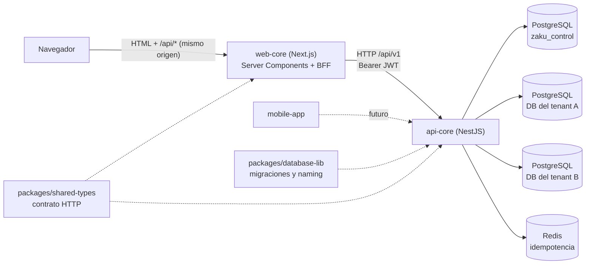
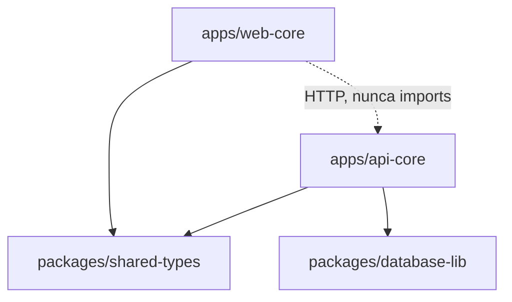
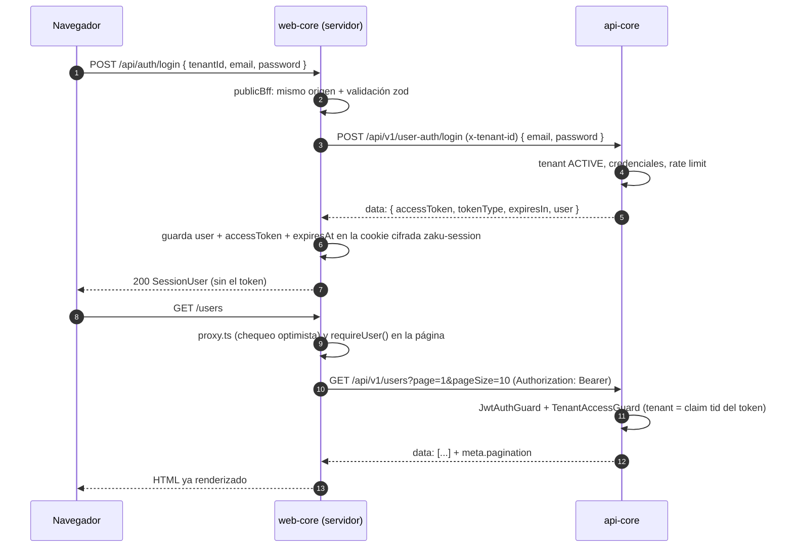

# ARCHITECTURE

Arquitectura de Zaku como **sistema**: qué piezas hay, cómo se comunican, qué contrato comparten y qué decisiones afectan a todas. La arquitectura interna de cada app está en su propia documentación:

- [api-core](../apps/api-core/docs/ARCHITECTURE.md): hexagonal + CQRS-lite, multi-tenancy, envelope de respuesta, idempotencia, mocks por port.
- [web-core](../apps/web-core/docs/ARCHITECTURE.md): capas `app → layout → modules → shared`, Server Components, mini-BFF, switch mock ⇄ real.

## 1. Visión general



- El **navegador** solo habla con web-core: recibe páginas renderizadas en el servidor y, para las acciones (login, logout…), llama a los endpoints `/api/*` del propio Next.js.
- **web-core** llama a api-core **desde su servidor**. El token de acceso nunca llega al JavaScript del navegador.
- **api-core** es la única pieza que se conecta a PostgreSQL y Redis.

## 2. Piezas del monorepo

La documentación de cada pieza está enlazada en el [hub](./README.md#4-documentación-por-aplicación-y-paquete).

| Ruta | Qué es | Tecnología |
|---|---|---|
| `apps/api-core` | API de negocio multi-tenant: hexagonal + CQRS-lite, una DB por tenant. | NestJS 10, TypeORM, PostgreSQL 16, Redis 7 |
| `apps/web-core` | Frontend web: páginas renderizadas en el servidor y un mini-BFF. | Next.js 16, React 19, Tailwind CSS 4, iron-session, zod |
| `apps/mobile-app` | Placeholder para la futura app móvil. | — |
| `packages/database-lib` | Esquema de datos: migraciones del control plane y de las DBs de tenant, naming de las DBs de tenant y scripts de migración. | TypeORM |
| `packages/shared-types` | Contrato HTTP entre apps: envelope de respuesta, requests y responses. Solo tipos. | TypeScript |
| `infra/` | Postgres y Redis locales con Docker Compose. | Docker ([DEVELOPMENT §4](./DEVELOPMENT.md#4-infraestructura-local)) |

## 3. Reglas de dependencia entre workspaces



- Una app **solo** depende de paquetes (`"@zaku/...": "workspace:*"` en su `package.json`), **nunca de otra app**. Las apps se comunican por HTTP. pnpm solo enlaza las dependencias declaradas, así que importar otra app por su nombre de paquete falla al resolver el módulo. Un import con ruta relativa hacia otra app no lo detecta ninguna herramienta: ahí la regla depende del code review.
- Los paquetes no dependen de las apps ni entre sí.
- `packages/shared-types` **solo contiene tipos**: se importa con `import type` y no añade código al bundle.
- `packages/database-lib` solo lo usan api-core y sus propios scripts de migración.
- Turbo compila los paquetes antes que las apps (`dependsOn: ["^build"]` en `turbo.json`).

## 4. Contrato HTTP entre apps

api-core **produce** el contrato y web-core lo **consume**. Los tipos viven en `packages/shared-types` (`ApiSuccessResponse`, `ApiErrorResponse`, `PaginationMeta`, `LoginRequest`, `LoginResponse`, `UserResponse`…).

```jsonc
// Éxito: los datos siempre van en data; la paginación, en meta
{ "success": true, "statusCode": 200, "message": "OK", "data": [ … ],
  "meta": { "requestId": "…", "timestamp": "…", "pagination": { "page": 1, "pageSize": 10, "totalItems": 13, "totalPages": 2 } } }

// Error: el cliente decide por error.code, nunca por message
{ "success": false, "statusCode": 401, "message": "The email or password is incorrect", "data": null,
  "error": { "code": "USER_AUTH_INVALID_CREDENTIALS", "details": [] },
  "errorImage": "https://http.cat/401", "meta": { "requestId": "…", "timestamp": "…", "path": "/api/v1/user-auth/login" } }
```

| Lado | Qué hace | Detalle |
|---|---|---|
| api-core (productor) | Todas las rutas van en `/api/v1/<controller>/<endpoint>`. El envelope lo arman un interceptor y un filtro globales; los errores esperados tienen un `code` estable. | [ARCHITECTURE §7](../apps/api-core/docs/ARCHITECTURE.md#7-estándar-de-respuesta) y [catálogo de errores](../apps/api-core/docs/ARCHITECTURE.md#71-errores) |
| web-core (consumidor) | Solo su servidor llama a api-core (`shared/server/http`). Desenvuelve `data`, convierte las listas en `{ items, pagination }` y normaliza los errores (`error.code`, y `details` como errores por campo). Al navegador le responde con su propio formato, más simple, y oculta el detalle de los 5xx. | [ARCHITECTURE §7](../apps/web-core/docs/ARCHITECTURE.md#7-capa-http-hacia-api-core) |

Qué endpoints de api-core usa hoy web-core:

| Service de web-core | Endpoint de api-core | Identificación |
|---|---|---|
| `AuthService.login` | `POST /api/v1/user-auth/login` | header `x-tenant-id` (aún no hay token) |
| `UsersService.listPage` | `GET /api/v1/users?page&pageSize` | `Authorization: Bearer <token>`; el tenant sale del token |

Reglas para cambiar el contrato:

1. El cambio toca, en el **mismo PR**, el tipo en `packages/shared-types`, el DTO de api-core (que implementa ese tipo con `implements`) y el service de web-core.
2. Un `code` de error publicado **nunca cambia**: web-core y los clientes futuros deciden por él.

## 5. Autenticación y sesión de punta a punta



- **El token no sale del servidor.** web-core lo guarda en la cookie `zaku-session` (iron-session: cifrada, `httpOnly`, `SameSite=Lax`). El navegador solo recibe el usuario (`SessionUser`).
- **La sesión vence con el token:** web-core guarda `expiresAt = ahora + expiresIn`. Cuando el JWT vence, la sesión deja de ser válida y el usuario vuelve al login. La cookie también tiene su propio límite (`SESSION_TTL_SECONDS`): manda el que venza primero. No hay refresh token (§9).
- **El tenant:**
  1. en el login lo escribe el usuario ("Organización (ID)") y viaja en `x-tenant-id`;
  2. después, api-core lo toma del claim `tid` del token, y web-core ya no envía el header;
  3. web-core recuerda el último tenant en la cookie `zaku-tenant` para rellenar el login.
- **Defensa en profundidad:** cada capa vuelve a comprobar la sesión. El proxy de Next solo redirige; cada página privada llama a `requireUser()`; cada endpoint BFF privado comprueba la sesión; y api-core valida el JWT y el tenant en cada request.
- Detalle de cada lado: [sesión en web-core](../apps/web-core/docs/ARCHITECTURE.md#9-sesión-y-autenticación) · [seguridad en api-core](../apps/api-core/docs/ARCHITECTURE.md#10-seguridad).

## 6. Multi-tenancy en el sistema

- Un **tenant** es una organización cliente. Se identifica con un UUID y tiene **su propia base de datos** ([DATABASE.md](./DATABASE.md)).
- api-core decide el tenant de cada request y comprueba que esté `ACTIVE` ([resolución del tenant](../apps/api-core/docs/ARCHITECTURE.md#61-resolución-del-tenant-en-cada-request)).
- web-core nunca decide el tenant por su cuenta:
  - en el login lo envía el usuario;
  - después usa el de la sesión, que viene del token emitido por api-core.
- Los tenants se crean hoy solo con la API de api-core (`/api/v1/tenants`, pública por ahora). web-core no tiene pantallas de administración de tenants.

## 7. Modo mock en todo el sistema

Las dos apps pueden trabajar sin su dependencia real, y los modos se combinan ([DEVELOPMENT §2](./DEVELOPMENT.md#2-primer-arranque)).

| App | Qué se reemplaza | Cómo se activa | Detalle |
|---|---|---|---|
| web-core | La llamada a api-core, método por método del service. | El primer `return mock(...)` de cada método de `*.service.ts`. `pnpm --filter web-core services:status` lista el modo de cada método. | [switch mock ⇄ real](../apps/web-core/docs/ARCHITECTURE.md#8-switch-mock--real) |
| api-core | Los adapters con I/O externo (Postgres, Redis), port por port. | `MOCK_ADAPTERS` y `MOCK_SEED_DATA` en su `.env`. | [capa de mocks](../apps/api-core/docs/ARCHITECTURE.md#9-capa-de-mocks-conmutable) |

Las identidades de demo ([DEVELOPMENT §2](./DEVELOPMENT.md#2-primer-arranque)) son **las mismas** en las dos apps, con ids fijos: existen siempre que quien responde sea un mock (web-core en MOCK, o api-core con `MOCK_SEED_DATA=true`), y el login funciona igual en los dos casos. En el modo "todo real" no existen. El resto de los datos puede variar: por ejemplo, el mock de web-core añade 12 usuarios más al listado, y el seed de api-core solo crea el usuario demo.

Dónde están definidas:

- api-core: `core/mocking/demo-fixtures.ts`;
- web-core: `shared/server/demo-fixtures.ts`.

## 8. Decisiones transversales (ADR resumido)

| # | Decisión | Por qué | Alternativa descartada |
|---|---|---|---|
| 1 | Monorepo con pnpm workspaces + Turborepo | Contrato y librerías compartidas en un solo lugar, PRs atómicos que tocan varias apps y builds cacheados. | Un repositorio por app: los contratos se desincronizan y los cambios cruzados necesitan PRs coordinados. |
| 2 | Una DB por tenant, con nombre derivado del id | Aislamiento físico, y backups y borrado por tenant. El nombre es inmutable y sin inyección. | Columna `tenant_id` (descartada por el negocio) o un schema por tenant. |
| 3 | Contrato HTTP tipado en `packages/shared-types`, solo tipos | Una sola fuente de verdad: si api-core cambia un DTO que implementa el tipo, TypeScript avisa en las dos apps. | Copiar los tipos en cada app (se desincronizan) o generarlos desde OpenAPI (más tooling; posible evolución). |
| 4 | web-core como BFF: el navegador solo llama a `/api/*` de Next.js | El token queda en el servidor, api-core no necesita CORS y la validación y el ocultamiento de errores viven en un solo lugar. | Llamar a api-core desde el navegador con el token en `localStorage`: expuesto a XSS y obliga a configurar CORS. |
| 5 | Mocks en las dos apps con las mismas identidades demo | Cada app se desarrolla sola, sin Docker, y los modos se combinan sin sorpresas. | Un servidor de mocks aparte (WireMock, MSW): más infraestructura que mantener. |
| 6 | Tests fuera de `src/`, con `test/unit/` como espejo de `src/`, en todos los workspaces | Decisión del equipo: todos los tests, fixtures y helpers en un solo lugar, y build, lint y Jest sin exclusiones de specs. Costos: mover el spec cuando se mueve el archivo, un spec por archivo y tests que importan rutas internas. El architecture test `test-layout` de cada app convierte esos costos en errores claros. | Specs al lado del archivo (convención de Nest y de muchos proyectos Next): menos movimientos al refactorizar, pero tests repartidos por `src/`. |
| 7 | Documentación en dos niveles: `docs/` para el sistema y `apps/<app>/docs/` para cada app | Cada app es dueña de su documentación y `docs/` no crece sin control. | Todo en `docs/`: se mezclaba documentación general y de una sola app. |

## 9. Riesgos transversales

Cada app documenta además sus propios riesgos: [api-core §12](../apps/api-core/docs/ARCHITECTURE.md#12-riesgos-conocidos-y-deuda-técnica-intencional) · [web-core §14](../apps/web-core/docs/ARCHITECTURE.md#14-riesgos-conocidos-y-deuda-técnica-intencional).

| Tema | Estado | Siguiente paso recomendado |
|---|---|---|
| Sin refresh token | La sesión de web-core dura lo que el JWT (`JWT_EXPIRES_IN_SECONDS`, 1 h por defecto), aunque `SESSION_TTL_SECONDS` sea mayor. | Refresh tokens en api-core y renovación en el BFF, o alinear ambos tiempos a propósito. |
| Contrato sin generación automática | `shared-types` se mantiene a mano. Los DTOs de api-core implementan sus interfaces, pero una ruta nueva puede olvidarse de declararlo. | Generar los tipos desde OpenAPI si el número de endpoints crece. |
