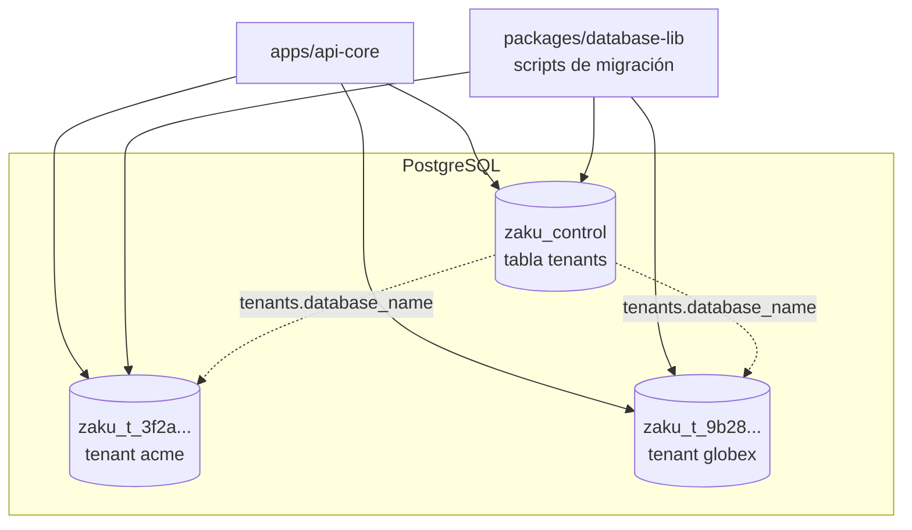
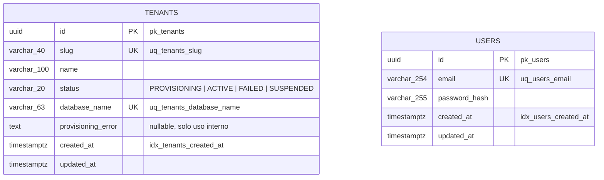
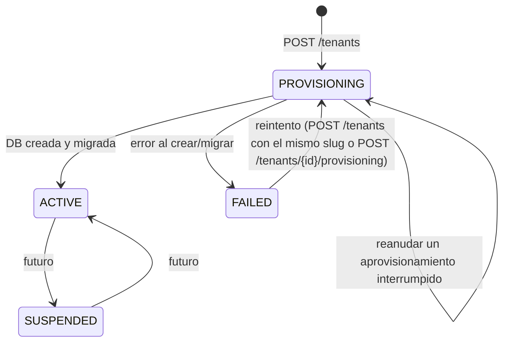

# DATABASE

Estrategia de datos de Zaku: **una base de datos PostgreSQL por tenant** más una base global de control. Aplica a todo el sistema: api-core es la única app que se conecta a PostgreSQL, y `packages/database-lib` define el esquema y las migraciones.

> Cómo se conecta api-core (pools, aprovisionamiento, tests contra Postgres y cómo añadir una tabla): [apps/api-core/docs/DATABASE.md](../apps/api-core/docs/DATABASE.md).

## 1. Estrategia

- **Control plane** (`zaku_control`): registro global de tenants (slug, nombre, estado y nombre de su DB).
- **Una DB por tenant** (`zaku_t_<uuid sin guiones>`): todos los datos del tenant. El aislamiento es físico, así que las tablas de negocio no tienen columna `tenant_id`.
- **Sin acceso directo desde el frontend:** web-core y cualquier cliente futuro piden los datos a api-core por HTTP. Ninguna otra app abre conexiones a PostgreSQL.

El porqué de esta decisión está en la [arquitectura general §8](./ARCHITECTURE.md#8-decisiones-transversales-adr-resumido).

## 2. Topología



El nombre de cada DB de tenant lo calcula `tenantDatabaseNameFor(tenantId)` (`@zaku/database-lib`). Es la **única fuente de verdad** del naming: la usan la API, el aprovisionador y el script de migraciones. Se valida contra `^zaku_t_[0-9a-f]{32}$` antes de cualquier DDL.

## 3. Esquema



- `TENANTS` vive en `zaku_control`; `USERS` existe una vez en **cada** DB de tenant.
- `USERS` no tiene `tenant_id`: el aislamiento es físico.
- Los ids (UUID v4) los genera la aplicación en el agregado, no la base.
- Nombres de constraints e índices explícitos (`pk_`, `uq_`, `idx_`) para poder mapear errores (`isUniqueViolation(error, 'uq_users_email')`) y evitar drift.

### 3.1 Estados de un tenant



Solo los tenants `ACTIVE` pueden recibir tráfico de negocio. api-core lo comprueba en cada request (`TenantAccessGuard`) y ejecuta las transiciones ([aprovisionamiento](../apps/api-core/docs/DATABASE.md#4-aprovisionamiento-de-un-tenant)).

## 4. Dónde vive cada pieza

| Pieza | Ubicación | Por qué |
|---|---|---|
| Migraciones del control plane | `packages/database-lib/src/control-plane/migrations/` | El esquema es un contrato compartido entre la API y los scripts CLI. |
| Migraciones de tenant | `packages/database-lib/src/tenant/migrations/` | Se ejecutan al aprovisionar cada tenant y con el script de migración masiva. |
| Naming de DBs de tenant | `packages/database-lib/src/tenant/tenant-database-name.ts` | Única fuente de verdad. |
| Scripts de migración | `packages/database-lib/src/scripts/` | Se ejecutan desde la raíz con `pnpm db:migration:run`. |
| Entidades ORM, registro de entidades y conexiones | `apps/api-core` | El mapeo pertenece al módulo dueño de los datos. Detalle en [api-core/docs/DATABASE.md §2](../apps/api-core/docs/DATABASE.md#2-dónde-vive-cada-pieza-dentro-de-api-core). |
| Postgres y Redis locales | `infra/docker-compose.yml` | Ver [DEVELOPMENT.md §4](./DEVELOPMENT.md#4-infraestructura-local). |

## 5. Migraciones

### 5.1 Reglas

- Nunca `synchronize: true`.
- SQL explícito en `up()` y `down()`, con nombres explícitos de constraints e índices.
- Una migración publicada **no se edita**; se crea otra.
- Nombre de archivo `<timestamp>-<accion-en-kebab>.ts` y clase `<AccionPascal><timestamp>`.
- Toda nueva migración se registra en el array `index.ts` de su carpeta (`controlPlaneMigrations` o `tenantMigrations`), en orden.
- Cambio de esquema = migración + entidad ORM actualizadas en el mismo PR. El test de integración `has every registered ORM entity matching the migrations exactly (no schema drift)` de api-core falla si divergen.

### 5.2 Comandos

```bash
pnpm infra:up
```

```bash
pnpm db:migration:run
```

`db:migration:run` (en `@zaku/database-lib`) hace, en orden:

| Script | Qué hace |
|---|---|
| `db:control:create` | Crea `CONTROL_DATABASE_NAME` si no existe (conectando a la DB `postgres`). |
| `migration:run:control` | Migra el control plane (CLI de TypeORM con `dist/control-plane/data-source.js`). |
| `migration:run:tenants` | Recorre los tenants `ACTIVE` y `SUSPENDED`, deriva el nombre de cada DB a partir del id y la migra. Si una falla, continúa con las demás, informa cuáles fallaron y termina con código 1. |

Los scripts leen **solo las variables de la shell**, no `apps/api-core/.env`: `DATABASE_HOST`, `DATABASE_PORT`, `DATABASE_USER`, `DATABASE_PASSWORD`, `DATABASE_SSL` y `CONTROL_DATABASE_NAME`. Si faltan, usan los valores de `infra/docker-compose.yml`.

Para añadir una tabla a las DBs de tenant, sigue la receta de [api-core/docs/DATABASE.md §5](../apps/api-core/docs/DATABASE.md#5-añadir-una-tabla-a-las-dbs-de-tenant): toca `database-lib` y el módulo de api-core en el mismo cambio.
