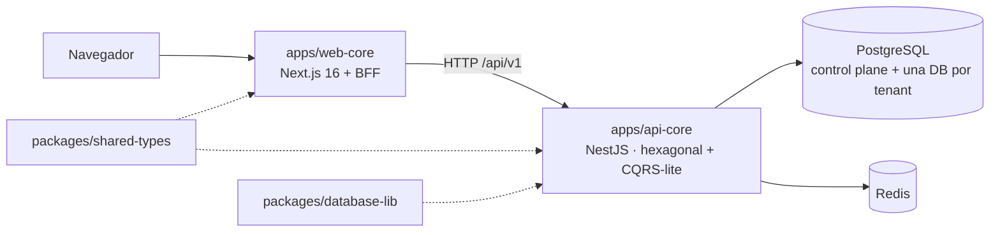

# Documentación de Zaku

Punto de entrada de toda la documentación del monorepo. Aquí está la documentación **general** (lo que aplica al sistema completo) y el enlace a la documentación **de cada app**, que vive dentro de la propia app.

## 1. Qué es Zaku

Zaku Enterprise es una plataforma **multi-tenant**: cada organización cliente (tenant) tiene su propia base de datos PostgreSQL. El código vive en un monorepo pnpm + Turborepo:

- **web-core** renderiza las páginas en el servidor y es el único que habla con el navegador.
- **api-core** concentra el negocio y es el único que habla con las bases de datos.
- **Los paquetes** comparten el contrato HTTP (`shared-types`) y el esquema de datos (`database-lib`).

Explicación completa en [ARCHITECTURE.md](./ARCHITECTURE.md). Los términos técnicos están en el [glosario](#6-glosario).

## 2. Por dónde empezar

| Si eres… | Lee, en orden |
|---|---|
| Nuevo en el proyecto | [DEVELOPMENT.md](./DEVELOPMENT.md) para instalar y compilar, [ARCHITECTURE.md](./ARCHITECTURE.md) para entender el sistema y después la ruta de tu app. |
| Backend | "Por dónde empezar" de [api-core](../apps/api-core/docs/README.md#por-dónde-empezar), y [DATABASE.md](./DATABASE.md). |
| Frontend | "Por dónde empezar" de [web-core](../apps/web-core/docs/README.md#por-dónde-empezar). |
| Agente de IA | [AI_RULES.md](./AI_RULES.md) → el `AI_RULES.md` de la app que vas a tocar. |

## 3. Documentación general

Solo lo que aplica a más de una app o al monorepo completo.

| Documento | Para qué |
|---|---|
| [ARCHITECTURE.md](./ARCHITECTURE.md) | Mapa del sistema, reglas de dependencia entre workspaces, contrato HTTP entre apps, autenticación de punta a punta, multi-tenancy, modo mock, decisiones y riesgos transversales. |
| [DATABASE.md](./DATABASE.md) | Estrategia de una DB por tenant, esquema, estados del tenant y migraciones. |
| [DEVELOPMENT.md](./DEVELOPMENT.md) | Requisitos, primer arranque, comandos de la raíz, infraestructura local, CI y problemas comunes. |
| [CLEAN_CODE.md](./CLEAN_CODE.md) | Reglas de código comunes: anti-slop, TypeScript, nombres, diseño, tests, commits y checklist de PR. |
| [AI_RULES.md](./AI_RULES.md) | Reglas obligatorias para agentes de IA en todo el monorepo. |

## 4. Documentación por aplicación y paquete

### Aplicaciones

| App | Qué es | Documentación |
|---|---|---|
| **api-core** | API de negocio: NestJS, hexagonal + CQRS-lite, una DB por tenant, idempotencia y mocks por port. | [apps/api-core/docs/README.md](../apps/api-core/docs/README.md) |
| **web-core** | Frontend web: Next.js 16, Server Components, mini-BFF, sesión con iron-session y switch mock ⇄ real. | [apps/web-core/docs/README.md](../apps/web-core/docs/README.md) |
| **mobile-app** | Placeholder de la futura app móvil. Aún no tiene documentación propia. | [apps/mobile-app/README.md](../apps/mobile-app/README.md) |

### Paquetes compartidos

| Paquete | Qué es | Documentación |
|---|---|---|
| `@zaku/database-lib` | Migraciones del control plane y de las DBs de tenant, naming de las DBs y scripts de migración. | [packages/database-lib/README.md](../packages/database-lib/README.md) |
| `@zaku/shared-types` | Tipos del contrato HTTP entre apps. | [packages/shared-types/README.md](../packages/shared-types/README.md) |

## 5. Dónde va cada documento

| El documento describe… | Va en | Y se enlaza desde |
|---|---|---|
| Algo que aplica a más de una app o al monorepo completo (arquitectura del sistema, contrato entre apps, base de datos, convenciones, CI) | `docs/` | §3 de este README |
| Algo de una sola app (su arquitectura interna, onboarding, variables, endpoints, propuestas) | `apps/<app>/docs/` | el `README.md` de esa carpeta |
| Un paquete compartido | `packages/<paquete>/README.md` | §4 de este README |

Reglas:

- Este README solo enlaza el **índice** de cada app, no sus documentos uno por uno. Así `docs/` no vuelve a crecer con documentación de una sola app.
- Cada app usa los mismos nombres de archivo cuando aplican (`README`, `ONBOARDING`, `ARCHITECTURE`, `DEVELOPMENT`, `CLEAN_CODE`, `AI_RULES`), para que se encuentren igual en todas.
- Un documento de app empieza enlazando su parte general (por ejemplo, el `CLEAN_CODE.md` de una app enlaza al general) y no la repite.
- Si una sección de una app empieza a describir algo de otra app, muévela a `docs/` y enlázala.

## 6. Glosario

| Término | Significado |
|---|---|
| **Tenant** | Una organización cliente. Cada una tiene su propia base de datos. |
| **Control plane** | La base de datos global (`zaku_control`) donde se registran los tenants. |
| **Monorepo / workspace** | Un solo repositorio con varias apps y paquetes; cada carpeta de `apps/` o `packages/` con su propio `package.json` es un workspace de pnpm. |
| **BFF** (Backend For Frontend) | Los endpoints `/api/*` de web-core: el navegador los usa para sus acciones (login, logout…) y ellos hablan con api-core. El navegador nunca llama a api-core. |
| **Server Component** | Componente de React que se ejecuta solo en el servidor y llega al navegador como HTML. |
| **Hexagonal (ports & adapters)** | El negocio declara interfaces (*ports*) y la infraestructura las implementa (*adapters*: Postgres, Redis o un mock). |
| **CQRS-lite** | Separar las operaciones que cambian datos (*commands*) de las que solo leen (*queries*), sin bases de datos separadas. |
| **Envelope** | La forma estándar de todas las respuestas de api-core: `success`, `statusCode`, `message`, `data`, `meta` y, si falla, `error.code`. |
| **Mock** | Implementación en memoria que imita a la real para trabajar sin backend o sin Docker. |
| **ADR** | *Architecture Decision Record*: una decisión de arquitectura con su porqué y la alternativa descartada. |
